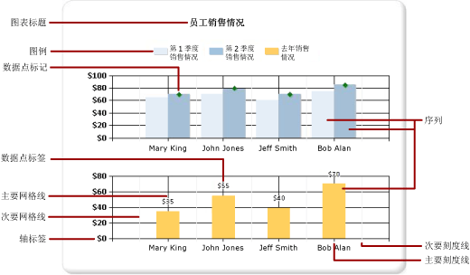
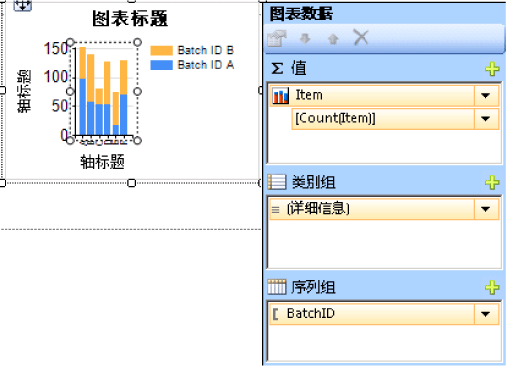
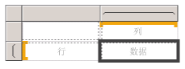
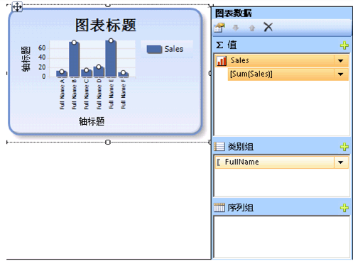

# 图表（报表生成器和 SSRS）
了解如何使用图表数据区域帮助 [!INCLUDE[ssRSnoversion_md](../../includes/ssrsnoversion-md.md)] 分页报表的读者一目了然地理解大量聚合数据。  

创建图表前，在细致准备和理解数据上花费的时间越多，就能够越轻松地实现快速高效的图表设计。 若要帮助选择使用哪个图表，请参阅[图表类型](../../reporting-services/report-design/chart-types-report-builder-and-ssrs.md) 要立即开始试用图表，请参阅[报表生成器教程](../../reporting-services/report-builder-tutorials.md)中的条形图、柱形图、迷你图和饼图教程。  
  
 下图显示了图表中使用的多种不同元素。  
  
   
  
 可以将图表作为报表部件与报表分开发布。 有关详细信息，请参阅[报表部件](../../reporting-services/report-design/report-parts-report-builder-and-ssrs.md)。
  
 
##   设计图表  
 将图表数据区域添加到设计图面后，可以将数值数据和非数值数据的报表数据集字段拖到图表的“图表数据”窗格中。 在您单击设计图面上的图表时，“图表数据”窗格将出现，并且具有三个区域（类别组、序列组和值）。 如果该报表具有共享的或嵌入的数据集，则数据集中的字段将显示在“报表数据”窗格中。 将数据集中的字段拖到“图表数据”窗格的适当区域中。 默认情况下，将字段添加到图表的某一区域中时， [!INCLUDE[ssRSnoversion](../../includes/ssrsnoversion-md.md)] 会计算字段的聚合。 您还可以使用序列分组动态生成序列。 图表[组织成矩阵](#SimilarMatrix)样式。  
  
   
  
> [!NOTE]  
>  设计时图表中的数据与处理报表时图表中的数据不同。 它不是您真正的数据。 已添加的是生成的数据，这样您就可以设计近似所见即所得的图表。  
  
##  图表如何组织成矩阵样式  
 考虑图表的工作方式的方法之一就是将图表与矩阵进行比较。  
  
   
  
 从概念上讲，它们的组织结构是相同的：  
  
-   矩阵中的“列”组与图表中的“类别组”区域类似。  
  
-   矩阵中的“行”组与图表中的“系列组”区域类似。  
  
-   矩阵中的“数据”区域与图表中的“值”区域类似。  
  
 
##   向图表添加数据  
 假定您具有一个显示“按名称的销售情况”的报表。 您将“全名”字段拖放到“类别组”区域中并将“销售量”字段拖放到“值”区域中。  
  
 在您将“销售量”字段添加到“值”区域中时，数据字段的文本将出现在图例中，并且数值字段的数据将会聚合为一个值。 默认情况下，是使用内置函数 Sum 来聚合值的。 “图表数据”窗格将为您的字段包含一个简单表达式。 在我们的示例中，将针对字段表达式 `[Sum(Sales)]` 显示 `=Sum(Fields!Sales.Value)`。 如果未指定任何组，则图表将仅显示一个数据点。 为了显示多个数据点，必须通过添加分组字段来对数据进行分组。 将“名称”字段添加到“类别组”区域中时，与字段的名称相同的分组字段将会自动添加到图表。 添加定义沿 x 和 y 轴的值的字段后，图表将有足够的信息以正确绘制数据。  
  
   
  
 当“序列组”区域保留为空时，序列数目将在设计时固定。 在本示例中，销售额是唯一显示在图表中的序列。  
  
 
##   图表中的类别组和序列组  
 图表支持嵌套的类别组和序列组。 图表不显示详细信息数据。 可通过将数据集字段拖到所选图表的类别和序列放置区向图表添加组。  
  
 形状图（例如饼图）支持类别组和嵌套类别组。 其他图（例如条形图）支持类别组和序列组。 可以嵌套组，但要确保类别或序列的数目不会使图表中信息的表示不清楚。  
  
### 向图表添加序列分组  
 如果将某个字段添加到“序列组”区域中，则序列的数量将取决于该字段中包含的数据。 在前面的示例中，假定向“序列组”区域添加了“年份”字段。 “年份”字段中值的数量将决定图表中显示的序列的数量。 如果“年份”字段包含 2004、2005 和 2006 年，则图表将为“值”区域中的每个字段都显示三个序列。  
  
##   创建图表前有关数据集的注意事项  
 图表提供了数据的摘要视图。 但是，对于较大的数据集，图表上的信息可能会变得模糊或不可读。 缺少数据点或数据点为 Null，数据类型不适合图表类型，以及具有诸如组合图表和表之类功能的高级应用程序都会影响图表的可读性。 在设计图表之前，应该先仔细准备和了解数据，以便可以快速高效地设计图表。  
  
 可以在报表中包含所需数量的图表。 像其他任何数据区域（如矩阵或表）一样，图表也绑定到单个数据集。 若要在同一图表上显示多个数据集，则可先创建在 SQL 查询中使用 JOIN 或 UNION 语句的另一数据集，然后再将数据添加到图表。 有关 JOIN 和 UNION 语句的详细信息，请参阅联机丛书或另一个 SQL 参考。  
  
 如果详细信息数据不是必要的或没有任何用处，请考虑在数据集查询中预先聚合数据。 若要更清楚地显示每个数据点，请减少数据集中的类别数。 您可以筛选数据集或者向查询添加能减少返回行数的条件。 
  
##   在图表中显示数据的最佳实践  
 当所显示的元素数目能够清晰地呈现基础信息情况时，图表的效果达到最佳。 对于一些类似散点图这样的图表，大量的数据点是有益的；而类似饼图这样的其他图表，数据点较少时效果更佳。 请根据数据集中的值和希望显示此信息的方式来仔细选择图表类型。 有关详细信息，请参阅 [图表类型（报表生成器和 SSRS）](../../reporting-services/report-design/chart-types-report-builder-and-ssrs.md)。  
  
 可以使用以下几种方法合并图表上的数据：  
  
-   使用饼图时，将小切片收集到一个名为“其他”的切片中。 这将减少饼图上的切片数。 有关详细信息，请参阅 [收集饼图上的小切片（报表生成器和 SSRS）](../../reporting-services/report-design/collect-small-slices-on-a-pie-chart-report-builder-and-ssrs.md)。  
  
-   有大量数据点时避免使用数据点标签。 仅当饼图上有少量数据点时，数据点标签才具有最佳效果。  
  
-   筛选出不需要或不相关的数据。 这有助于突出显示要在图表上显示的关键数据。 若要筛选图表中的数据点，可以对类别组或序列组设置筛选器。 默认情况下，图表使用内置函数 Sum 将属于同一组的值聚合到序列中的单个数据点中。 如果更改序列的聚合函数，则也必须更改筛选表达式中的聚合函数。 有关详细信息，请参阅 [对数据进行筛选、分组和排序（报表生成器和 SSRS）](../../reporting-services/report-design/filter-group-and-sort-data-report-builder-and-ssrs.md)。  
  
-   若要在表或矩阵模板中显示比率数据，请考虑使用线性仪表而不是条形图。 仪表更适用于在单元中显示单个值。 有关详细信息，请参阅 [嵌套数据区域（报表生成器和 SSRS）](../../reporting-services/report-design/nested-data-regions-report-builder-and-ssrs.md)。  
   
##   聚合图表上数据字段中的值  
 默认情况下，将字段添加到图表的“值”区域中时， [!INCLUDE[ssRSnoversion](../../includes/ssrsnoversion-md.md)] 会计算字段的聚合。 如果将某一字段拖到图表上，但未将该字段拖到特定区域中，则图表将基于字段的数据类型来确定该字段是属于类别 (x) 轴还是属于值 (y) 轴。 使用 SUM 函数可聚合拖放到“值”区域中的数值字段。 如果值字段的数据类型是“值”区域中的字符串，则图表将无法显示数值，即使字段中有数字，因此图表会显示 COUNT 函数。 若要避免该行为，请确保使用的字段是数值数据类型的，而不是包含格式化数字的字符串。 可以使用 Visual Basic 表达式以将字符串值转换为使用 **CDbl** 或 **CInt** 常量的数值数据类型。 例如，以下复杂表达式会转换名为 `MyField` 且包含格式为字符串的数值的字段。  
  
 `=Sum(CDbl(Fields!MyField.Value))`  
  
 有关聚合表达式的详细信息，请参阅[聚合函数引用（报表生成器和 SSRS）](../../reporting-services/report-design/report-builder-functions-aggregate-functions-reference.md)。  
   
##   本节内容  
 [向报表添加图表（报表生成器和 SSRS）](../../reporting-services/report-design/add-a-chart-to-a-report-report-builder-and-ssrs.md)  
 介绍向报表添加图表时最先执行的步骤。  
  
 [图表类型（报表生成器和 SSRS）](../../reporting-services/report-design/chart-types-report-builder-and-ssrs.md)  
 介绍 [!INCLUDE[ssRSnoversion](../../includes/ssrsnoversion-md.md)]中可用的所有图表类型和子类型，包括使用各种图表类型的注意事项和最佳做法。  
  
 [设置图表格式（报表生成器和 SSRS）](../../reporting-services/report-design/formatting-a-chart-report-builder-and-ssrs.md)  
 使用格式设置可以改进整体外观，并突出显示您的图表的关键数据点。  
  
 [图表中的空白和 Null 数据点（报表生成器和 SSRS）](../../reporting-services/report-design/empty-and-null-data-points-in-charts-report-builder-and-ssrs.md)  
 介绍在使用基于具有空值或 Null 值的字段的图表时需注意的事项。  
  
 [在图表中显示包含多个数据区域的序列（报表生成器和 SSRS）](../../reporting-services/report-design/displaying-a-series-with-multiple-data-ranges-on-a-chart.md)  
 介绍如何向包含多个数据范围的序列添加刻度分隔线。  
  
 [图表中的多个序列（报表生成器和 SSRS）](../../reporting-services/report-design/multiple-series-on-a-chart-report-builder-and-ssrs.md)  
 介绍在同一图表中显示多个序列的若干方法，包括组合图表类型、使用辅助轴、指定不同图表类型和使用多个图表区域。  
  
 [将多个数据区域链接到同一数据集（报表生成器和 SSRS）](../../reporting-services/report-design/linking-multiple-data-regions-to-the-same-dataset-report-builder-and-ssrs.md)  
 提供来自同一报表数据集的数据的不同视图。  
  
 [在图表中添加或删除组（报表生成器和 SSRS）](../../reporting-services/report-design/add-or-delete-a-group-in-a-chart-report-builder-and-ssrs.md)  
 介绍如何向图表添加组和嵌套组。  
  
 [向图表添加移动平均线（报表生成器和 SSRS）](../../reporting-services/report-design/add-a-moving-average-to-a-chart-report-builder-and-ssrs.md)  
 介绍如何使用移动平均公式计算序列中数据的平均值。  
  
 [图表故障排除（报表生成器和 SSRS）](../../reporting-services/report-design/troubleshoot-charts-report-builder-and-ssrs.md)  
 介绍用于处理图表的技巧。  
  
## 另请参阅  
 [图像、文本框、矩形和线条（报表生成器和 SSRS）](../../reporting-services/report-design/images-text-boxes-rectangles-and-lines-report-builder-and-ssrs.md)   
 [交互式排序、文档结构图和链接（报表生成器和 SSRS）](../../reporting-services/report-design/interactive-sort-document-maps-and-links-report-builder-and-ssrs.md)   
 [嵌套数据区域（报表生成器和 SSRS）](../../reporting-services/report-design/nested-data-regions-report-builder-and-ssrs.md)   
 [教程：向报表添加柱形图（报表生成器）](../../reporting-services/tutorial-add-a-column-chart-to-your-report-report-builder.md)   
 [教程：向报表添加饼图（报表生成器）](../../reporting-services/tutorial-add-a-pie-chart-to-your-report-report-builder.md)   
 [教程：向报表添加条形图（报表生成器）](../../reporting-services/tutorial-add-a-bar-chart-to-your-report-report-builder.md)  
  
  
