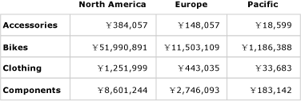
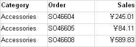
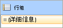
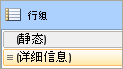
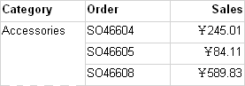
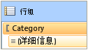
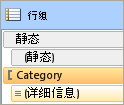
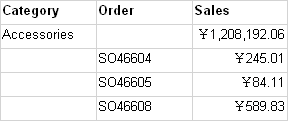
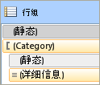

# 控制行标题和列标题（报表生成器和 SSRS）
  表、矩阵或列表数据区域可以水平或垂直跨多页。 您可以指定是否在每页上重复显示行标题或列标题。 在交互式呈现器（如报表管理器）或报表预览中，还可以指定是否冻结行标题或列标题，以便在滚动报表时始终显示标题。 在表或矩阵中，第一行通常包含列标题，用来为每列中的数据加上标签；第一列通常包含行标题，用来为每行中的数据加上标签。 对于嵌套组，您可能需要重复显示包含组标签的初始行标题集和列标题集。 默认情况下，列表数据区域不包含标题。  
  
 控制是否重复或冻结标题的方式取决于以下因素：  
  
-   对于在每页顶部重复的列标题：  
  
    -   表或矩阵是否具有水平扩展的列组区域。  
  
    -   您是否要将与列组关联的所有行作为一个单元进行控制。  
  
-   对于沿每页的边线重复的行标题：  
  
    -   表或矩阵是否具有垂直扩展的行组区域。 仅支持具有行组头的行组的行标题。  
  
> [!NOTE]  
>  [!INCLUDE[ssRBRDDup](../../includes/ssrbrddup-md.md)]  
  
## 了解 Tablix 数据区域中的行和列  
 表或矩阵是基础 tablix 数据区域的模板。 Tablix 数据区域可能具有四个区域：行组区（控制报表中向下扩展的行）、列组区（控制报表中横向扩展的列）、正文区（显示数据）和角区。 若要了解在何处设置属性来控制重复或冻结标题，首先应了解 tablix 数据区域有两种表示形式：  
  
-   **在报表定义中** Tablix 数据区域定义中的每行或每列都是特定行组或列组的 tablix 成员。 Tablix 成员是静态成员或动态成员。 静态 tablix 成员包含标签或小计，每组重复一次。 动态 tablix 成员包含组值，每个唯一组值（也称为组实例）重复一次。  
  
-   **在设计图面上** 在设计图面上，虚线将 tablix 数据区域分为四个区域。 Tablix 数据区域中的每个单元被组织为行和列。 行和列与组（包括详细信息组）关联。 对于选定的 tablix 数据区域，行控点和列控点以及突出显示栏指示组成员身份。 行组或列组区域中的单元表示 tablix 成员的组头。 一行或一列可以与多个组关联。  
  
     有关详细信息，请参阅 [Tablix 数据区域（报表生成器和 SSRS）](../../reporting-services/report-design/tablix-data-region-report-builder-and-ssrs.md)和 [Tablix 数据区域单元格、行和列（报表生成器和 SSRS）](../../reporting-services/report-design/tablix-data-region-cells-rows-and-columns-report-builder-and-ssrs.md)。  
  
 对于具有行组或列组区域的 tablix 数据区域，设置 tablix 数据区域的属性即可控制关联的行和列。 对于所有其他情况，则可通过在“属性”窗格中设置选定 tablix 成员的属性来控制行和列。 有关分步说明，请参阅[在多个页中显示行标题和列标题（报表生成器和 SSRS）](../../reporting-services/report-design/display-row-and-column-headers-on-multiple-pages-report-builder-and-ssrs.md)和[在滚动报表时保持标题可见（报表生成器和 SSRS）](../../reporting-services/report-design/keep-headers-visible-when-scrolling-through-a-report-report-builder-and-ssrs.md)。  
  
##   示例  
 Tablix 数据区域最常见的示例包括：矩阵、没有组的表、具有行组和行组头的表以及具有行组但没有行组头的表。 若要控制如何重复或冻结表头，必须确定要控制的行或列是与行组区域中的组头关联，还是与列组区域中的组头关联。  
  
 以下部分提供有关 tablix 数据区域通用布局的示例：  
  
-   [矩阵](#Matrix)  
  
-   [没有组的表](#TableNoGroups)  
  
-   [具有行组和行组区域的表](#TableRowGroupsGroupHeader)  
  
-   [具有行组但没有行组区域的表](#TableRowGroupsNoGroupHeader)  
  
###   矩阵  
 默认情况下，简单矩阵具有一个行组和一个列组。 下图显示的矩阵具有一个基于 Category 的行组和一个基于 Geography 的列组：  
  
   
  
 虚线显示四个 tablix 区域。 行组区域具有一个控制第一列中类别标签的行组头。 同样，列组区域具有一个控制第一行中地理标签的列组头。 在预览中，当矩阵跨页展开时，第一行会显示列标题，如下图所示：  
  
   
  
 若要重复或冻结第一行中的列标题，请设置 tablix 数据区域中列标题的属性。 将自动包含嵌套列组的列标题。  
  
 若要重复或冻结第一列中的行标题，请设置 tablix 数据区域中行标题的属性。 将自动包含嵌套行组的行标题。  
  
 [返回页首](#Top)  
  
###   没有行组的表  
 默认情况下，没有组的简单表包含详细信息组。 下图所示的表显示了类别、订单号和销售数据：  
  
   
  
 因为该表只有 tablix 正文区，所以没有虚线。 第一行显示列标题，表示一个未与组关联的静态 tablix 成员。 第二行显示详细信息数据，表示一个与详细信息组关联的动态 tablix 成员。 下图在预览中显示此表：  
  
   
  
 若要重复或冻结列标题，请设置某一静态行（该静态行是 tablix 数据区域定义一部分）的 tablix 成员的属性。 若要选择静态行，必须使用“分组”窗格的高级模式。 下图显示的是“行组”窗格：  
  
   
  
 在高级模式中，下图显示了表中行组的静态 tablix 成员和动态 tablix 成员：  
  
   
  
 若要重复或冻结 tablix 成员的列标题，请选择已标记 (**Static**) 的静态行。 “属性”窗格将显示所选 tablix 成员的属性。 通过设置此 tablix 成员的属性，您可以控制如何重复或始终显示第一行。  
  
 [返回页首](#Top)  
  
###   具有行组和行组区域的表  
 如果向简单表中添加行组，将向设计图面上的表添加一个行组区域。 下图显示的表具有一个基于 Category 的行组：  
  
   
  
 虚线显示 tablix 行组区和 tablix 正文区。 行组区有行组头，但没有列组头。 下图在预览中显示此表：  
  
   
  
 若要重复或冻结列标题，请使用前面示例中的相同方法。 下图显示“行组”窗格的默认视图：  
  
   
  
 使用“行组”窗格的 **“高级”** 模式显示 tablix 成员，如下图所示：  
  
   
  
 列出的 tablix 成员包括： **Static**、(**Static**)、Category 和 (**Details**)。 带有括号 () 的 tablix 成员指示没有相应的组头。 若要重复或冻结列标题，请选择上面的 Static tablix 成员，然后在“属性”窗格中设置属性。  
  
 [返回页首](#Top)  
  
###   具有行组但没有行组区域的表  
 在很多情况下，表可能具有行组但没有行组区域。 其中的两种情况为：  
  
-   开始时表具有行组和行组区域，后来删除了行组区域的列。 仅删除列而不是组。 例如，您可能想将表格式控制为简单网格。  
  
-   升级为早期 RDL 版本（引入 tablix 数据区域之前）创建的报表。  
  
 下图所示的表在设计图面上具有行组但没有行组区域：  
  
   
  
 该表有三行。 第一行包含列标题。 第二行包含组值和小计。 第三行包含详细信息数据。 因为只有 tablix 正文区，所以没有虚线。 下图在预览中显示此表：  
  
   
  
 若要控制如何重复或始终显示行，必须设置每一行 tablix 成员的属性。 在默认模式下，此示例与具有行组和组头的表的上一示例没有差别。 下图显示的是默认模式下此表的“分组”窗格：  
  
   
  
 但是，在高级模式中，此布局结构显示一组不同的 tablix 成员。 下图显示的是高级模式中此表的“分组”窗格：  
  
   
  
 在“行组”窗格中列出了以下 tablix 成员：(**Static**)、(Category)、(**Static**) 和 (**Details**)。 若要重复或冻结列标题，请选择上面的 (**Static**) tablix 成员，然后在“属性”窗格中设置属性。  
  
 [返回页首](#Top)  
  
## 呈现器对重复或冻结标题的支持  
 不同呈现器对重复或冻结标题的支持有所不同。  
  
 使用物理页（PDF、图像和打印稿）的呈现器支持以下功能：  
  
-   当 tablix 数据区域跨多页水平扩展时，重复行标题。  
  
-   当 tablix 数据区域跨多页垂直扩展时，重复列标题。  
  
 此外，使用软分页符（报表管理器、报表预览或报表查看器控件）的呈现器支持以下功能：  
  
-   当您水平滚动报表时，始终显示行标题。  
  
-   当您向下滚动报表时，始终显示列标题。  
  
 有关详细信息，请参阅[呈现行为（报表生成器和 SSRS）](../../reporting-services/report-design/rendering-behaviors-report-builder-and-ssrs.md)。  
  
## 另请参阅  
 [对数据进行筛选、分组和排序（报表生成器和 SSRS）](../../reporting-services/report-design/filter-group-and-sort-data-report-builder-and-ssrs.md)   
 [表、矩阵和列表（报表生成器和 SSRS）](../../reporting-services/report-design/tables-matrices-and-lists-report-builder-and-ssrs.md)   
 [Reporting Services 中的分页（报表生成器和 SSRS）](../../reporting-services/report-design/pagination-in-reporting-services-report-builder-and-ssrs.md)   
 [导出报表（报表生成器和 SSRS）](../../reporting-services/report-builder/export-reports-report-builder-and-ssrs.md)  
  
  
