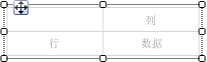
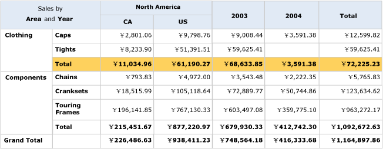
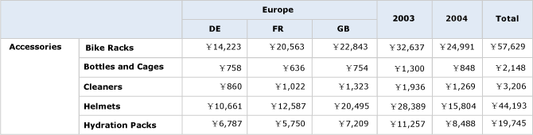

# 创建矩阵（报表生成器和 SSRS）
  使用矩阵可显示分组数据和摘要信息。 您可以按行组和列组中的多个字段或表达式对数据进行分组。 矩阵所提供的功能与交叉表和透视表的功能类似。 在运行时，由于报表数据和数据区域是组合在一起的，所以矩阵在页面上沿水平和垂直方向增长。 矩阵单元中的值显示仅限于单元所属行组和列组的交集的聚合值。 您可以设置行和列的格式以突出显示要强调的数据。 您也可以包括最初隐藏详细信息数据的明细切换，然后用户便可单击该切换以根据需要显示更多或更少的详细信息。  
  
 在最初设计之后，便可继续开发矩阵以改善用户的查看体验。 有关详细信息，请参阅[控制 Tablix 数据区域在报表页上的显示（报表生成器和 SSRS）](../../reporting-services/report-design/controlling-the-tablix-data-region-display-on-a-report-page.md)。  
  
 若要快速开始使用列表，请参阅[教程：创建矩阵报表（报表生成器）](../../reporting-services/tutorial-creating-a-matrix-report-report-builder.md)。  
  
> [!NOTE]  
>  您可以将列表作为报表部件与报表分开发布。 阅读有关 [报表部件（报表生成器和 SSRS）](../../reporting-services/report-design/report-parts-report-builder-and-ssrs.md)的详细信息。  
  
##   向报表添加矩阵  
 从功能区上的“插入”选项卡向设计图面添加一个矩阵。 您可以选择通过使用表或矩阵向导添加矩阵，包括创建数据源连接和数据集，以及基于矩阵模板配置矩阵或添加矩阵。  
  
> [!NOTE]  
>  该向导仅在 [!INCLUDE[ssRBDenali](../../includes/ssrbdenali-md.md)]中提供。  
  
 为了从头至尾描述如何配置表，本主题使用矩阵模板。  矩阵最初具有行组、列组、角单元和数据单元，如下图所示。  
  
   
  
 在设计图面上选择矩阵时，将显示行控点和列控点，如下图所示。  
  
   
  
 通过将数据集字段拖动至“分组”面板的“行组”和“列组”区域来添加组。 您拖动至行组或列组窗格的第一个字段将替换最初的空默认组。 然后便可根据数据为每个单元应用格式设置。  
  
   
  
 在“预览”中，矩阵将扩展以显示行组和列组值。 单元将显示汇总值，如下图所示。  
  
   
  
 您开始使用的矩阵为基于 Tablix 数据区域的模板。 不过，您可以继续设计自己矩阵，例如，添加嵌套的或相邻的行组或列组，甚至可以添加详细信息组。 有关详细信息，请参阅[利用 Tablix 数据区域的灵活性（报表生成器和 SSRS）](../../reporting-services/report-design/exploring-the-flexibility-of-a-tablix-data-region-report-builder-and-ssrs.md)。  
  
  
##   向矩阵添加父组或子组  
 若要基于单个数据集字段添加组，请将该字段从“报表数据”窗格拖动至“分组”窗格的相应“行组”或“列组”区域。 将该字段放在组层次结构中可设置其与现有组的关系。 将其放在现有组的上方可创建父组，或者将其放在现有组的下方可创建子组。  
  
 将字段放在 **“分组”** 窗格中时，将发生以下几种情况：  
  
-   将自动创建具有基于字段名称的唯一名称的新组。 组表达式将设置为简单字段名称引用，例如 `[Category]`。  
  
-   相应行组或列组区域中将显示新行或新列。  
  
-   在新列中，将显示一个针对报表数据集中默认数据行的行组单元。 Tablix 正文中此行的单元现在为该行组的成员。 如果定义了任何列组，则列中的单元为这些列组的成员。 组指示器为每个单元的组成员身份提供了视觉提示。  
  
 若要在创建组之后对其进行自定义，请使用 **“Tablix 组”** 对话框。 您可以更改组名、在组定义中编辑或添加其他表达式。 若要在表中添加或删除行，请参阅[插入或删除行（报表生成器和 SSRS）](../../reporting-services/report-design/insert-or-delete-a-row-report-builder-and-ssrs.md)。  
  
 当报表运行时，动态列标题向右扩展（如果将矩阵的 Direction 属性设置为 RTL，则向左扩展），有多少唯一组值就扩展多少列。 而动态行则沿页面方向纵向扩展。 Tablix 正文单元中显示的数据是基于行组和列组的交集的聚合，如下图所示。  
  
   
  
 在预览中，报表显示如下图所示。  
  
   
  
 若要编写指定范围而不是使用默认范围的表达式，您必须在聚合函数 all 中指定数据集、数据区域或组的名称。 若要计算每个子类别在 Clothing 类别组值中所占的百分比，请在 Category 组内部 Total 列的旁边添加一列，设置文本框的格式以显示百分比，然后添加一个分子使用默认范围、分母使用 Category 组范围的表达式，如下例所示。  
  
 `=SUM(Fields!Linetotal.Value)/SUM(Fields! Linetotal.Value,"Category")`  
  
 有关详细信息，请参阅 [总计、聚合和内置集合的表达式作用域（报表生成器和 SSRS）](../../reporting-services/report-design/expression-scope-for-totals-aggregates-and-built-in-collections.md)。  
  
  
##   向矩阵添加相邻组  
 若要添加基于单个数据集字段的相邻组，请在“分组”窗格中使用快捷菜单。 有关详细信息，请参阅[在数据区域中添加或删除组（报表生成器和 SSRS）](../../reporting-services/report-design/add-or-delete-a-group-in-a-data-region-report-builder-and-ssrs.md)。 下图显示了基于地域的组和基于年份的相邻组。  
  
   
  
 在此示例中，查询已对数据值进行了筛选，仅包括 2003 年和 2004 年欧洲地区的值。 然而，您可以单独为每个组设置筛选器。 在预览中，报表显示如下图所示。  
  
   
  
 若要为相邻列组添加一个总计列，请单击列组定义单元并使用 **“添加总计”** 命令。 将向列组旁添加一个新的静态列，包含现有行中每个数值字段的默认聚合总数。 若要更改表达式，请手动编辑默认聚合，例如 `Avg([Sales])`。 有关详细信息，请参阅[向组或 Tablix 数据区域添加总计（报表生成器和 SSRS）](../../reporting-services/report-design/add-a-total-to-a-group-or-tablix-data-region-report-builder-and-ssrs.md)。  
  
  
## 另请参阅  
 [聚合函数引用（报表生成器和 SSRS）](../../reporting-services/report-design/report-builder-functions-aggregate-functions-reference.md)   
 [表达式示例（报表生成器和 SSRS）](../../reporting-services/report-design/expression-examples-report-builder-and-ssrs.md)  
  
  
