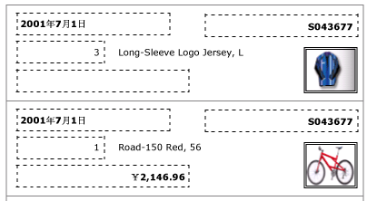
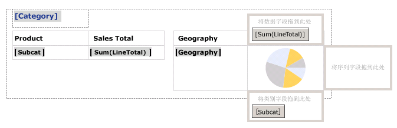
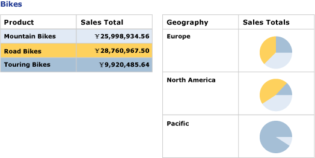

# 创建带列表的发票和表单（报表生成器和 SSRS）
  列表数据区域重复 [!INCLUDE[ssRSnoversion](../../includes/ssrsnoversion-md.md)] 分页报表数据集中的每一个组或行。 可以使用列表创建自由格式的报表或表单（如发票），或与其他数据区域结合使用。 可以定义包含任意数量的报表项的列表。 可以使用以下项嵌套列表  
  
 若要快速开始使用列表，请参阅[教程：创建自由格式的报表（报表生成器）](../../reporting-services/tutorial-creating-a-free-form-report-report-builder.md)。  
  
> [!NOTE]  
>  您可以将列表作为报表部件与报表分开发布。 阅读有关 [报表部件（报表生成器和 SSRS）](../../reporting-services/report-design/report-parts-report-builder-and-ssrs.md)的详细信息。  
  
##   向报表添加列表  
 从功能区上的“插入”选项卡向设计图面添加一个列表。 默认情况下，该列表最初在一行中有一个单元与详细信息组关联。  
  
   
  
 在设计图面上选择列表时，将显示行控点和列控点，如下图所示。  
  
   
  
 最开始使用的列表是一个基于 Tablix 数据区域的模板。 添加一个列表后，可以继续增强设计，具体的方法是通过指定筛选器、排序或组表达式来更改此列表的内容或外观，或者更改此列表跨多个报表页显示的方式。 有关详细信息，请参阅 [控制 Tablix 数据区域在报表页上的显示（报表生成器和 SSRS）](../../reporting-services/report-design/controlling-the-tablix-data-region-display-on-a-report-page.md)。 尽管列表起初只具有一行、一列，但您可以通过添加嵌套或相邻的行组或列组或者添加额外的详细信息行，来进一步改进列表的设计。 有关详细信息，请参阅[利用 Tablix 数据区域的灵活性（报表生成器和 SSRS）](../../reporting-services/report-design/exploring-the-flexibility-of-a-tablix-data-region-report-builder-and-ssrs.md)。  
  
  
##   以自由格式布局显示数据  
 若要以自由格式布局而非网格形式组织报表数据，可以向设计图面添加一个列表。 从“报表数据”窗格向单元拖动字段。 默认情况下，单元包含一个用作容器的矩形。 移动此容器内的各个字段，直到产生所需的设计效果为止。 使用在此矩形容器内拖动文本框时显示的对齐线来帮助垂直和水平对齐边缘。 通过调整单元的大小，删除不需要的空白区域。 有关详细信息，请参阅[更改行高或列宽（报表生成器和 SSRS）](../../reporting-services/report-design/change-row-height-or-column-width-report-builder-and-ssrs.md)。  
  
 下图显示了一个列表，该列表显示有关一个订单的信息，其中包括这些字段：Date、Order、Qty、Product、LineTotal 和一张图像。  
  
   
  
 预览时，该列表重复以自由格式显示字段数据，如下图中所示：  
  
   
  
> [!NOTE]  
>  这两张图中显示的点线用来说明每个字段值的自由格式布局。 通常情况下，在生产报表中不会使用点线。  
  
  
##   显示经过一级分组的数据  
 由于列表自动提供容器，因此可以使用列表来显示具有多个视图的分组数据。 若要更改默认列表以便指定组，请编辑“详细信息”组，指定一个新名称，然后指定一个组表达式。  
  
 例如，可以嵌入一个表和一张图表，分别显示同一数据集的不同视图。 可以向列表添加组，以使嵌套的报表项将对每个组值重复一次。 下图显示一个按产品类别分组的列表。 请注意，没有详细信息行。 两个表并列嵌套在此列表中。 第一个表显示包含总销售额的子类别。 第二个表显示按地域分组的类别，并包含一张显示子类别分布情况的图表。  
  
   
  
 预览时，该表显示自行车的所有子类别的总销售额，它旁边的表显示每个地域的销售额细目。 通过使用表达式为表指定背景色和为图表指定自定义调色板，第一个表还提供了图表颜色的图例。  
  
   
  
  
## 另请参阅  
 [聚合函数引用（报表生成器和 SSRS）](../../reporting-services/report-design/report-builder-functions-aggregate-functions-reference.md)   
 [表达式示例（报表生成器和 SSRS）](../../reporting-services/report-design/expression-examples-report-builder-and-ssrs.md)  
  
  
