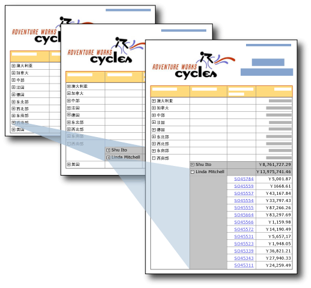

# 深化操作（报表生成器和 SSRS）
  B 在文本框上提供了加号和减号图标，使用户能够以交互方式隐藏和显示项。 这称为 *深化* 操作。 对于表或矩阵，可以显示或隐藏静态行和列，或者与组关联的行和列。  
  
   
  
 在此图中，用户单击报表中的加号 (+) 可显示详细信息数据。  
  
 例如，对于包含行组的表，您可以一开始就隐藏除外部组摘要行之外的所有行。 对于每个内部组（包括详细信息组），可为包含组的分组单元格添加展开/折叠图标。 当呈现出报表后，用户就可以单击该文本框来展开或折叠详细信息数据。 有关详细信息，请参阅[表（报表生成器和 SSRS）](../../reporting-services/report-design/tables-report-builder-and-ssrs.md)。  
  
 若要让用户能够展开或折叠某个项，请设置该项的可见性属性。  
  
> [!NOTE]  
>  在通过深化操作创建报表时，必须对要隐藏的组、列或行设置可见性信息，而不能仅对行或列中的单个文本框设置可见性信息。 此外，用于切换的文本框必须位于控制要显示或隐藏的项的包含作用域中。  
>   
>  例如，若要隐藏与嵌套组关联的行，文本框必须位于在包容层次结构中与父组或更高层次结构关联的行中。  
>   
>  有关在组、列或行上设置可见性信息的内容，请参阅[为项添加展开或折叠操作（报表生成器和 SSRS）](../../reporting-services/report-design/add-an-expand-or-collapse-action-to-an-item-report-builder-and-ssrs.md)  
  
 有关隐藏报表项的详细信息，请参阅[隐藏项（报表生成器和 SSRS）](../../reporting-services/report-builder/hide-an-item-report-builder-and-ssrs.md)。  
  
> [!NOTE]  
>  [!INCLUDE[ssRBRDDup](../../includes/ssrbrddup-md.md)]  
  
## 比较明细报表和钻取报表  
 在明细报表中，用户单击加号或减号按钮即可展开或折叠报表的某个部分，以显示详细信息数据。 在钻取报表中，用户单击摘要值的链接即可打开一个单独的相关报表，来显示详细信息数据。 详细信息数据仅在运行详细信息报表时检索。 钻取报表所需的资源通常少于明细报表。 有关详细信息，请参阅 [钻取、深化、子报表和嵌套数据区域（报表生成器和 SSRS）](../../reporting-services/report-design/drillthrough-drilldown-subreports-and-nested-data-regions.md)。  
  
## 呈现扩展插件对隐藏报表项的支持  
 只有支持用户交互功能的呈现扩展插件（如在报表生成器和报表管理器中运行报表时使用的 HTML 呈现扩展插件）才支持报表项在显示状态和隐藏状态之间的切换功能。 其他呈现扩展插件会显示隐藏项。 下面的列表说明了对具有条件可见性的报表项的支持：  
  
-   在 HTML 中，如果项已隐藏，则在 HTML 源中不可见。  
  
-   不管报表项是否为隐藏状态，XML 呈现扩展插件都会显示所有的报表项。  
  
-   Excel 呈现扩展插件将显示并扩展表、矩阵或列表的隐藏行和列。 所有行和列都可见。  
  
 有关详细信息，请参阅[呈现行为（报表生成器和 SSRS）](../../reporting-services/report-design/rendering-behaviors-report-builder-and-ssrs.md)。  
  
## 另请参阅  
 [钻取、深化、子报表和嵌套数据区域（报表生成器和 SSRS）](../../reporting-services/report-design/drillthrough-drilldown-subreports-and-nested-data-regions.md)   
 [交互式排序、文档结构图和链接（报表生成器和 SSRS）](../../reporting-services/report-design/interactive-sort-document-maps-and-links-report-builder-and-ssrs.md)   
 [表达式示例（报表生成器和 SSRS）](../../reporting-services/report-design/expression-examples-report-builder-and-ssrs.md)  
  
  
