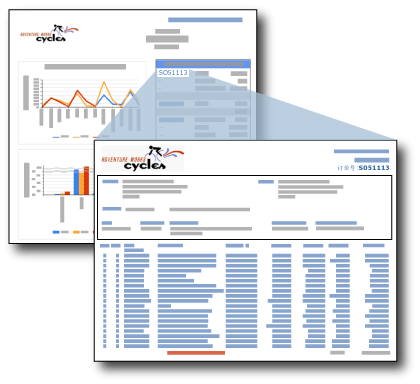

# 钻取报表（报表生成器和 SSRS）
  钻取报表是指用户通过单击其他报表中的链接打开的报表。 钻取报表通常包含某原始汇总报表中所包含的某项的详细信息。 例如，在此图中，销售额汇总报表列出了销售订单和总额。 当用户单击该汇总列表中的某个订单编号后，便会打开另一个包含此订单详细信息的报表。  
  
   
  
 在用户单击主报表中用于打开钻取报表的链接之前，不会检索钻取报表中的数据。 如果必须同时检索主报表和钻取报表的数据，请考虑使用子报表。 有关详细信息，请参阅[子报表（报表生成器和 SSRS）](../../reporting-services/report-design/subreports-report-builder-and-ssrs.md)。  
  
> [!NOTE]  
>  当您在报表生成器中工作时，必须连接到报表服务器，才能查看在单击主报表中钻取链接时打开的钻取报表。  
  
 若要快速开始使用钻取报表，请参阅[教程：生成钻取报表和主报表（报表生成器）](../../reporting-services/tutorial-creating-drillthrough-and-main-reports-report-builder.md)。 
   
## 钻取报表中的参数  
 钻取报表通常包含由汇总报表传入其中的参数。 在销售额汇总报表示例中，汇总报表将字段 [OrderNumber] 包含在表单元的文本框中。 该钻取报表中包含一个将订单号作为值的参数。 在 [OrderNumber] 的文本框中设置钻取报表链接时，同时也将目标报表的参数设置为 [OrderNumber]。 当用户单击该汇总报表中的订单号后，目标详细信息报表随即打开并显示该订单号的信息。 若要查看有关基于参数值自定义钻取报表的说明，请参阅[报表参数（报表生成器和报表设计器）](../../reporting-services/report-design/report-parameters-report-builder-and-report-designer.md)和 [InScope 函数（报表生成器和 SSRS）](../../reporting-services/report-design/report-builder-functions-inscope-function.md)。  
  
## 设计钻取报表  
 若要创建钻取报表，必须首先设计钻取报表，然后才能在主报表中创建钻取操作。  
  
 钻取报表可以是任何报表。 通常，钻取报表根据主报表中的链接接受一个或多个参数，以便指定要显示的数据。 例如，如果为销售订单定义了主报表中的链接，则将销售订单号传递到该钻取报表。  
  
## 在主报表中创建钻取操作  
 可以将钻取链接添加到文本框（包括表或矩阵单元中的文本）、图像、图表、仪表以及具有“操作”属性页的任何其他报表项。 有关详细信息，请参阅[在报表中添加钻取操作（报表生成器和 SSRS）](../../reporting-services/report-design/add-a-drillthrough-action-on-a-report-report-builder-and-ssrs.md)。  
  
 可以在主报表中将钻取操作作为报表操作或 URL 操作进行创建。 对于报表操作，钻取报表必须与主报表位于同一报表服务器上。 对于 URL 操作，报表必须位于完全限定的 URL 位置。 为报表服务器或与报表服务器集成的 SharePoint 站点指定报表的方式可能不同。 如果在 SharePoint 集成模式下配置报表服务器，则仅支持 URL 操作。  
  
 有关详细信息，请参阅[在报表中添加钻取操作（报表生成器和 SSRS）](../../reporting-services/report-design/add-a-drillthrough-action-on-a-report-report-builder-and-ssrs.md)和[指定外部项的路径（报表生成器和 SSRS）](../../reporting-services/report-design/specifying-paths-to-external-items-report-builder-and-ssrs.md)。  
  
## 查看钻取报表  
 若要在带有钻取链接的汇总报表发布后查看它，必须确保钻取报表与汇总报表位于同一报表服务器上。 在所有情况下，用户必须拥有对钻取报表的相关权限才能查看它。  
  
## 另请参阅  
 [钻取、深化、子报表和嵌套数据区域（报表生成器和 SSRS）](../../reporting-services/report-design/drillthrough-drilldown-subreports-and-nested-data-regions.md)  
  
  
