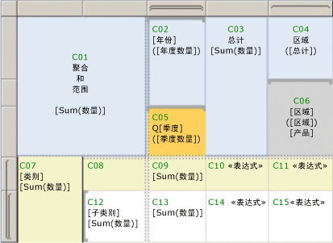

# <a name="expression-scope-for-totals-aggregates-and-built-in-collections"></a>总计、聚合和内置集合的表达式作用域
  在编写表达式时，您会发现在很多情况下都会使用“作用域”  一词。 作用域可以指定要用于计算表达式的数据、呈现的页面上的文本框集、可基于切换显示或隐藏的报表项集。 “作用域”  一词出现在与表达式计算、聚合函数语法和条件可见性相关的主题中以及有关这些范畴的错误消息中。 使用以下说明有助于区分“作用域”  适用的含义：  
  
-   **数据作用域** ：数据作用域是在报表处理器合并报表数据和报表布局时使用的作用域层次结构，并且数据作用域扩大数据区域（例如要在其上显示数据的表和图表）的范围。 理解数据作用域可帮助您在执行以下操作时获得所需的结果：  
  
    -   **编写使用聚合函数的表达式** ：指定要聚合的数据。 表达式在报表中的位置会影响处于作用域中用于聚合计算的数据。  
  
    -   **向表或矩阵添加迷你图** ：为图表轴指定用于对齐表或矩阵中嵌套实例的最小和最大范围。  
  
    -   **向表或矩阵添加指示器** ：为仪表指定用于对齐表或矩阵中嵌套实例的最小和最大刻度。  
  
    -   **编写排序表达式** ：指定一个包含作用域，您可以使用该作用域在多个相关的报表项之间同步排序顺序。  
  
-   **单元作用域** ：单元作用域是某一单元所属于的 Tablix 数据区域中行组和列组的集合。 默认情况下，每个 Tablix 单元都包含一个文本框。 该文本框的值是表达式。 该单元的位置间接确定您可为表达式中的聚合计算指定的数据作用域。  
  
-   **报表项作用域** ：报表项作用域表示呈现的报表页上项的集合。 报表处理器将报表数据与报表布局元素相结合，以便生成一个编译的报表定义。 在这个过程中，表和矩阵之类的数据区域将根据需要进行扩展，以便显示所有报表数据。 报表呈现器然后处理已编译的报表。 报表呈现器确定在每个页面上将出现哪些报表项。 在报表服务器上，每个页面将在您查看时呈现。 当您导出报表时，呈现所有页。 理解报表项作用域可帮助您在执行以下操作时获得所需的结果：  
  
    -   **添加切换项** ：指定要添加控制报表项的可见性的切换的文本框。 您只能将一个切换添加到要切换的报表项的作用域中的文本框。  
  
    -   **编写页眉和页脚中的表达式** ：指定文本框或者要在呈现的页面上出现的其他报表项中表达式的值。  
  
 理解作用域可帮助您成功编写提供所需结果的表达式。  
  
> [!NOTE]  
>  [!INCLUDE[ssRBRDDup](../../includes/ssrbrddup-md.md)]  
  
##  <a name="DataScope"></a> 了解数据作用域和数据层次结构  
 数据作用域指定一组报表数据。 数据作用域具有一个自然的层次结构，其中具有固有的包容关系。 在该层次结构上较高的作用域包含在该层次结构上较低的作用域。 下面的数据作用域列表按从最多数据到最少数据的顺序描述该层次结构：  
  
-   **数据集，在应用了数据集筛选器后** ：指定链接到数据区域或表体中的报表项的报表数据集。 用于聚合的数据来自应用了数据集筛选表达式后的报表数据集。 对于共享数据集，这意味着共享数据集定义中的筛选器以及报表中共享数据集实例中的筛选器。  
  
-   **数据区域** ：指定应用数据区域筛选器和排序表达式后的数据区域中的数据。 为数据区域计算聚合时，不使用组筛选器。  
  
-   **数据区域组，在应用了组筛选器后** ：指定对父组和子组应用组表达式和组筛选器后的数据。 对于表，这是行组和列组。 对于图表，这是序列组和类别组。 为了标识作用域包容内容，每个父组都应包含其子组。  
  
-   **嵌套数据区域** ：指定已添加到单元格上下文中并应用了嵌套数据区域筛选器和排序表达式的嵌套数据区域中的数据。  
  
-   **嵌套数据区域的行组和列组** ：指定应用嵌套数据区域组表达式和组筛选器后的数据。  
  
 在您编写包含聚合函数的表达式时，理解包含作用域和被包含作用域十分重要。  
  
##  <a name="Aggregates"></a> 单元作用域和表达式  
 当您指定一个作用域时，指示的是其数据要用于聚合计算的报表处理器。 根据表达式和表达式的位置，有效作用域可以是“包含作用域” （也称作父作用域）或“被包含作用域” （也称作子作用域或嵌套作用域）。 一般而言，您不能在聚合计算中指定单独的组实例。 您可以指定跨所有组实例的聚合。  
  
 因为报表处理器将来自报表数据集的数据与 Tablix 数据区域组合在一起，所以，它计算组表达式并且创建表示组实例所需的行和列。 在单元作用域的上下文中对各 Tablix 单元的文本框中的表达式值进行计算。 根据 Tablix 结构，一个单元可能属于多个行组和列组。 对于聚合函数，可以通过使用以下作用域之一指定要使用的作用域：  
  
-   **默认作用域** ：在报表处理器对表达式进行计算时位于用于计算的作用域中的数据。 默认作用域是单元或数据点所属于的组的最内层集合。 对于 Tablix 数据区域，该集合可以包括行组和列组。 对于图表数据区域，该集合可以包括类别组和序列组。  
  
-   **命名作用域** ：处于作用域中用于表达式的数据集、数据区域或数据区域组的名称。 对于聚合计算，您可以指定包含作用域。 不能在一个表达式中同时为行组和列组指定命名作用域。 不能指定被包含作用域，除非该表达式针对聚合的聚合。  
  
     以下表达式生成介于 SellStartDate 和 LastReceiptDate 之间的间隔年。 这些字段在两个不同的数据集内，即 DataSet1 和 DataSet2。 [First 函数（报表生成器和 SSRS）](../../reporting-services/report-design/report-builder-functions-first-function.md)是一个聚合函数，它返回 DataSet1 中 SellStartDate 的第一个值和 DataSet2 中 LastReceiptDate 的第一个值。  
  
    ```  
    =DATEDIFF(“yyyy”, First(Fields!SellStartDate.Value, "DataSet1"), First(Fields!LastReceiptDate.Value, "DataSet2"))  
    ```  
  
-   **域作用域** ：也称作同步作用域。 适用于针对嵌套数据区域的表达式计算的一种数据作用域类型。 域作用域用于指定跨某一组的所有实例的聚合，以便可以对齐并轻松地比较嵌套实例。 例如，您可以对齐在表中嵌入的迷你图的范围和高度，以便值排成一行。  
  
 在报表的某些位置中，您必须指定一个作用域。 例如，对于设计图面上的文本框，你必须指定数据集的名称才能使用： `=Max(Fields!Sales.Value,"Dataset1")`。 在其他位置中，有隐式的默认作用域。 例如，如果您没有为组作用域中的文本框指定聚合，则首先使用默认聚合。  
  
 每个聚合函数主题都列出了可供其使用的作用域。 有关详细信息，请参阅 [聚合函数引用（报表生成器和 SSRS）](../../reporting-services/report-design/report-builder-functions-aggregate-functions-reference.md)。  
  
##  <a name="Examples"></a> 用于表数据区域的聚合表达式示例  
 为了编写指定非默认作用域的表达式，需要进行一些实践。 为了帮助您理解不同的作用域，请使用下面的图和表。 该图标记销售信息表中显示按年份和季度销售以及按销售区域销售的物品数量的各单元。 请注意行控点和列控点上的可视化提示，它们显示行和列组结构并且指示嵌套组。 该表具有以下结构：  
  
-   一个包含角单元的表头和包括列组标题的三行。  
  
-   两个嵌套的行组，分别基于名为 Cat 的类别以及名为 SubCat 的子类别。  
  
-   两个嵌套的列组，分别基于名为 Year 的年份以及名为 Qtr 的季度。  
  
-   一个标记有“Totals”的静态总计列。  
  
-   一个基于名为 Territory 的销售区域的相邻列组。  
  
 出于显示目的，用于销售区域组的列标题已拆分为两个单元。 第一个单元显示区域名称和总计，第二个单元将具有占位符文本，它计算每个区域占所有销售额的百分比。  
  
   
  
 假定该数据集名为 DataSet1，该表名为 Tablix1。 下表列出了单元标签、默认作用域和示例。 占位符文本的值按表达式语法显示。  
  
|单元|默认作用域|占位符标签|文本或占位符值|  
|----------|-------------------|------------------------|--------------------------------|  
|C01|Tablix1|[Sum(Qty)]|聚合和作用域<br /><br /> `=Sum(Fields!Qty.Value)`|  
|C02|外部列组“Year”|[Year]<br /><br /> ([YearQty])|`=Fields!Year.Value`<br /><br /> `=Sum(Fields!Qty.Value)`|  
|C03|Tablix1|[Sum(Qty)]|Totals<br /><br /> `=Sum(Fields!Qty.Value)`|  
|C04|对等列组“Territory”|([Total])|Territory<br /><br /> `=Sum(Fields!Qty.Value)`|  
|C05|内部组“Qtr”|[Qtr]<br /><br /> ([QtrQty])|Q<br /><br /> `=Fields!Qtr.Value`<br /><br /> `=Sum(Fields!Qty.Value)`|  
|C06|对等列组“Territory”|[Territory]<br /><br /> ([Tty])<br /><br /> [Pct]|`=Fields!Territory.Value`<br /><br /> `=Sum(Fields!Qty.Value)`<br /><br /> `=FormatPercent(Sum(Fields!Qty.Value,"Territory")/Sum(Fields!Qty.Value,"Tablix1"),0) & " of " & Sum(Fields!Qty.Value,"Tablix1")`|  
|C07|外部行组“Cat”|[Cat]<br /><br /> [Sum(Qty)]|`=Fields!Cat.Value`<br /><br /> `=Sum(Fields!Qty.Value)`|  
|C08|与 C07 相同|||  
|C09|外部行组“Cat”和内部列组“Qtr”|[Sum(Qty)]|`=Sum(Fields!Qty.Value)`|  
|C10|与 C07 相同|<\<Expr>>|`=Sum(Fields!Qty.Value) & ": " & FormatPercent(Sum(Fields!Qty.Value)/Sum(Fields!Qty.Value,"Tablix1"),0) & " of " & Sum(Fields!Qty.Value,"Tablix1")`|  
|C11|外部行组“Cat”和列组“Territory”|<\<Expr>>|`=Sum(Fields!Qty.Value) & ": " & FormatPercent(Sum(Fields!Qty.Value)/Sum(Fields!Qty.Value,"Territory"),0) & " of " & Sum(Fields!Qty.Value,"Territory")`|  
|C12|内部行组“Subcat”|[Subcat]<br /><br /> [Sum(Qty)]|`=Fields!SubCat.Value`<br /><br /> `=Sum(Fields!Qty.Value)`|  
|C13|内部行组“Subcat”和内部列组“Qtr”|[Sum(Qty)]|`=Sum(Fields!Qty.Value)`|  
|C14|内部行组“Subcat”|<\<Expr>>|`=Sum(Fields!Qty.Value) & ": " & FormatPercent(Sum(Fields!Qty.Value)/Sum(Fields!Qty.Value,"Cat"),0) & " of " & Sum(Fields!Qty.Value,"Cat")`|  
|C15|内部行组“Subcat”和列组“Territory”|<\<Expr>>|`=Sum(Fields!Qty.Value) & ": " & FormatPercent(Code.CalcPercentage(Sum(Fields!Qty.Value),Sum(Fields!Qty.Value,"Cat")),0) & " of " & Sum(Fields!Qty.Value,"Cat")`|  
  
 有关解释 Tablix 数据区域中的可视化提示的详细信息，请参阅 [Tablix 数据区域单元、行和列（报表生成器和 SSRS）](../../reporting-services/report-design/tablix-data-region-cells-rows-and-columns-report-builder-and-ssrs.md)。 有关 Tablix 数据区域的详细信息，请参阅 [Tablix 数据区域单元、行和列（报表生成器和 SSRS）](../../reporting-services/report-design/tablix-data-region-cells-rows-and-columns-report-builder-and-ssrs.md)。 有关表达式和聚合的详细信息，请参阅[在报表中使用表达式（报表生成器和 SSRS）](../../reporting-services/report-design/expression-uses-in-reports-report-builder-and-ssrs.md)和[聚合函数引用（报表生成器和 SSRS）](../../reporting-services/report-design/report-builder-functions-aggregate-functions-reference.md)。  
  
  
##  <a name="Sparklines"></a> 为迷你图同步刻度  
 若要为在表或矩阵中嵌套的迷你图比较水平轴上的各时间值，可以同步类别组值。 这称为对齐轴。 通过选择用于对齐轴的选项，报表自动设置轴的最小值和最大值，并且为在每个类别中不存在的聚合值提供占位符。 这将导致迷你图中的值在每个类别上排成一行，并且使您可以比较每行聚合数据的值。 通过选择此选项，您在将表达式求值的作用域更改为“域作用域” 。 为嵌套图表设置域作用域还间接控制对图例中每种类别的颜色分配。  
  
 例如，在显示每周趋势的迷你图中，假定一个城市具有 3 个月的销售数据，另一个城市具有 12 个月的销售数据。 如果没有同步的刻度，则第一个城市的迷你图将只具有 3 个条，并且它们将会宽得多并与第二个城市的 12 个月的条集合占据相同的空间。  
  
 有关详细信息，请参阅[在表或矩阵中的图表中对齐数据（报表生成器和 SSRS）](../../reporting-services/report-design/align-the-data-in-a-chart-in-a-table-or-matrix-report-builder-and-ssrs.md)  
  
  
##  <a name="Indicators"></a> 为指示器同步范围  
 若要指定要用于指示器集的数据值，您必须指定一个作用域。 根据包含指示器的数据区域的布局，您可以指定一个作用域或包含作用域。 例如，在与销售额类别相关联的组标题行中，一组箭头（向上、向下、横向）可以指示相对于阈值的销售值。 包含作用域是包含指示器的表或矩阵的名称。  
  
 有关详细信息，请参阅 [设置同步作用域（报表生成器和 SSRS）](../../reporting-services/report-design/set-synchronization-scope-report-builder-and-ssrs.md)。  
  
  
##  <a name="Page"></a> 从页眉或页脚指定作用域  
 若要显示在每个报表页上不同的数据，您将表达式添加到必须位于呈现的页面上的报表项。 因为报表在呈现时划分为多页，所以，只能在呈现期间确定哪些项存在于页面上。 例如，详细信息行中的单元具有在某一页面上含许多实例的文本框。  
  
 出于此目的，存在一个名为 ReportItems 的全局集合。 这是当前页上文本框的集合。  
  
 有关详细信息，请参阅[页眉和页脚（报表生成器和 SSRS）](../../reporting-services/report-design/page-headers-and-footers-report-builder-and-ssrs.md)和 [ReportItems 集合引用（报表生成器和 SSRS）](../../reporting-services/report-design/built-in-collections-reportitems-collection-references-report-builder.md)。  
  
  
##  <a name="Toggles"></a> 为明细和条件可见性指定切换项  
 切换是添加到文本框中的加号或减号图像，用户可以单击切换以显示或隐藏其他报表项。 在大多数报表项属性的 **“可见性”** 页上，您可以指定要将切换添加到哪一报表项。 切换项必须处于比要显示或隐藏的项更高的包容作用域中。  
  
 在 Tablix 数据区域中，若要创建一个明细效果（其中，您单击文本框可以展开表以便显示更多的数据），您必须对组设置 **“可见性”** 属性，并且在与某一包含组相关联的组标题中选择作为切换文本框。  
  
 有关详细信息，请参阅 [为项添加展开或折叠操作（报表生成器和 SSRS）](../../reporting-services/report-design/add-an-expand-or-collapse-action-to-an-item-report-builder-and-ssrs.md)。  
  
  
##  <a name="Sort"></a> 指定用于同步排序顺序的排序表达式  
 在您向某一表列添加交互式排序按钮时，可为具有公共包含作用域的多个项同步排序。 例如，您可以向某一矩阵中的列标题添加一个排序按钮，并且将包含作用域指定为绑定到该矩阵的数据集的名称。 在用户单击排序按钮时，不仅对矩阵行进行排序，而且还对绑定到相同数据集的图表的图表序列组进行排序。 这样，可以同步依赖于该数据集的所有数据区域，以便显示相同的排序顺序。  
  
 有关详细信息，请参阅 [对数据进行筛选、分组和排序（报表生成器和 SSRS）](../../reporting-services/report-design/filter-group-and-sort-data-report-builder-and-ssrs.md)。  
  
  
##  <a name="Nulls"></a> 取消单元中的 Null 值或零值  
 对于大多数报表，计算的作用域为组时可以创建多个具有零 (0) 或 Null 值的单元。 若要减少报表中的混乱，请添加在聚合值为 0 时返回空白的表达式。 有关详细信息，请参阅 [表达式示例（报表生成器和 SSRS）](../../reporting-services/report-design/expression-examples-report-builder-and-ssrs.md)。  
  
  
## <a name="see-also"></a>另请参阅  
 [表达式示例（报表生成器和 SSRS）](../../reporting-services/report-design/expression-examples-report-builder-and-ssrs.md)   
 [组表达式示例（报表生成器和 SSRS）](../../reporting-services/report-design/group-expression-examples-report-builder-and-ssrs.md)   
 [创建递归层次结构组（报表生成器和 SSRS）](../../reporting-services/report-design/creating-recursive-hierarchy-groups-report-builder-and-ssrs.md)   
 [表、矩阵和列表（报表生成器和 SSRS）](../../reporting-services/report-design/tables-matrices-and-lists-report-builder-and-ssrs.md)   
 [设置文本和占位符的格式（报表生成器和 SSRS）](../../reporting-services/report-design/formatting-text-and-placeholders-report-builder-and-ssrs.md)  
  
  
