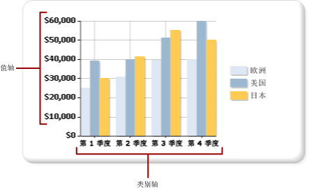

# 设置图表上轴标签的格式（报表生成器和 SSRS）
  基于坐标的图表类型（柱形图、条形图、面积图、点状图、折线图和范围图）有两个用于分类和显示数据关系的轴。 不同类型的格式设置将应用于每个轴。  
  
 可以使用 **“轴属性”** 对话框或“属性”窗格来设置轴的格式。 右键单击要设置其格式的轴，然后单击“轴属性”  可以更改轴文本的值，数值格式和日期格式，主要和次要刻度线，标签的自动调整方式以及轴线的粗细、颜色和样式。 若要更改轴标题的值，请右键单击轴标题，然后单击“轴标题属性”  。  
  
 轴标签标识图表上的主要间隔。 默认情况下，图表使用一种算法来确定标签应如何以最佳方式放置在轴上，以避免文本重叠。  
  
> [!NOTE]  
>  [!INCLUDE[ssRBRDDup](../../includes/ssrbrddup-md.md)]  
  
## 轴的类型  
 图表有两个主轴：值轴和类别轴。  
  
   
  
 当您将一个字段从数据集拖放到图表表面上时，该图表会确定此字段是属于类别轴还是值轴。  
  
 值轴通常是图表的垂直轴（或 y 轴）。 它用于显示要绘制的数值数据值。 拖放到数据字段区域中的字段将绘制在值轴上。 类别轴通常是图表的水平轴（或 x 轴）。 对于条形图中的这些轴，情况正好相反。 在条形图中，类别轴是垂直轴，而值轴是水平轴。 有关详细信息，请参阅 [条形图（报表生成器和 SSRS）](../../reporting-services/report-design/bar-charts-report-builder-and-ssrs.md)。  
  
## 图表如何计算轴标签间隔  
 在设置轴标签的格式之前，应先了解图表如何计算轴标签间隔。 这样，您就可以通过设置必需的属性来实现所需的轴标记行为。  
  
 轴刻度是由用于定义要沿该轴显示的数据范围的最小值和最大值限定的。 图表将根据结果集中的值计算每个轴上的最小值和最大值。 在值轴上，该刻度始终由值字段中的最小数和最大数确定。 在类别轴上，最小值类型和最大值类型根据类别字段的类型而定。 数据集中的任何字段都可分为三种类别字段类型之一。 下表说明了这三种类型的类别字段。  
  
|类别字段类型|描述|示例|  
|-------------------------|-----------------|-------------|  
|数字|按数值顺序沿 x 轴绘制类别。|按雇员标识号排列的销售报表沿 x 轴显示雇员标识号。|  
|日期/时间|按时间顺序沿 x 轴绘制类别。|月销售报表沿 x 轴显示已格式化的日期。|  
|字符串|按类别在数据源中首次出现的顺序沿 x 轴绘制类别。|区域销售报表沿 x 轴显示区域名称。|  
  
 对于具有两个轴的所有图表类型，设计它们的目的是当图表要容纳过多类别时可以取消一些轴标签，以便在图表上生成一个更清晰的图像，并避免标签冲突。  
  
 应用程序按以下步骤计算标签在轴上的放置位置：  
  
1.  根据结果集中的值确定最小值和最大值。  
  
2.  根据这些最小值和最大值计算出一组等距轴间隔，数量通常介于 4 个到 6 个之间。  
  
3.  根据轴标签属性，将标签显示在这些间隔处。 影响标签放置位置的属性包括字体大小、标签的显示角度以及文本换行属性。 可以更改这些轴标签自动调整选项。  
  
### 图表计算轴标签的方式示例  
 此处显示的表包含要绘制在柱形图上的示例销售数据。 “姓名”字段将添加到“类别组”区域中，“数量”字段将添加到“值”区域中。  
  
|“属性”|数量|  
|----------|--------------|  
|Michael Blythe|229|  
|Jae Pak|112|  
|Ranjit Varkey Chudukatil|494|  
|Jillian Carson|247|  
|Linda Mitchell|339|  
|Rachel Valdez|194|  
  
 “Quantity”字段沿值轴绘制。 最小值是 112，最大值是 494。 在这种情况下，图表计算出的刻度是从 0 开始，到 500 结束。 该图表还计算出 5 个等距间隔，每个间隔的大小为 100，然后在 0、100、200、300、400 和 500 处创建标签。  
  
 “Name”字段沿类别轴绘制。 图表在 4 到 6 个标签之间进行计算，并计算自动调整设置来确定应如何调整类别轴上的标签，而不会导致标签冲突。 因此，某些类别标签可能被取消。 您可以单独覆盖每个轴的自动调整选项。  
  
## 在类别轴上显示所有标签  
 在值轴上，轴间隔提供图表上数据点的一致度量。 但是，在类别轴上，此功能会导致显示不带轴标签的类别。 通常，您希望所有类别都带有标签。 可以通过将间隔数设置为 1 来显示所有类别。  有关详细信息，请参阅 [指定轴间隔（报表生成器和 SSRS）](../../reporting-services/report-design/specify-an-axis-interval-report-builder-and-ssrs.md)。  
  
> [!NOTE]  
>  使用手动设置轴上间隔来代替自动标记功能后，图表必须对其他元素进行相应的调整。 因此，图表上标签的位置和大小或者其他元素的大小可能是不可预知的。  
  
## 可变轴间隔  
 图表计算大约 5 个轴标签间隔而不考虑图表的大小。 在更宽或更高的图表上，如果在一个轴上仅显示 5 个标签，则各个标签之间会出现较大的间隔。 这会使根据该轴来确定每个数据点的值变得更加困难。 若要避免在更宽或更高的图表上出现此情况，您可以设置可变轴间隔。 图表会根据相应轴的具体情况基于该图表的宽度或高度来计算能够在轴上显示的最佳标签数。 有关详细信息，请参阅 [指定轴间隔（报表生成器和 SSRS）](../../reporting-services/report-design/specify-an-axis-interval-report-builder-and-ssrs.md)。  
  
## 对轴值进行排序  
 类别按它们在结果集中的出现顺序沿 x 轴显示。 通过向查询添加 SORT 命令或通过使用表达式对数据集进行排序，可以更改组顺序。 图表数据区域与其他数据区域的排序方式相同。 有关如何对数据进行排序的详细信息，请参阅[对数据区域中的数据进行排序（报表生成器和 SSRS）](../../reporting-services/report-design/sort-data-in-a-data-region-report-builder-and-ssrs.md)。  
  
## 指定类别轴上的标量值  
 默认情况下，图表只为数据集中包含有效值的数据点显示轴标签。 例如，如果类别轴上有值 1、2 和 6，图表将只显示类别 1、2 和 6。 若要维护类别值的刻度，可以指定图表使用标量轴。 在这种情况下，该图表将在它的 x 轴上为 1 到 6 显示标签，即使数据集不包含 3 到 5 的值。  
  
 有两种方法可用于设置标量轴：  
  
-   在 **“轴属性”** 对话框中选择 **“标量轴”** 选项。 这样会将数值或日期/时间值添加到没有数据分组值的轴。 有关详细信息，请参阅[“轴属性”对话框 ->“轴选项”（报表生成器和 SSRS）](https://msdn.microsoft.com/library/b276e210-7a12-48ae-971b-7dabae51df11)。  
  
-   在 **“序列属性”** 对话框的 **“类别字段”** 选项中选择一个字段或键入一个表达式。 图表将为您指定的类别字段中的所有值添加轴间隔。  
  
## 在类别轴中添加或删除侧边距  
 在条形图、柱形图和散点图中，图表会自动在 x 轴结尾处添加侧边距。 您无法更改该边距的大小。 在所有其他图表类型中，图表都不会添加侧边距。 有关详细信息，请参阅 [在图表中添加或删除边距（报表生成器和 SSRS）](../../reporting-services/report-design/add-or-remove-margins-from-a-chart-report-builder-and-ssrs.md)。  
  
## 本节内容  
 [将轴标签的格式设置为日期或货币（报表生成器和 SSRS）](../../reporting-services/report-design/format-axis-labels-as-dates-or-currencies-report-builder-and-ssrs.md)  
  
 [图表中的位置标签（报表生成器和 SSRS）](../../reporting-services/report-design/position-labels-in-a-chart-report-builder-and-ssrs.md)  
  
 [指定轴间隔（报表生成器和 SSRS）](../../reporting-services/report-design/specify-an-axis-interval-report-builder-and-ssrs.md)  
  
 [在图表中添加或删除边距（报表生成器和 SSRS）](../../reporting-services/report-design/add-or-remove-margins-from-a-chart-report-builder-and-ssrs.md)  
  
 [指定对数刻度（报表生成器和 SSRS）](../../reporting-services/report-design/specify-a-logarithmic-scale-report-builder-and-ssrs.md)  
  
## 另请参阅  
 [设置图表格式（报表生成器和 SSRS）](../../reporting-services/report-design/formatting-a-chart-report-builder-and-ssrs.md)   
 [图表（报表生成器和 SSRS）](../../reporting-services/report-design/charts-report-builder-and-ssrs.md)   
 [设置图表上数据点的格式（报表生成器和 SSRS）](../../reporting-services/report-design/formatting-data-points-on-a-chart-report-builder-and-ssrs.md)  
  
  
