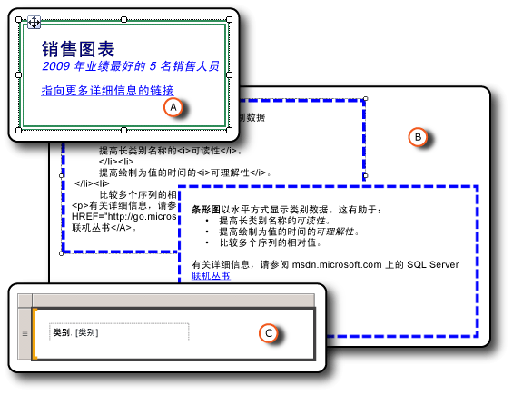

# 设置报表项的格式（报表生成器和 SSRS）
  对报表中的项进行格式设置可以使报表更赏心悦目并增强其可读性。 在报表设计模式下，可以对文本框、文本框中的各项、图像、表达式以及数据进行格式设置。  
  
   
  
 A. 带双线边框和各种格式设置样式（包括链接）的文本框。  
  
 B. 带虚线边框、原始 HTML 和呈现的 HTML 的文本框。  
  
 C. 包含文本标签和占位符的文本框。  
  
 通过选择要对其设置格式的项，然后打开该项的“属性”对话框，可以更改格式设置选项。 例如，如果要对整个文本框的内容或文本框中的选定文字设置格式，则只需右键单击该项，再选择“文本框属性”。 然后，便可应用所需的格式设置样式。  
  
 若要快速开始使用，请参阅[教程：设置文本格式（报表生成器）](../../reporting-services/tutorial-format-text-report-builder.md)。  
  
> [!NOTE]  
>  [!INCLUDE[ssRBRDDup](../../includes/ssrbrddup-md.md)]  
  
## 本节内容  
 [设置文本和占位符的格式（报表生成器和 SSRS）](../../reporting-services/report-design/formatting-text-and-placeholders-report-builder-and-ssrs.md)  
 介绍如何设置文本的格式以及如何自定义文本框中不同文本块的格式选项。  
  
 [将 HTML 导入报表（报表生成器和 SSRS）](../../reporting-services/report-design/importing-html-into-a-report-report-builder-and-ssrs.md)  
 介绍如何在报表中插入和使用 HTML。  
  
 [设置数字和日期格式（报表生成器和 SSRS）](../../reporting-services/report-design/formatting-numbers-and-dates-report-builder-and-ssrs.md)  
 介绍如何使用 [!INCLUDE[ssRSnoversion](../../includes/ssrsnoversion-md.md)]支持的标准和自定义格式设置字符串。  
  
 [设置线条、颜色和图像的格式（报表生成器和 SSRS）](../../reporting-services/report-design/formatting-lines-colors-and-images-report-builder-and-ssrs.md)  
 介绍如何设置报表项和数据区域中的线条、网格线、颜色和图像的格式。  
  
 [设置报表或文本框的区域设置 (Reporting Services)](../../reporting-services/report-design/set-the-locale-for-a-report-or-text-box-reporting-services.md)  
 描述如何更改按语言和区域而不同的数据显示格式的设置，例如日期、货币和数值。  
  
## 另请参阅  
 [设置图表格式&#40;报表生成器和 SSRS&#41;](../../reporting-services/report-design/formatting-a-chart-report-builder-and-ssrs.md)  
  
  
