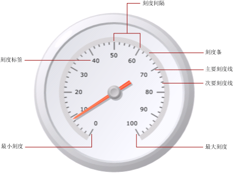
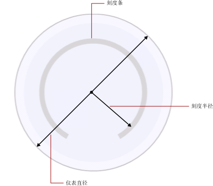

# 设置仪表上刻度的格式（报表生成器和 SSRS）
  在 [!INCLUDE[ssRSnoversion_md](../../includes/ssrsnoversion-md.md)] 分页报表中，仪表刻度是仪表上显示的具有上限和下限的数字范围。 为了准确显示仪表指针指向的读数，仪表刻度通常包含仪表标签和刻度线。 仪表刻度通常与一个或多个仪表指针相关联。 同一个仪表中可以具有多个刻度。  
  
   
  
 与其中定义了多个组的图表不同，仪表上只显示一个值。 必须定义刻度的最小值和最大值。 间隔数值会根据指定的最小值和最大值自动计算。  
  
 在已包含一个刻度的仪表上添加第二个刻度时，第一个刻度的外观属性将克隆到第二个刻度上。  
  
 通过右键单击刻度标签或刻度线然后选择“径向刻度属性”或“线性刻度属性”，可以设置刻度的属性。 每个仪表类型至少包含一个具有相同属性集的刻度。 此外，每个仪表类型还包含其特有的属性：  
  
-   在径向仪表中，可以指定径向刻度的半径、开始角度和扫描角度。  
  
-   在线性仪表中，可以指定起始边界和结束边界相对于线性仪表上的端点的宽度。  
  
 若要快速开始设置刻度格式，请参阅[设置仪表的最小值和最大值（报表生成器和 SSRS）](../../reporting-services/report-design/set-a-minimum-or-maximum-on-a-gauge-report-builder-and-ssrs.md)。  
  
##   定义刻度的最小值、最大值和间隔值  
 仪表通常用于显示按百分比度量的从 0 到 100 之间的 KPI，因此 0 和 100 分别是仪表上的最小属性和最大属性的默认值。 但是，这些值可能无法表示要尝试显示的值的刻度。 由于没有任何内置逻辑用来确定 KPI 数据字段所表示的内容，因此，仪表不会自动计算最小值和最大值。 如果 KPI 数据字段不是 0 和 100 之间的值，则必须显式设置最小属性和最大属性的值，以便为仪表上将显示的一个值提供上下文。  
  
 刻度上有主要刻度线和次要刻度线。 此外，刻度还具有通常与主要刻度线关联的标签。 例如，刻度可能在 0、20、40、60、80 和 100 处标有主要刻度线。 标签应与这些刻度线对应。 各标签值之间的差称为刻度间隔。 在本示例中，刻度间隔设置为 20。 可以在 **“径向刻度属性”** 或 **“线性刻度属性”** 对话框中设置“间隔”属性。  
  
 应用程序按以下步骤计算刻度间隔：  
  
1.  指定最小值和最大值。 不会根据数据集自动计算这些值，因此必须在仪表的 **“属性”** 对话框中提供相应的值。  
  
2.  如果未为“间隔”指定值，则使用默认值“自动”。 这表示应用程序将根据在第一步中指定的最小值和最大值计算等距间隔。 如果指定了间隔值，仪表将计算最大值和最小值的差，并用该数字除以在“间隔”属性中指定的值。  
  
 还存在用于定义标签和刻度线间隔的属性。 如果指定了这些属性的值，这些值将覆盖为刻度间隔属性指定的值。 例如，如果刻度间隔为“自动”，但是您指定了 4 作为标签间隔，则标签将显示为 0、4、8 等，不过仪表仍将根据其自身的计算方式来计算主要刻度线。 这可能导致标签与刻度线不同步的情况。 如果设置了标签间隔，请考虑隐藏刻度线。  
  
 间隔偏移量确定在显示第一个标签之前将跳过的单位数。 刻度上显示的所有连续的主要刻度线和标签都将使用指定的间隔。 如将标签或刻度线间隔值设置为 0，则效果与将间隔重置为“自动”相同。  
  
##   使用乘数减少标签冲突  
 如果值包含多个位数，则可能会影响仪表的可读性。 可以使用刻度乘数增大或缩小值的刻度。 指定刻度乘数后，刻度上的每个原始值都将在乘以该乘数后再显示在刻度上。 若要缩小值的刻度，必须指定一个小数。 例如，如果刻度从 0 到 10000，但是希望在仪表上显示 0 到 10 之间的数字，则可以使用 0.001 作为乘数值。  
  
> [!NOTE]  
>  使用乘数后，相应乘数不会与仪表使用的聚合字段的实际值相乘， 而仅与在定义最小值、最大值和间隔值之后在仪表上显示的标签值相乘。 使用乘数时，请考虑将间隔计算保持为自动。  
  
##   指定径向刻度的刻度条宽度、半径和角度  
 使用 **“径向刻度属性”** 对话框的 **“布局”** 页可以设置刻度条宽度、刻度半径、刻度的开始角度和扫描角度。 可以使用这些属性自定义刻度的大小和格式。 例如，如果将刻度标签放置在刻度外侧，则需要重新调整刻度半径的大小，使这些标签能在仪表中显示。  
  
> [!NOTE]  
>  当单击仪表刻度时，将围绕该刻度以点线显示一个轮廓。 该轮廓不是刻度条，并且不用于在仪表上计算度量值。 该轮廓仅在设计时使用，是为了访问刻度属性而突出显示刻度。  
  
 所有度量都基于刻度条。 选择仪表时，不会显示刻度条宽度。 如果指定了刻度条的值，则有助于您进行与该刻度相关的所有其他度量。 若要查看刻度条，请在 **“径向刻度属性”** 对话框的 **“布局”** 页上将 **“刻度条宽度”** 属性设置为大于 0 的值。 在径向仪表上，刻度条按仪表直径的百分比度量。 在线性仪表上，刻度条按仪表宽度或高度（以值小者为准）的百分比度量。  
  
 刻度半径是从仪表中心到刻度条中间位置的距离。 刻度半径的值按仪表直径的百分比度量。 最好使刻度半径值低于 35。 如果指定的值大于 35，绘制的刻度将可能超出仪表的边界。 下图显示如何相对于仪表直径在刻度条上度量刻度半径。  
  
   
  
 开始角度是介于 0 至 360 之间的旋转角度，是刻度的起始位置。 位置零 (0) 位于仪表的底部，开始角度按顺时针方向旋转。 例如，如开始角度为 90 度，将使刻度从 9 点钟位置开始。  
  
 扫描角度是刻度将在一个圆周中所跨的度数（介于 0 至 360 之间）。 扫描角度为 360 度将生成为一个完整圆的刻度。 如果您希望设计一个外观类似于时钟的仪表，则此方法很有用。  
  
##   在线性或径向刻度上放置标签  
 有两个属性可确定标签的位置。 标签放置属性指定标签是显示在刻度条的内侧、外侧还是与刻度条交叉。 距离属性用于设置标签与刻度相隔的距离（以刻度条为起点）。 如果您希望将标签放置到刻度条内侧，请指定一个负数。 例如，如果标签位于刻度外侧，并将到刻度的距离设置为 10，则标签将显示在刻度外侧的 10 个单位处（标签通常放置于此位置），其中 1 个单位代表：  
  
-   径向仪表上仪表直径的 1%，或  
  
-   线性仪表上仪表高度或宽度（以值小者为准）的 1%。  
  
## 另请参阅  
 [设置仪表上范围的格式（报表生成器和 SSRS）](../../reporting-services/report-design/formatting-ranges-on-a-gauge-report-builder-and-ssrs.md)   
 [设置仪表上指针的格式（报表生成器和 SSRS）](../../reporting-services/report-design/formatting-pointers-on-a-gauge-report-builder-and-ssrs.md)   
 [将轴标签的格式设置为日期或货币（报表生成器和 SSRS）](../../reporting-services/report-design/format-axis-labels-as-dates-or-currencies-report-builder-and-ssrs.md)   
 [设置图表上轴标签的格式（报表生成器和 SSRS）](../../reporting-services/report-design/formatting-axis-labels-on-a-chart-report-builder-and-ssrs.md)   
 [仪表（报表生成器和 SSRS）](../../reporting-services/report-design/gauges-report-builder-and-ssrs.md)  
  
  