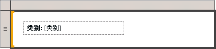

# 设置文本和占位符的格式（报表生成器和 SSRS）
  文本框可以是数据区域中包含以下内容的报表项或独立单元：文本、计算字段、指向数据库中字段的指针或前面所有三项的组合。 您可以混合字体和颜色、添加加粗和倾斜样式以及使用段落样式（如对齐和悬挂缩进）。 可以设置整个文本框的格式，也可以设置文本框内特定文本、数字、表达式或字段的格式。  
  
 字体、大小、颜色和效果均影响报表的可读性。 可以对文本框或数据区域中的文本应用字体、字形、字号以及下划线效果。 默认情况下，报表字体采用宋体、10 磅和黑色字体。 通过使用 **“文本框”** 和 **“文本属性”** 对话框，可以指定文本在呈现报表时的显示方式。  
  
   
  
 在此图中，文本框本身带有边框，而且所有文本均位于同一文本框内，但文本具有各种不同的格式。  
  
 若要快速开始使用，请参阅[教程：设置文本格式（报表生成器）](../../reporting-services/tutorial-format-text-report-builder.md)。  
  
> [!NOTE]  
>  [!INCLUDE[ssRBRDDup](../../includes/ssrbrddup-md.md)]  
  
## 在文本框中创建占位符文本  
 在文本框内定义简单或复杂表达式时，生成的该表达式的用户界面表示形式称为“占位符”  。 可以对单个文本框中的任意多个占位符或部分文本定义颜色、字体、操作和其他行为。  
  
 占位符的值始终是简单表达式或复杂表达式。 您可以使用下列方法之一来创建表达式，以便向文本框添加占位符：  
  
-   将 **“报表数据”** 窗格中的字段拖放到文本框中。 如果将表达式拖放到表体的任意其他位置，则将创建包含占位符的新文本框。 该占位符的值将为与已删除字段对应的字段表达式。  
  
-   右键单击文本框中的任意位置，并选择“插入占位符”  。 在 **“占位符属性”** 对话框中，可以将表达式指定为占位符的值。 有关详细信息，请参阅 [“占位符属性”对话框，“常规”（报表生成器和 SSRS）](https://msdn.microsoft.com/library/7a867736-a3b0-4b5a-b3e5-fe7c8d7618a8)。  
  
-   在文本框中键入任何简单或复杂表达式。 例如，如果在文本框中键入 **Name: [Name]** ，则 **[Name]** 文本将作为表示 `=Fields!Name.Value`表达式的占位符显示。  
  
-   在空文本框中键入以等号 (=) 作为开头的表达式。 将焦点更改到文本框之外时，生成的表达式则转换为可编辑的占位符。 如果文本框不为空，或者在文本框中的任何其他位置插入等号而不作为第一个字符，则将等号视为字符串文字，并且不会创建占位符。 有关定义简单和复杂表达式的详细信息，请参阅[报表中的表达式用法（报表生成器和 SSRS）](../../reporting-services/report-design/expression-uses-in-reports-report-builder-and-ssrs.md)。  
  
## 在文本框中设置占位符和静态文本的格式  
 使用 **“占位符属性”** 对话框可以设置占位符的格式。 只能设置整个占位符的格式，而不能设置部分占位符的格式。 如果要查看基础表达式，则可以将指针停留在占位符上。 通过双击该占位符，或者右键单击该占位符并选择“占位符属性”，可以更改基础表达式  。 还可以使用 **“占位符属性”** 对话框 **“常规”** 中的 **“标签”** 属性来指定用户界面标签。 该标签是在设计时显示的占位符的文本。  
  
   
  
 在此图中，列表中的文本框包含一个粗体格式的标签和一个无格式的占位符。  
  
 与占位符文本不同，您可以在文本框中单独对齐单个文本，在单个文本框中使用多个段落，并定义任何文本子集的其他行为。  
  
 可以对单个文本框中的任何文本子集定义颜色、字体、操作和其他行为，以便为报表中的文本创建邮件合并或模板。 还可以在单个文本框内使用多个段落。 例如，如果有两个独立的文本段落，通过在文本框中按 Enter 键可以分隔段落。 还可以对任何单独的文本字符串设置对齐值。 您还可以为文本框中的单独文本定义操作。 如果要为文本框内包含的文本字符串添加超链接，此方法可能很有用。  
  
> [!NOTE]  
>  对文本框定义的操作的优先级高于为文本框中各文本定义的操作的优先级。  
  
 有关混合格式的详细信息，请参阅[设置文本框中文本的格式（报表生成器和 SSRS）](../../reporting-services/report-design/format-text-in-a-text-box-report-builder-and-ssrs.md)。  
  
## 使用“常规”对齐水平文本  
 在 **“文本框属性”** 对话框的 **“对齐”** 中，可以指定文本的水平对齐方式。 如果未为对齐指定值，则使用对齐的默认值 **“默认”** 。 这表示将根据占位符值的字段类型对齐文本。 如果指定的表达式的计算结果为非字符串值（即，非数字），则文本为右对齐。 如果表达式的计算结果为字符串值（如数字），则文本为左对齐。  
  
## 另请参阅  
 [表达式（报表生成器和 SSRS）](../../reporting-services/report-design/expressions-report-builder-and-ssrs.md)   
 [设置图表上轴标签的格式（报表生成器和 SSRS）](../../reporting-services/report-design/formatting-axis-labels-on-a-chart-report-builder-and-ssrs.md)   
 [设置仪表上刻度的格式（报表生成器和 SSRS）](../../reporting-services/report-design/formatting-scales-on-a-gauge-report-builder-and-ssrs.md)   
 [表、矩阵和列表（报表生成器和 SSRS）](../../reporting-services/report-design/tables-matrices-and-lists-report-builder-and-ssrs.md)   
 [“占位符属性”对话框 ->“常规”（报表生成器和 SSRS）](https://msdn.microsoft.com/library/7a867736-a3b0-4b5a-b3e5-fe7c8d7618a8)   
 [导出到 Microsoft Excel（报表生成器和 SSRS）](../../reporting-services/report-builder/exporting-to-microsoft-excel-report-builder-and-ssrs.md)   
 [文本框（报表生成器和 SSRS）](../../reporting-services/report-design/text-boxes-report-builder-and-ssrs.md)  
  
  
