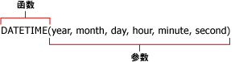

# 报表模型查询中的公式（报表生成器和 SSRS）
  公式用于对报表中将报表模型用作数据源的值进行计算。 当你为报表模型数据源定义查询时，可以在报表模型查询设计器的“定义公式”对话框中定义公式。  公式可以包含函数、运算符、常量和对字段或实体的引用。 使用公式，您可以对数字和文本数据进行组合、聚合、筛选和计算。 您可以创建公式并将其另存为新字段；或者您也可以修改现有字段的公式。  
  
 公式不是 RDL 表达式，不以等号 (=) 开头。 有关 RDL 表达式的详细信息，请参阅[表达式（报表生成器和 SSRS）](../../reporting-services/report-design/expressions-report-builder-and-ssrs.md)。  
  
 公式外观类似于：  
  
-   **Sum Line Total**  
  
-   6+12  
  
-   **SUM**(**IF**(**Finished Goods Flag**, "Finished", "Unfinished"))  
  
> [!NOTE]  
>  [!INCLUDE[ssRBRDDup](../../includes/ssrbrddup-md.md)]  
  
## References  
 引用是字段名称。 它可以是实体中现有的字段名称，也可以是已创建并添加到“字段”列表中的计算字段名称。 引用为报表生成器提供要在公式中使用的值或数据的查找位置。 可以在一个公式中引用当前上下文实体中的字段和其他实体中的字段，也可以在多个公式中使用同一字段中的值。  
  
 在使用引用时，报表处理器将对字段中的每个值运行公式。 例如，假设某个字段包含过去五年中的年度总销售额。 此字段包含五个值，每个值表示给定年份的总销售额。 如果公式包含对此字段的引用，则该公式将使用每个值来计算新的值。  
  
## 运算符  
 运算符指定要对公式中的值执行的计算类型。 有三种不同类型的运算符：算术运算符、比较运算符和文本运算符。 使用符号（例如加号 (+)）表示运算符。  
  
 **算术运算符。** 算术运算符用于执行基本的数学运算（例如加法、减法或乘法）、组合数字以及生成数值结果。  
  
 **比较运算符。** 可以使用比较运算符对两个值进行比较。 在使用这些运算符对两个值进行比较时，结果将为逻辑值 True 或 False。  
  
 **文本串联运算符。** 使用“and”(&amp;) 符号可以联接或串联一个或多个文本字符串，以生成单个文本。  
  
##   常量  
 常量不是计算得出的值，因此不会发生更改。 报表生成器使用以下常量： **True**、 **False**和 **Empty**。 这些常量用于计算布尔字段。 例如，假设有一个名为 IsDiscontinued 的字段。 此字段的有效值只能为 True、False 或 Empty (" ")。  
  
##   函数  
 函数是通过使用按特定顺序指定的特定值（称为“参数” ）来执行计算的预定义公式。 参数可以是文字值或字段，也可以是二者的组合。 在公式中使用字段时，字段名称代表该字段的每个实例。 如果参数为文字值，则可能需要使用特定字符来指定该参数为文字值。  
  
 函数可用于执行简单计算或复杂计算。 函数的结构以函数名称开头，后跟左括号、用逗号分隔的函数参数、右括号。  
  
   
  
 参数可以是字段引用、数字、文本和逻辑值（如 **TRUE** 或 **FALSE**）。 参数也可以是常量、公式或其他函数。 所输入的参数必须生成该参数的有效值。 例如，如果公式为两个整数相乘，则结果不能为文本字符串。  
  
 报表生成器附带以下九类常用函数：  
  
|||  
|-|-|  
|聚合函数|**AVG**, **COUNT**, **COUNTDISTINCT**, **MAX**, **MIN**, **STDEV**, **STDEVP**, **SUM**, **VAR**, **VARP**|  
|条件函数|**IF**、 **IN**、 **SWITCH**|  
|转换函数|**INT**、 **DECIMAL**、 **FLOAT**、 **TEXT**|  
|日期和时间函数|**DATE**, **DATEADD**, **DATEDIFF**, **DATETIME**, **DATEONLY**, **DAY**, **DAYOFWEEK**, **DAYOFYEAR**, **HOUR**, **MINUTE**, **MONTH**, **NOW**, **QUARTER**, **SECOND**, **TIMEONLY**, **TODAY**, **WEEK**, **YEAR**|  
|信息函数|**GETUSERCULTURE**、 **GETUSERID**|  
|逻辑函数|**AND**、 **NOT**、 **OR**|  
|数学函数|**MOD**、 **ROUND**、 **TRUNC**|  
|运算符|加 (+), 除 (/), 等于 (=), 乘方 (^), 大于 (>), 大于或等于 (>=), 小于 (<), 小于或等于 (<=), 乘 (*), 取反 (-), 不等于 (<>), 减 (-)|  
|文本函数|**CONCAT**, **FIND**, **LEFT**, **LENGTH**, **LOWER**, **LTRIM**, **REPLACE**, **RIGHT**, **RTRIM**, **SUBSTRING**, **UPPER**|  
  
  
