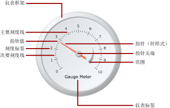

# 仪表（报表生成器和 SSRS）
  在 [!INCLUDE[ssRSnoversion_md](../../includes/ssrsnoversion-md.md)] 分页报表中，仪表数据区域显示数据集的单个值。 各仪表始终位于仪表面板内，您可以在仪表面板内添加子仪表或相邻仪表。 在单个仪表面板中，可以创建多个共享公用功能（如筛选、分组或排序）的多个仪表。  
  
 仪表可以在报表中执行多个任务：  
  
-   在单个径向仪表或线性仪表中显示关键绩效指标 (KPI)。  
  
-   在表或矩阵内放置仪表以便显示每个单元内的值。  
  
-   在一个仪表面板中使用多个仪表比较各字段之间的数据。  
  
 有两种类型的仪表：径向仪表和线性仪表。 下图显示了仪表面板中单个径向仪表的基本元素。  
  
   
  
 有关将仪表用作 KPI 的详细信息，请参阅[教程：向报表添加 KPI（报表生成器）](../../reporting-services/tutorial-adding-a-kpi-to-your-report-report-builder.md)。  
  
> [!NOTE]  
>  您可以将仪表作为报表部件与报表分开发布。 阅读有关 [报表部件](../../reporting-services/report-design/report-parts-report-builder-and-ssrs.md)的详细信息。  
  
##   仪表类型  
 [!INCLUDE[ssRSnoversion](../../includes/ssrsnoversion-md.md)] 提供两种仪表类型：径向仪表和线性仪表。 在您要将数据表示为速度时通常使用径向仪表。 线性仪表用于将数据表示为温度或刻度值。  
  
 这两种类型之间的主要差异体现在仪表的整体形状和可用仪表指针上。 径向仪表是圆形或圆形的度数，类似里程表。 仪表指针通常是针形，但可以是标记和条。  
  
 线性仪表为矩形，方向为水平或垂直，类似标尺。 仪表指针通常是温度计，但可以是标记和条。 由于其形状，此仪表类型用于集成到表或矩阵数据区域中，以便显示进度数据。  
  
 除了上述差异外，这两种仪表类型可互换。 但是，如果您需要在报表中使用简单仪表，则应考虑使用指示器来代替仪表。 有关详细信息，请参阅[指示器（报表生成器和 SSRS）](../../reporting-services/report-design/indicators-report-builder-and-ssrs.md)。  
  
 下图显示了径向仪表和线性仪表。 径向仪表是圆形并且使用针形指针。 线性仪表是水平的并且使用温度计指针。  
  
 **径向仪表**  
  
   
  
 径向仪表选项：“径向”、“径向，最小仪表”、“两个刻度”、“东北方向 90 度”、“西北方向 90 度”、“西南方向 90 度”、“东南方向 90 度”、“北方 180 度”、“南方 180 度”、“西方 180 度”、“东方 180 度”和“仪表”。  
  
 **线性仪表**  
  
   
  
 线性仪表选项：“水平”、“垂直”、“多个条形指针”、“两个刻度”、“三个颜色范围”、“对数”、“温度计”、“华氏/摄氏温度计”和“圆点图”。  
  
##   向仪表添加数据  
 在您将仪表添加到设计图面后，可以将数据集字段拖到仪表数据窗格上。 默认情况下，仪表将字段值聚合为在仪表上显示的一个值。 该值通过使用 Value 属性附加到指针。 根据字段的数据类型，仪表使用 SUM 或 COUNT 聚合。 在您使用适合于相加的数字数据时，仪表使用 SUM 函数。 否则，它使用 COUNT 聚合。 指针的值可以使用其他聚合或不使用聚合。  
  
 可以向仪表添加分组，以便在仪表上查看各组或各行。 应用分组和筛选时，仪表使用指针值显示返回数据集中的最后一组或一行。  
  
 通过添加另一个指针，可以将多个值添加到单个仪表中。 该指针可以属于同一刻度，或者您也可以添加另一个刻度，然后将指针与该刻度关联。  
  
 与 **“选择图表类型”** 对话框中的可用图表类型不同， **“选择仪表类型”** 对话框中的可用仪表类型是通过组合使用仪表属性来创建的。 因此，无法用更改图表类型的相同方式来更改仪表类型。 若要更改仪表类型，必须先删除该仪表，然后再将它重新添加到设计图面。 仪表至少具有一个刻度和一个指针。 通过右键单击仪表并选择 **“添加刻度”**，您可以具有多个刻度。 默认情况下，这将创建位于第一个刻度内部的更小刻度。 刻度显示标签和刻度线。 刻度线有两种类型：次要刻度线和主要刻度线。  
  
 通过右键单击仪表并选择 **“添加指针”**，您可以具有多个指针。 这将在相同刻度上另外创建一个指针，但是如果具有多个刻度，则可以将指针与仪表上的任何刻度关联。  
  
### 向仪表添加数据时的注意事项  
 与所有其他数据区域一样，仪表数据区域只能绑定到一个数据集。 如果具有多个数据集，请考虑使用 JOIN 或 UNION 创建一个数据集，或者针对每个数据集使用单独的仪表。  
  
 数字数据类型是使用 SUM 函数聚合的。 非数字数据类型是使用 COUNT 函数聚合的，该函数可对数据集或组中特定值或字段的实例数进行计数。  
  
 在添加数据之后，如果右键单击指针，将会显示“清除指针值”和“删除指针”选项。 “清除指针值”选项将删除附加到仪表的字段，但仍将在仪表上显示指针。 “删除指针”选项将从仪表中删除字段，并且从视图中删除指针。 如果向该仪表重新添加字段，则该默认指针将重新出现。 向仪表添加字段之后，必须对相应刻度设置最大值和最小值，以便为仪表上的值提供上下文。 您还可以设置某一范围的最小值和最大值，该范围在刻度上显示一个关键区域。 仪表不会自动设置刻度或范围的最小值或最大值，因为它无法确定应如何识别值。  
  
### 向仪表添加数据的方法  
 为报表定义数据集后，可以使用以下方法之一向仪表添加数据字段：  
  
-   将字段从数据集拖到数据窗格中。 单击仪表并向其拖动字段。 您可以通过单击仪表或者沿仪表拖动字段，打开数据窗格。 如果仪表中尚没有指针，则向该仪表添加一个指针，并将该指针绑定到已添加的字段。  
  
-   显示数据窗格，并指向字段占位符。 单击字段占位符旁的向下箭头，然后选择要使用的字段。 如果已选择某一字段，则单击该向下箭头，然后选择不同的字段。  
  
    > [!NOTE]  
    >  如果仪表上没有任何指针或报表包含多个数据集，并且仪表面板不与数据集关联，则该方法不适用。  
  
-   右键单击仪表指针，然后选择 **“指针属性”**。 对于 **“值”**，请从下拉列表中选择字段或单击 **“表达式”** (*fx*) 按钮来定义字段表达式。  
  
### 将字段聚合为单个值  
 默认情况下，将字段添加到仪表时， [!INCLUDE[ssRSnoversion](../../includes/ssrsnoversion-md.md)] 会计算字段的聚合。 数字数据类型是使用 SUM 函数聚合的。 非数字数据类型是使用 COUNT 函数聚合的，该函数可对数据集或组中特定值或字段的实例数进行计数。 如果值字段的数据类型是字符串，则仪表将无法显示数值，即使这些字段中包含数字也是如此。 仪表将改用 COUNT 函数来聚合字符串字段。 若要避免此行为，请确保使用的字段是数字数据类型，而不是包含格式化数字的字符串。 可以使用 Visual Basic 表达式以将字符串值转换为使用 CDbl 或 CInt 常量的数值数据类型。 例如，以下表达式将名为 MyField 的字符串字段转换为数值。  
  
 `=Sum(CDbl(Fields!MyField.Value))`  
  
 有关聚合表达式的详细信息，请参阅[聚合函数引用（报表生成器和 SSRS）](../../reporting-services/report-design/report-builder-functions-aggregate-functions-reference.md)。  
  
### 在仪表上定义组  
 将字段添加到仪表之后，可以添加一个数据组。 仪表不同于 [!INCLUDE[ssRSnoversion](../../includes/ssrsnoversion-md.md)]中的所有其他数据区域，它可以在一个数据区域中显示多个组。 通过在仪表上定义组表达式来添加组与在 Tablix 数据区域中添加行组相同。 但是，添加组之后，仪表仅将最后一个组的值显示为指针值。 例如，如果针对年份添加分组表达式，指针将指向数据集中表示最后一年的销售额聚合值的值。 有关组的详细信息，请参阅[了解组（报表生成器和 SSRS）](../../reporting-services/report-design/understanding-groups-report-builder-and-ssrs.md)。  
  
 对于在表或列表中显示多个仪表并希望显示按组聚合的数据等情况，您可能希望在仪表中添加组。 有关详细信息，请参阅[在数据区域中添加或删除组（报表生成器和 SSRS）](../../reporting-services/report-design/add-or-delete-a-group-in-a-data-region-report-builder-and-ssrs.md)。  
  
##   定位仪表中的元素  
 仪表面板是包含一个或多个仪表的顶级容器。 通过单击仪表之外，可以查看 **“仪表面板属性”** 对话框。 每个仪表又都包含几个仪表元素：仪表刻度、仪表范围和仪表指针。 使用仪表时，将需要了解如何在仪表面板中度量元素，以修改这些元素的大小和位置。  
  
### 了解大小和位置度量  
 仪表上的所有大小和位置度量都是按其父元素的百分比进行计算的。 如果父元素有不同的宽度和高度值，则仪表元素的大小可按两个值中较小的值的百分比进行计算。 例如，在线性仪表上，所有指针度量是按线性仪表的宽度或高度的百分比进行计算的，以较小的值为准。  
  
 位置度量也是使用坐标系统并按其父元素的百分比进行计算。 坐标系的原点位于左上角，且 X 轴指向右方，Y 轴指向下方。 坐标值应当在 0 和 100 之间，并且所有度量都以百分比来表示。 例如，如果线性仪表的 X 和 Y 位置设置为 50 和 50，则线性仪表将位于仪表面板的中间位置。  
  
### 定位仪表面板内的多个仪表  
 有两个方式可将新仪表添加到已经包含一个仪表的仪表面板。 您可以将一个仪表作为第一个仪表的子仪表添加，或者可以在第一个仪表的相邻位置添加另一个仪表。  
  
 将新仪表添加到仪表面板时，其大小和位置会根据仪表面板中所有其他仪表的相等比例来进行调整。 例如，如果将一个径向仪表添加到已经包含了一个径向仪表的仪表面板，则两个仪表将自动调整大小以使每个仪表都适合面板一半。  
  
 您可以将新仪表添加到已经包含了一个仪表的仪表面板。 为此，请右键单击仪表面板上的任何位置，将光标悬停在 **“添加新仪表”** 并选择 **“子仪表”**。 **“选择仪表类型”** 对话框将出现。 如果将新仪表作为子仪表进行添加，则新仪表可以通过以下两种方式之一进行添加。 在径向仪表中，子仪表将位于第一个仪表的左上角。 在线性仪表中，子仪表将位于第一个仪表的中间。 使用“位置”属性，您可以相对于父仪表来定位子仪表。 与所有其他元素一样，仪表上的位置度量是按其父元素的百分比进行计算的。  
  
### 定位仪表刻度标签和仪表范围  
 有两个属性可确定仪表刻度上标签的位置。 可以设置仪表刻度的 **“位置”** 属性以指定标签是显示在刻度条的内部、外部还是与刻度条交叉。 还可以指定 **“到刻度的距离”** 属性的数值，该属性可指定从该位置加上或减去的单位数来确定标签位置。 例如，如果将 **“位置”** 设置为 **外部** 并且已将 **“到刻度的距离”** 设置为 10，则标签将位于离仪表刻度的外缘 10 个单位，其中 1 个单位可以是：  
  
-   径向仪表上仪表直径的 1%，或  
  
-   线性仪表上仪表高度或宽度（以值小者为准）的 1%。  
  
 **“位置”** 和 **“到刻度的距离”** 属性也适用于仪表范围。  
  
### 保持线性仪表上的宽高比  
 径向仪表假定为圆形，因此该仪表类型通常可保持相同的宽度和高度值。 但是，在线性仪表上，该仪表假定为矩形，宽度和高度之间的比例通常是不相等的。 仪表的宽高比可确定调整仪表大小后应保持的宽度和高度的比例。 例如，如果该值设置为 2，则无论如何调整仪表的大小，仪表的宽度将始终是仪表高度的两倍。 若要设置纵横比，可以在“线性仪表属性”对话框中设置 AspectRatio 属性。  
  
##   操作指南主题  
 本节中列出的过程分步骤显示如何在报表中使用仪表、如何使数据在仪表中高效地显示以及如何添加和配置仪表及其元素。  
  
-   [向报表添加仪表（报表生成器和 SSRS）](../../reporting-services/report-design/add-a-gauge-to-a-report-report-builder-and-ssrs.md)  
  
-   [设置仪表的最小值或最大值（报表生成器和 SSRS）](../../reporting-services/report-design/set-a-minimum-or-maximum-on-a-gauge-report-builder-and-ssrs.md)  
  
-   [在仪表上设置对齐间隔（报表生成器和 SSRS）](http://msdn.microsoft.com/en-us/0ece7297-6e2f-47fb-835d-b9e9cce53fe2)  
  
-   [指定图像作为仪表的指针（报表生成器和 SSRS）](http://msdn.microsoft.com/en-us/9d73b3c3-a068-4868-a2be-0cd261b6e92b)  
  
##   本节内容  
 下列主题提供与使用仪表有关的其他信息。  
  
|||  
|-|-|  
|术语|定义|  
|[设置仪表上刻度的格式（报表生成器和 SSRS）](../../reporting-services/report-design/formatting-scales-on-a-gauge-report-builder-and-ssrs.md)|提供与设置仪表上刻度的格式有关的一般信息，并且提供与径向仪表和线性仪表上刻度的格式设置选项有关的详细信息。|  
|[设置仪表上指针的格式（报表生成器和 SSRS）](../../reporting-services/report-design/formatting-pointers-on-a-gauge-report-builder-and-ssrs.md)|提供与设置仪表上指针的格式有关的一般信息，并且提供与可用于径向仪表和线性仪表的指针样式的格式设置选项有关的详细信息。|  
|[设置仪表上范围的格式（报表生成器和 SSRS）](../../reporting-services/report-design/formatting-ranges-on-a-gauge-report-builder-and-ssrs.md)|提供与设置仪表上范围的格式以便指示仪表上一段重要的值或者以直观方式指示指针值何时进入某一值范围有关的信息。|  
  
## 另请参阅  
 [表达式（报表生成器和 SSRS）](../../reporting-services/report-design/expressions-report-builder-and-ssrs.md)   
 [对数据进行筛选、分组和排序（报表生成器和 SSRS）](../../reporting-services/report-design/filter-group-and-sort-data-report-builder-and-ssrs.md)   
 [报表参数（报表生成器和报表设计器）](../../reporting-services/report-design/report-parameters-report-builder-and-report-designer.md)   
 [图表（报表生成器和 SSRS）](../../reporting-services/report-design/charts-report-builder-and-ssrs.md)   
 [表、矩阵和列表（报表生成器和 SSRS）](../../reporting-services/report-design/tables-matrices-and-lists-report-builder-and-ssrs.md)  
  
  
