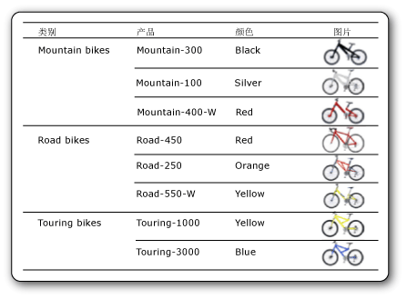

# 图像（报表生成器和 SSRS）
  图像是一种报表项，包含对嵌入在报表中、存储在数据库中、存储在报表服务器上或存储在 Web 上其他位置的图像的引用。 图像可以是数据行重复使用的图片。 您还可以将图像用作某些报表项的背景。  
  
 在服务器上存储徽标的想法很好，因为您可以在许多报表中使用相同的徽标。  
  
> [!NOTE]  
>  [!INCLUDE[ssRBRDDup](../../includes/ssrbrddup-md.md)]  
  
##   比较外部图像、嵌入图像和数据绑定图像  
 如果在报表中使用基于服务器的图像或其他外部图像，则该图像项会包含一个路径，指向位于报表服务器上的图像或 Web 上图像所在的位置。 但是，在使用嵌入图像时，图像数据存储在报表定义中，而不是作为独立的文件存在。  
  
 基于服务器的图像适合用作在多个报表或网页间共享的徽标和静态图片。 嵌入图像可确保图像始终对报表可用，但是嵌入图像不能共享。 含有外部图像的报表定义要比含有嵌入图像的报表定义小。  
  
 数据绑定图像还可以通过数据库中存储的二进制数据进行显示。 例如，在产品列表中产品名旁边显示的图片就属于数据库图像。 在下图中，自行车图像存储于数据库中并且在报表中检索，以便说明各产品。  
  
   
  
  
##   作为报表部件的图像  
 您可以将图像作为报表部件与报表分开保存。 [!INCLUDE[ssRBrptparts](../../includes/ssrbrptparts-md.md)]  
  
  
##   嵌入图像  
 您可以将图像嵌入报表，使所有的图像数据都存储在报表定义中。 嵌入图像时，将对该图像进行 MIME 编码，然后以文本形式将其存储到报表定义中。 使用嵌入图像可确保图像始终对报表可用，但它也会增大报表定义的大小。  
  
 有关嵌入图像的详细信息，请参阅 [在报表中嵌入图像（报表生成器和 SSRS）](../../reporting-services/report-design/embed-an-image-in-a-report-report-builder-and-ssrs.md)。  
  
  
##   外部图像  
 通过指定图像的 URL 可以在报表中包括存储的图像。 在报表中使用外部图像时，图像源设置为 **External** ，图像的值是该图像的 URL 地址或路径。  
  
 有关详细信息，请参阅[指定外部项的路径（报表生成器和 SSRS）](../../reporting-services/report-design/specifying-paths-to-external-items-report-builder-and-ssrs.md)。  
  
 当报表在报表生成器或报表设计器中运行时，预览将使用用户的凭据来显示图像。 当报表在报表服务器上运行时，如果服务器凭据没有足够权限来访问图像，则报表中的图像可能无法显示。 在此种情况下，请与系统管理员联系。  
  
 有关向报表添加外部图像的详细信息，请参阅 [添加外部图像（报表生成器和 SSRS）](../../reporting-services/report-design/add-an-external-image-report-builder-and-ssrs.md)。  
  
  
##   背景图像  
 您可以使用图像作为表体或者矩形框、文本框、列表，矩阵或表的背景图像。 背景图像与图像具有类似的属性。 您还可以指定如何重复图像来填充项的背景。  
  
> [!NOTE]  
>  某些呈现扩展插件（例如 HTML 呈现扩展插件）可以在表体、页眉和页脚中呈现表体的背景图像。 可以为页眉和页脚单独定义背景图像，但如果没有定义图像，则报表将使用表体的背景图像。 其他呈现扩展插件（例如图像呈现扩展插件）不能在页眉和页脚中呈现表体的背景图像。  
  
 有关添加背景图像的详细信息，请参阅 [添加背景图像（报表生成器和 SSRS）](../../reporting-services/report-design/add-a-background-image-report-builder-and-ssrs.md)。  
  
  
##   数据绑定图像  
 您可以向报表中添加存储于数据库中的图像。 您使用的图像报表项与静态图像所用的相同，但还需要使用一组指示该图像存储在数据库中的属性。 若要查看有关使用数据绑定图像的说明，请参阅 [添加数据绑定图像（报表生成器和 SSRS）](../../reporting-services/report-design/add-a-data-bound-image-report-builder-and-ssrs.md)。  
  
  
##   操作指南主题  
 [添加外部图像（报表生成器和 SSRS）](../../reporting-services/report-design/add-an-external-image-report-builder-and-ssrs.md)  
  
 [在报表中嵌入图像（报表生成器和 SSRS）](../../reporting-services/report-design/embed-an-image-in-a-report-report-builder-and-ssrs.md)  
  
 [添加背景图像（报表生成器和 SSRS）](../../reporting-services/report-design/add-a-background-image-report-builder-and-ssrs.md)  
  
 [添加数据绑定图像（报表生成器和 SSRS）](../../reporting-services/report-design/add-a-data-bound-image-report-builder-and-ssrs.md)  
  
  
## 另请参阅  
 [导出到图像文件（报表生成器和 SSRS）](../../reporting-services/report-builder/exporting-to-an-image-file-report-builder-and-ssrs.md)   
 [呈现行为 &#40;报表生成器和 SSRS &#41;](../../reporting-services/report-design/rendering-behaviors-report-builder-and-ssrs.md)  
  
  
