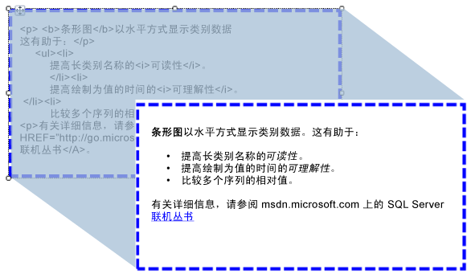

# 将 HTML 导入报表（报表生成器和 SSRS）
  可以使用文本框向报表中插入从数据集字段中检索到的 HTML 格式的文本。 文本可以来自于其计算结果为正确格式的 HTML 的任何简单或复杂表达式。 格式化文本可以呈现为支持的所有输出格式，包括 PDF。  
  
   
  
 下图显示了在报表设计视图中显示 HTML 格式的文本，以及在运行报表时所呈现的相同文本。  
  
> [!NOTE]  
>  导入包含 HTML 标记的文本时，文本框必须始终首先分析数据。 由于仅支持 HTML 标记的子集，因此在呈现报表中显示的 HTML 可能不同于您的原始 HTML。  
  
 若要快速开始使用，请参阅[教程：设置文本格式（报表生成器）](../../reporting-services/tutorial-format-text-report-builder.md)。  
  
> [!NOTE]  
>  [!INCLUDE[ssRBRDDup](../../includes/ssrbrddup-md.md)]  
  
## 支持的 HTML 标记  
 以下是作为占位符文本定义时将呈现为 HTML 标记的完整列表：  
  
-   超链接： \<HREF >  
  
-   字体：\<字体 >  
  
-   标头、 样式和块元素： \<H {n} >， \
，\<跨度 >，\
， \
， \<L >， \<HN >  
  
-   文本格式： \<B >，\<我 >， \<U >， \<S >  
  
-   列表处理： \<OL >， \<u L >， \<L >  
  
 在报表处理期间，将忽略任何其他 HTML 标记。 如果占位符文本中表达式所表示的 HTML 格式不正确，则将占位符呈现为纯文本。 所有 HTML 标记都不区分大小写。  
  
 如果文本框中的文本仅包含一个文本块，将以正确方式呈现占位符中用于定义块元素的任何 HTML。 但是，如果文本框具有多个文本块，则忽略 HTML 标记，并通过文本块定义文本结构。  
  
 如果为文本定义了一个以上的标记，并且 [!INCLUDE[ssRSnoversion](../../includes/ssrsnoversion-md.md)] 检测到 HTML 与现有报表约束冲突，则只有最内部的 HTML 标记被视为 HTML。  
  
 有关详细信息，请参阅[将 HTML 添加到报表（报表生成器和 SSRS）](../../reporting-services/report-design/add-html-into-a-report-report-builder-and-ssrs.md)。  
  
## 级联样式表属性的限制  
 使用级联样式表 (CSS) 属性时，仅定义一组基本标记。 以下是支持的属性列表：  
  
-   text-align、text-indent  
  
-   font-family  
  
-   font-size  
  
    -   仅支持采用绝对 CSS 长度单位的有效 RDL 大小值。 支持的单位为：in、cm、mm、pt、pc。  
  
    -   忽略相对 CSS 长度单位，不支持它们。 不支持的单位包括 em、ex、px、%、rem。  
  
     有关 CSS 单位的详细信息，请参阅 [CSS Values and Units Reference](http://msdn.microsoft.com/library/ms531211\(VS.85\).aspx) （CSS 值和单位参考）(http://msdn.microsoft.com/library/ms531211(VS.85).aspx)。  
  
-   color  
  
-   padding、padding-bottom、padding-top、padding-right、padding-left  
  
-   font-weight  
  
 以下是使用 CSS 的一些注意事项：  
  
-   格式不正确的 CSS 值和 HTML 的忽略方式相同。  
  
-   如果同一标记中存在特性和 CSS 样式特性，则 CSS 属性具有较高优先级。 例如，如果你的文本为 **\
**、 将应用仅 text-align 属性和文本将是右对齐。  
  
-   对于特性和 CSS 样式，如果多次指定某一属性，则仅应用该属性的最后一个实例。 例如，如果你的文本为 **\
**，文本将是右对齐。  
  
## 另请参阅  
 [以 HTML 格式呈现（报表生成器和 SSRS）](../../reporting-services/report-builder/rendering-to-html-report-builder-and-ssrs.md)  
  
  

