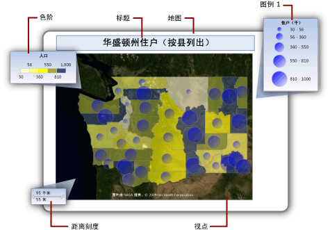
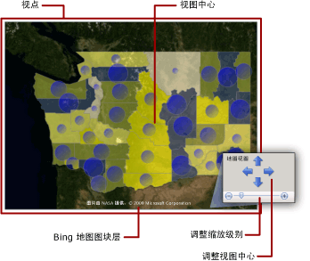
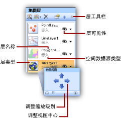

# 地图（报表生成器和 SSRS）
  若要针对地理背景实现业务数据的可视化，可以向 [!INCLUDE[ssRSnoversion_md](../../includes/ssrsnoversion-md.md)] 分页报表添加地图。 您选择的地图类型取决于您要在报表中传达的信息。 您可以添加只显示位置的地图、气泡地图（气泡大小随着某地区的家庭数量而变化）、标记地图（标记样式随每个商店盈利情况最好的产品而变化）或线条地图（显示商店之间的路线）。  
  
 地图包含标题、指定中心点和刻度的视区、一个用于视区的最佳 Bing 地图图块背景、一个或多个显示空间数据的层以及各种帮助用户解释数据可视化效果的图例。 下图显示了地图的基本组成部分。  
  
   
  
 若要开始立即使用地图，请参阅[教程：地图报表（报表生成器）](../../reporting-services/tutorial-map-report-report-builder.md)或[报表示例（报表生成器和 SSRS）](http://go.microsoft.com/fwlink/?LinkId=198283)。  
  
> [!NOTE]  
>  可以将地图作为报表部件与报表分开保存。 阅读有关 [报表部件](../../reporting-services/report-design/report-parts-report-builder-and-ssrs.md)的详细信息。  
  
##   向报表添加地图  
 若要将地图添加到报表，请参阅下面给出的一般步骤列表：  
  
-   确定您要显示哪些分析数据以及您需要哪些类型的空间数据。 例如，若要在气泡图上显示相关的商店年销售额，您需要用于分析数据的商店名称和商店销售额以及用于空间数据的商店名称和商店位置（如经度和纬度）。  
  
-   决定您所需的地图样式。 基本图只显示位置。 气泡图的气泡大小根据单个分析值而发生变化。 分析颜色图的地图元素随着分析数据的范围而发生变化。 您选择的样式同时取决于您要实现可视化的数据和您使用的空间数据的类型。  
  
-   收集您指定空间数据源、空间数据、分析数据源和分析数据所必须具有的信息。 这包括到空间数据源的连接字符串，指定您所需的空间数据类型，以及确保报表数据包含将空间数据与分析数据关联起来的匹配字段。  
  
-   运行地图向导以便向报表中添加地图。 这可以将第一个地图层添加到地图。 运行地图层向导以创建其他层或者修改现有层。 这些向导提供了简单的方法供您开始。 有关详细信息，请参阅 [地图向导和地图层向导（报表生成器和 SSRS）](../../reporting-services/report-design/map-wizard-and-map-layer-wizard-report-builder-and-ssrs.md)。  
  
-   当您在报表中预览地图之后，您可能要调整地图视图，更改数据改变每层显示的方式，提供图例以帮助用户解释数据，以及调整分辨率来为用户提供良好的查看体验。  
  
 有关详细信息，请参阅 [规划地图报表（报表生成器和 SSRS）](../../reporting-services/report-design/plan-a-map-report-report-builder-and-ssrs.md)。  
  
##   向地图添加数据  
 地图使用两类数据：空间数据和分析数据。 空间数据定义地图的外观，而分析数据提供与地图关联的值。 例如，空间数据定义某个地区中各市县的位置，而分析数据提供每个市县的人口数。  
  
 地图必须具有空间数据；分析数据是可选的。 例如，您可以添加一个地图，该地图只显示某个市县的商店位置。  
  
 若要对地图上的数据实现可视化效果，分析数据与空间数据必须具有某种关系。 当空间数据和分析数据来自同一个源时，关系是已知的。 当空间数据和分析数据来自不同源时，必须指定匹配字段以使它们相关。  
  
### 空间数据  
 空间数据由一系列坐标组成。 来自数据源的空间数据可以是单个点、多个点、单一线条、多个线条或一组多边形。 每组坐标定义一个“地图元素” ，例如，表示国家/地区轮廓的多边形、表示道路的线条或表示市县所在位置的点。  
  
 空间数据基于以下坐标系之一：  
  
-   **地理** ：通过使用经度和纬度，在球面上指定测地学坐标。 当空间数据为地理坐标时，必须指定投影。 投影是一系列规则，用于指定如何将具有球坐标的物体绘制到平面上。 只能比较或组合具有相同投影的地理数据。  
  
-   **平面数据** ：通过使用 X 和 Y，在平面上指定几何坐标。  
  
 每个地图层都显示一种类型的空间数据：多边形、线条或点。 若要显示多种类型的空间数据，请向地图添加多个层。 还可以添加由 Microsoft Bing 地图图块组成的层。 图块层不依赖于空间数据。 图块层显示与地图视区的坐标相对应的图像图块。  
  
#### 空间数据的来源  
 支持以下空间数据源：  
  
-   **地图库报表。** 空间数据嵌入在位于地图库中的报表内。 默认情况下，地图库安装在*\<驱动器 >*: files\microsoft SQL Server\Report 生成器 \MapGallery。  
  
    > [!NOTE]  
    >  这一 [!INCLUDE[ssRSnoversion](../../includes/ssrsnoversion-md.md)] 地图功能使用的数据来自经美国人口人口调查局开发 ([http://www.census.gov/](http://www.census.gov/))。 TIGER/Line 形状文件是从 Census MAF/TIGER 数据库中精选的地理和制图信息的摘录。 TIGER/Line 形状文件可以从美国人口普查局免费获得。 若要获取有关 TIGER/Line 形状文件的详细信息，请访问 [http://www.census.gov/geo/www/tiger](http://www.census.gov/geo/www/tiger)。 TIGER/Line 形状文件中的边界信息仅用于统计数据收集和制表目的；其中用于统计目的的描述和名称不构成对于司法机构、所有权或享有权利的界定，它们不是法律上关于领土的说明。 Census TIGER 和 TIGER/Line 是美国人口普查局的注册商标。  
  
-   **ESRI 形状文件。** ESRI 形状文件包含符合 Environmental Systems Research Institute, Inc. (ESRI) 形状文件空间数据格式的数据。 ESRI 形状文件指一组文件。 .shp 文件中的数据指定地理或几何形状。 .dbf 文件中的数据提供形状的属性。 若要在设计视图中查看地图或从报表服务器运行地图，这两个文件必须位于同一个文件夹中。 当您从本地文件系统上的 .shp 文件添加空间数据时，空间数据将嵌入到报表中。 若要在运行时动态检索空间数据，请将形状文件上载到您的报表服务器中，然后将它们指定为空间数据源。 有关详细信息，请参阅 [Finding ESRI Shapefiles for a Map](http://go.microsoft.com/fwlink/?linkid=178814)（查找用于地图的 ESRI 形状文件）。  
  
-   **存储在数据库中的 SQL Server 空间数据。** 可以使用一个查询，该查询从 **关系数据库中指定** SQLGeometry **或** SQLGeography [!INCLUDE[ssNoVersion](../../includes/ssnoversion-md.md)] 数据类型。 有关详细信息，请参阅 [SQL Server 联机丛书](../../relational-databases/spatial/spatial-data-types-overview.md) 中的 [空间数据类型概述](http://go.microsoft.com/fwlink/?linkid=98335)。  
  
     在您从查询设计器中看到的结果集中，每行空间数据都被视为一个单位并存储在单个地图元素中。 例如，如果多个点是在结果集的一行中定义的，则显示属性将应用于该地图元素中的所有点。  
  
-   **您创建的自定义位置。** 可以手动将位置作为嵌入点添加到嵌入点层。 有关详细信息，请参阅 [向地图添加自定义位置（报表生成器和 SSRS）](../../reporting-services/report-design/add-custom-locations-to-a-map-report-builder-and-ssrs.md)。  
  
#### 设计视图中的空间数据  
 在设计视图中，报表处理器显示示例空间数据，以帮助您设计地图层。 您看到的数据取决于空间数据的可用性：  
  
-   **嵌入的数据。** 从嵌入报表的地图层中的地图元素检索示例数据。  
  
-   **链接到 ESRI 形状文件。** 如果提供了 ESRI 形状文件 (.shp) 和支持文件 (.dbf)，则从形状文件中加载示例数据。 否则，报表处理器生成示例数据并显示消息 **“没有可用的空间数据”**。  
  
-   **SQL Server 空间数据。** 如果数据源可用且凭据有效，则从数据库的空间数据中加载示例数据。 否则，报表处理器生成示例数据并显示消息 **“没有可用的空间数据”**。  
  
#### 在报表定义中嵌入空间数据  
 与分析数据不同，您可以选择在报表定义中嵌入地图层的空间数据。 当您嵌入空间数据时，您将嵌入在地图层中使用的地图元素。  
  
 嵌入元素增加报表定义的大小，但确保当报表运行时空间数据始终可用（无论是在预览中还是在报表服务器上）。 数据越多，表明存储空间越大，处理时间越长。 将空间数据限制为只限报表需要的信息（除了其他报表数据外）始终是一个好做法。  
  
#### 在运行时控制地图分辨率  
 当您更改空间数据的分辨率时，您是在指定在地图上绘制线条的详细程度。 例如，对于面积，您是需要将粒度降到地球上百米的表面积，还是一英里就足够详细了？  
  
 如果在报表中嵌入了空间数据，则您使用的分辨率将影响报表定义中的地图元素数。 分辨率提高将增加以该分辨率绘制边界所需的元素数。 如果报表中未嵌入空间数据，则报表服务器在您每次查看报表时，都将计算以该分辨率绘制边界所需的线条数。 若要设计一个报表以便在显示分辨率与可接受的呈现时间之间达到平衡，应将地图分辨率简化为在报表中实现分析数据的可视化所需的详细程度。  
  
### 分析数据  
 分析数据是您要在地图上实现可视化的数据，例如，市县的人口数或商店的总销售额。 分析数据可以来自以下源之一：  
  
-   **数据集字段：** 来自“报表数据”窗格中某个数据集的字段。  
  
-   **空间数据源字段：** 空间数据源中随空间数据提供的字段。 例如，ESRI 形状文件常常同时包含空间数据和分析数据。 来自空间数据源的字段名称以 # 开始，当您为某层的规则指定数据字段时，这些字段将出现在字段下拉列表中。  
  
-   **地图元素的嵌入数据：** 在报表中嵌入多边形、线条或点之后，您可以针对单独的地图元素覆盖数据字段并设置自定义值。  
  
 当为层指定规则并选择分析数据字段时，如果数据类型为数值，则报表处理器将自动使用默认函数 Sum 来计算地图元素的聚合值。 如果字段不是数值，则不指定聚合函数，而是使用隐式聚合函数 First。 若要更改默认表达式，请针对层的规则更改选项。 有关详细信息，请参阅 [按规则和分析数据更改多边形、线条和点的显示方式（报表生成器和 SSRS）](../../reporting-services/report-design/vary-polygon-line-and-point-display-by-rules-and-analytical-data.md)。  
  
### 匹配字段  
 若要将分析数据与层上的地图元素相关，必须指定“匹配字段” 。 可以使用匹配字段在地图元素与分析数据之间建立关系。 可以使用一个或多个字段来进行匹配，只要它们能够为每个空间位置指定唯一的分析值。  
  
 例如，对于气泡大小随市县人口数发生变化的气泡图，需要下面的数据：  
  
-   从空间数据源：  
  
    -   **SpatialData。** 具有指定城市经纬度的空间数据字段。  
  
    -   **名称：** 具有市县名称的字段。  
  
    -   **区域：** 具有区域名称的字段。  
  
-   从分析数据源：  
  
    -   **人口数：** 具有市县人口数的字段。  
  
    -   **市县：** 具有市县名称的字段。  
  
    -   **区域：** 具有区域、省/市/自治区或地区名称的字段。  
  
 在本例中，只靠市县名称不足以唯一标识人口数。 例如，在美国有多个市县的名称为 Albany。 若要指定特定市县，必须指定地区以及市县名称。  
  
##   了解地图视区  
 在为报表指定地图数据之后，可以通过指定地图“视区” 来限制地图的显示区域。 默认情况下，视区为整个地图的区域。 若要裁剪地图，可以指定中心、缩放级别以及最大和最小坐标，以定义要在报表中包含的区域。 若要改进地图在报表中的显示，可以将图例、距离刻度和色阶移到视区之外。 下图显示一个视区：  
  
   
  
##   添加 Bing 地图图块层  
 您可以为 Bing 地图图块添加一个层，以便为由视区定义的当前地图视图提供地理背景。 若要添加图块层，必须指定 **“地理”** 坐标系和投影类型 **Mercator**。 将自动从 Bing 地图 Web 服务中检索与您选择的视区中心和缩放级别匹配的图块。  
  
 可通过指定下列选项自定义层：  
  
-   图块类型。 支持以下样式：  
  
    -   **道路：** 显示道路地图样式，它具有白色背景、道路和标签文本。  
  
    -   **空中：** 显示空中图像样式（无文本）。  
  
    -   **混合：** 显示 **“道路”** 和 **“空中”** 样式的组合。  
  
-   用于图块上的显示文本的语言。  
  
-   是否使用安全连接从 Bing 地图 Web 服务检索图块。  
  
 有关分步说明，请参阅 [添加、更改或删除地图或地图层（报表生成器和 SSRS）](../../reporting-services/report-design/add-change-or-delete-a-map-or-map-layer-report-builder-and-ssrs.md)。  
  
 有关图块的详细信息，请参阅 [Bing 地图图块系统](http://go.microsoft.com/fwlink/?linkid=147315)。 有关在报表中使用 Bing 地图图块的详细信息，请参阅 [其他使用条款](http://go.microsoft.com/fwlink/?LinkId=151371)。  
  
##   了解地图层和地图元素  
 一个地图可以具有多个层。 有三种类型的层。 每层显示一种类型的空间数据：  
  
-   **多边形层：** 显示区域的轮廓或对于多边形中心点显示标记，这是针对每个多边形自动计算的。  
  
-   **线条层：** 对于路径或路线显示线条。  
  
-   **点层：** 对于点位置显示标记。  
  
 当您为层指定空间数据源时，向导将检查空间数据字段并基于其类型设置层类型。 对于数据源中的每个值，向层中添加一个地图元素。  
  
 例如，若要显示从中央仓库到商店的交货路线，您可以添加两个层：具有图钉标记以显示商店位置的点层和显示从该仓库到每个商店的交货路线的线条层。 点层需要用于指定商店位置的“点”空间数据，而线条层需要用于指定交货路线的“线条”空间数据。  
  
 第四种层类型为图块层。 图块层添加与地图视区中心和缩放级别相符的 Bing 地图图块背景。  
  
 若要使用层，请在报表设计图面上选择一个地图以显示“地图”窗格。 “地图”窗格显示为地图定义的层列表。 使用此窗格可以选择某个层，以便更改选项，更改层的绘制顺序，添加层或运行“地图层”向导，隐藏或显示某个层，以及更改地图视区的视图中心和缩放级别。 下图显示一个视区：  
  
   
  
 有关地图层的详细信息，请参阅 [添加、更改或删除地图或地图层（报表生成器和 SSRS）](../../reporting-services/report-design/add-change-or-delete-a-map-or-map-layer-report-builder-and-ssrs.md)。  
  
### 改变点、线条和多边形的显示属性  
 可以在层级别通过对该层使用规则或对单独的元素设置地图元素的显示选项。 例如，您可以为层上的所有点设置显示属性；也可以设置规则来控制层上所有点的显示属性（无论它们是否为嵌入的点）；还可以覆盖特定嵌入点的显示属性设置。  
  
 当您查看报表时，您看到的显示值由此层次结构控制并按升序列出。 数字越大，优先级越高：  
  
1.  **层属性：** 适用于整个层的属性。 例如，使用层属性设置分析数据的源或整个层的可见性。  
  
2.  **多边形、线条、点属性以及嵌入的多边形、线条、点属性：** 应用于层上所有地图元素的属性，无论元素来自动态空间数据还是嵌入的空间数据。 例如，使用多边形中心点属性将气泡的填充颜色设置为某个渐变效果，此效果从上到下填充气泡区域，颜色从深蓝渐变到浅蓝。  
  
3.  **颜色规则、大小规则、宽度规则、标记类型规则：** 当某个层具有的地图元素与分析数据具有某种关系时，规则将属性应用于该层。 规则的类型随层类型而异。 例如，使用点大小规则以基于人口数改变气泡大小。  
  
4.  **覆盖嵌入多边形、线条或点属性：** 对于嵌入地图元素，可以选择覆盖选项并更改任何属性或数据值。 您所做的任何用于覆盖单独元素的规则的更改都是不可逆的。 例如，您可以使用图钉标记来突出显示特定的商店。  
  
 有关详细信息，请参阅 [按规则和分析数据更改多边形、线条和点的显示方式（报表生成器和 SSRS）](../../reporting-services/report-design/vary-polygon-line-and-point-display-by-rules-and-analytical-data.md)。  
  
 除了改变地图元素的外观之外，还可以通过以下方式向点、线条和多边形或层添加交互性：  
  
-   创建工具提示，以便在用户将指针悬停在地图上时提供地图元素的附加详细信息。  
  
-   添加钻取操作以链接到报表中的其他位置、其他报表或网页。  
  
-   在表达式中添加定义层可见性的参数，以使用户能够显示或隐藏特定的地图层。  
  
 有关详细信息，请参阅[交互式排序、文档结构图和链接（报表生成器和 SSRS）](../../reporting-services/report-design/interactive-sort-document-maps-and-links-report-builder-and-ssrs.md)。  
  
##   了解地图图例、色阶和距离刻度  
 可以向报表中添加各种图例以帮助用户解释地图。 地图可以包含以下各项：  
  
-   **图例：** 您可以创建多个图例。 将根据您为每个层上的地图元素指定的规则，自动生成图例中列出的项。 对于每个规则，您可以指定用于显示其相关项的图例。 通过这种方法，您可以将来自多个层的项分配给同一图例或不同图例。  
  
-   **色阶：** 您可以创建一个色阶。 作为为颜色规则提供图例的另一种方法，您可以在色阶中显示颜色规则的项。 多个颜色规则可以应用于此色阶。  
  
-   **距离刻度：** 可以显示一个距离刻度。 距离刻度同时用公里和英里为当前地图视图显示刻度。  
  
 您可以将图例、色阶和距离刻度定位在视区内外的不连续位置。 有关详细信息，请参阅 [更改地图图例、色阶和关联的规则（报表生成器和 SSRS）](../../reporting-services/report-design/change-map-legends-color-scale-and-associated-rules-report-builder-and-ssrs.md)。  
  
##   排除地图故障  
 地图报表使用的空间数据和分析数据来自各种数据源。 每个地图层都可能使用不同的数据源。 每个层的显示属性遵循特定的优先顺序（基于层属性、规则和地图元素属性）。  
  
 如果您查看地图报表时看不到所需的结果，其根源可能是各种问题。 为了帮助您隔离和了解每个问题，一次处理一个层肯定会有所帮助。 使用“地图”窗格可以选择层并轻松地切换其可见性。  
  
 有关地图报表问题的详细信息，请参阅 [报表故障排除：地图报表（报表生成器和 SSRS）](../../reporting-services/report-design/troubleshoot-reports-map-reports-report-builder-and-ssrs.md)  
  
##   操作指南主题  
 本部分列出的过程分步向您介绍如何在报表中使用地图和地图层。  
  
-   [添加、更改或删除地图或地图层（报表生成器和 SSRS）](../../reporting-services/report-design/add-change-or-delete-a-map-or-map-layer-report-builder-and-ssrs.md)  
  
-   [更改地图图例、色阶和关联的规则（报表生成器和 SSRS）](../../reporting-services/report-design/change-map-legends-color-scale-and-associated-rules-report-builder-and-ssrs.md)  
  
-   [向地图添加自定义位置（报表生成器和 SSRS）](../../reporting-services/report-design/add-custom-locations-to-a-map-report-builder-and-ssrs.md)  
  
##   本节内容  
 [规划地图报表（报表生成器和 SSRS）](../../reporting-services/report-design/plan-a-map-report-report-builder-and-ssrs.md)  
  
 [地图向导和地图层向导（报表生成器和 SSRS）](../../reporting-services/report-design/map-wizard-and-map-layer-wizard-report-builder-and-ssrs.md)  
  
 [自定义地图或地图层的数据和显示（报表生成器和 SSRS）](../../reporting-services/report-design/customize-the-data-and-display-of-a-map-or-map-layer-report-builder-and-ssrs.md)  
  
 [按规则和分析数据更改多边形、线条和点的显示方式（报表生成器和 SSRS）](../../reporting-services/report-design/vary-polygon-line-and-point-display-by-rules-and-analytical-data.md)  
  
 [添加、更改或删除地图或地图层（报表生成器和 SSRS）](../../reporting-services/report-design/add-change-or-delete-a-map-or-map-layer-report-builder-and-ssrs.md)  
  
 [更改地图图例、色阶和关联的规则（报表生成器和 SSRS）](../../reporting-services/report-design/change-map-legends-color-scale-and-associated-rules-report-builder-and-ssrs.md)  
  
 [向地图添加自定义位置（报表生成器和 SSRS）](../../reporting-services/report-design/add-custom-locations-to-a-map-report-builder-and-ssrs.md)  
  
 [报表故障排除：地图报表（报表生成器和 SSRS）](../../reporting-services/report-design/troubleshoot-reports-map-reports-report-builder-and-ssrs.md)  
  
  
