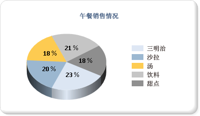

# 饼图（报表生成器和 SSRS）
  饼图和圆环图将数据显示为整体的一定比例。 饼图常用于在各组之间进行比较。 饼图和圆环图与棱锥图和漏斗图一起构成了一组称为形状图的图表。 形状图没有轴。 在形状图上放置某数值字段后，该图表将计算每个值相对总计的百分比。 有关形状图的详细信息，请参阅[形状图（报表生成器和 SSRS）](../../reporting-services/report-design/shape-charts-report-builder-and-ssrs.md)。  
  
 下图显示了带有百分比格式的数据标签的三维饼图。  图例位于右侧中间位置。  
  
   
  
> [!NOTE]  
>  [!INCLUDE[ssRBRDDup](../../includes/ssrbrddup-md.md)]  
  
## 变体  
  
-   **分离型饼图**。 所有切片均从饼图中心向外发散的饼图。 除分离型饼图（其中所有切片都是分离的）之外，您还可以创建分离型切片图，在其中只会标注一片切片。  
  
-   **圆环图**。 中心为空的饼图。  
  
-   **分离型圆环图**。 所有切片均从圆环图中心向外发散的圆环图。  
  
-   **三维饼图**。 应用了三维样式的饼图。  
  
-   **三维分离型饼图**。 应用了三维样式的分离型饼图。  
  
## 针对饼图显示的数据注意事项  
  
-   饼图的视觉效果较好，因此常用于报表中。 但是，饼图是一种非常简单化的图表类型，可能无法最好地表示数据。 仅当数据聚合成七个数据点或更少数据点后，才考虑使用饼图。  
  
-   饼图将每个数据组均显示为图表上的单独切片。 必须向饼图中至少添加一个数据字段和一个类别字段。 如果向饼图中添加多个数据字段，则饼图会在同一个图表中显示这些数据字段。  
  
-   当计算比率时，Null 值、空值、负值和零值均无效。 因此，这些值不会显示在饼图中。 若要将这些类型的值显示在图表中，需将图表类型更改为除饼图外的其他类型。  
  
-   若要使用自定义调色板在饼图上定义自己的颜色，请确保调色板中有足够的颜色，从而均用唯一的颜色显示各个数据点。 有关详细信息，请参阅 [设置图表上序列颜色的格式（报表生成器和 SSRS）](../../reporting-services/report-design/formatting-series-colors-on-a-chart-report-builder-and-ssrs.md)。  
  
-   与大多数其他图表类型不同的是，饼图将在其图例中显示各个数据点，而不是各个序列。  
  
-   饼图至少需要两个值才能在各部分之间进行有效比较。 如果您的饼图仅包含一种颜色，请确认已添加一个类别字段作为分组依据。 如果饼图不包含类别，则会将数据字段中的值聚合为一个值并显示出来。  
  
-   与其他所有图表类型一样，饼图根据默认调色板中包含的颜色值生成颜色。 在报表中使用多个饼图时，此方法可能导致不同的饼图对数据点所使用的颜色不同。 如果报表中具有多个饼图，最好为每个类别组手动设定颜色以在不同图表之间保持一致的颜色。 有关如何在图表上定义颜色的详细信息，请参阅 [设置图表上序列颜色的格式（报表生成器和 SSRS）](../../reporting-services/report-design/formatting-series-colors-on-a-chart-report-builder-and-ssrs.md)。  
  
## 对饼图应用绘制样式  
 您可以向饼图添加特殊的绘制样式以增强其视觉效果。 绘制样式包括凹凸效果和凹陷效果。 这些效果仅可在二维饼图上使用。 下图显示了饼图上的凹凸绘制样式和凹陷绘制样式示例。  
  
   
  
 有关详细信息，请参阅[向图表添加凹凸效果、阳文和纹理样式（报表生成器和 SSRS）](../../reporting-services/report-design/chart-effects-add-bevel-emboss-or-texture-report-builder.md)。  
  
## 在饼图上显示百分比值  
 与其他形状图类似，饼图表示整体的各部分比例。 因此，通常将饼图标签设置为百分比格式。 为与其他图表类型保持一致，默认情况下图表不显示百分比标签。 有关如何在图表上将值显示为百分比的详细信息，请参阅 [在饼图上显示百分比值（报表生成器和 SSRS）](../../reporting-services/report-design/display-percentage-values-on-a-pie-chart-report-builder-and-ssrs.md)。 有关如何在报表中将数字设置为百分比格式的详细信息，请参阅[设置数字和日期格式（报表生成器和 SSRS）](../../reporting-services/report-design/formatting-numbers-and-dates-report-builder-and-ssrs.md)。  
  
   
  
## 防止饼图上的标签重叠  
 如果饼图上有许多数据点，数据标签将会重叠。 有几种方法可避免标签重叠：  
  
-   减小数据点标签的字号。  
  
-   增加图表的宽度和高度，从而为标签留出更多空间。  
  
-   在图表区域之外显示饼图标签。 有关详细信息，请参阅 [在饼图外显示数据点标签（报表生成器和 SSRS）](../../reporting-services/report-design/display-data-point-labels-outside-a-pie-chart-report-builder-and-ssrs.md)。  
  
-   将较小的饼图切片收集到一个切片中。  
  
## 合并饼图上的小切片  
 饼图中的点数量过多时，数据会变得模糊，难以辨认。 如果数据中有许多小数据点，可采用以下两种方法来收集多个饼图切片：  
  
-   将较小的数据切片收集到饼图的一个切片中。 这在一些情况下非常有用，例如，希望饼图具有一个只收集剩余数据的“其他”数据点。 有关详细信息，请参阅 [收集饼图上的小切片（报表生成器和 SSRS）](../../reporting-services/report-design/collect-small-slices-on-a-pie-chart-report-builder-and-ssrs.md)。  
  
-   将小切片收集到增补饼图中。 第二个饼图不会显示在设计器中。 而在报表处理期间，图表会基于数据点的值计算是否需要显示第二个饼图。 如果需要显示第二个饼图，则值将会添加到另一个饼图中。  
  
## 另请参阅  
 [在饼图外显示数据点标签（报表生成器和 SSRS）](../../reporting-services/report-design/display-data-point-labels-outside-a-pie-chart-report-builder-and-ssrs.md)   
 [收集饼图上的小切片（报表生成器和 SSRS）](../../reporting-services/report-design/collect-small-slices-on-a-pie-chart-report-builder-and-ssrs.md)   
 [在饼图上显示百分比值（报表生成器和 SSRS）](../../reporting-services/report-design/display-percentage-values-on-a-pie-chart-report-builder-and-ssrs.md)   
 [教程：向报表添加饼图（报表生成器）](../../reporting-services/tutorial-add-a-pie-chart-to-your-report-report-builder.md)   
 [设置图表上图例的格式（报表生成器和 SSRS）](../../reporting-services/report-design/chart-legend-formatting-report-builder.md)   
 [图表中的空点和 Null 数据点（报表生成器和 SSRS）](../../reporting-services/report-design/empty-and-null-data-points-in-charts-report-builder-and-ssrs.md)   
 [设置图表上序列颜色的格式（报表生成器和 SSRS）](../../reporting-services/report-design/formatting-series-colors-on-a-chart-report-builder-and-ssrs.md)  
  
  
