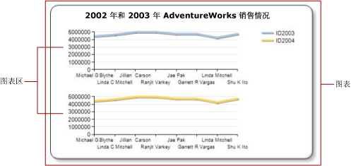

# 指定序列的图表区（报表生成器和 SSRS）
  在 [!INCLUDE[ssRSnoversion_md](../../includes/ssrsnoversion-md.md)] 分页报表中，“图表”为包括外部边框、图表标题和图例的顶级容器。 默认情况下，图表包含一个“图表区域”。 图表区在图表表面上不可见，但您可将图表区当作只包含轴标签、轴标题和一个或多个序列的绘图区的容器。 下图说明了单个图表中的多个图表区的概念。  
  
   
  
 默认情况下，所有序列都将添加到默认图表区。 使用面积图、柱形图、折线图和散点图时，这些序列的任何组合均可显示在同一图表区上。 如果您在同一图表区拥有多个序列，则图表的可读性将会下降。 最好将图表类型分为多个图表区。 使用多个图表区将提高可读性以更易于进行比较。 例如，价量股票图表通常具有不同范围的值，但可以在同一时期在价格和数量数据之间进行比较。  
  
 条形图序列、极坐标图序列或形状序列只能与同一图表区中相同图表类型的序列组合。 如果您使用极坐标图图表或形状图表，请考虑为希望显示的各个字段使用单独的图表数据区域。  
  
> [!NOTE]  
>  [!INCLUDE[ssRBRDDup](../../includes/ssrbrddup-md.md)]  
  
## 将序列与新的图表区相关联  
  
1.  右键单击图表上的任意位置并选择“添加新图表区域”。 图表上将出现一个新的空白图表区。  
  
2.  右键单击图表上的序列或右键单击“图表数据”窗格中的相应区域中的序列或数据字段，然后单击“序列属性”。  
  
3.  在 **“轴和图表区”** 中，选择要在其中显示序列的图表区。  
  
4.  （可选）将图表区垂直对齐。 若要执行此操作，请右键单击图表并选择“图表区域属性”。 在 **“对齐”** 中，选择要将选中的图表区与其对齐的另一图表区。  
  
## 另请参阅  
 [图表中的多个序列（报表生成器和 SSRS）](../../reporting-services/report-design/multiple-series-on-a-chart-report-builder-and-ssrs.md)   
 [设置图表上数据点的格式（报表生成器和 SSRS）](../../reporting-services/report-design/formatting-data-points-on-a-chart-report-builder-and-ssrs.md)   
 [使用调色板定义图表上的颜色（报表生成器和 SSRS）](../../reporting-services/report-design/define-colors-on-a-chart-using-a-palette-report-builder-and-ssrs.md)   
 [极坐标图（报表生成器和 SSRS）](../../reporting-services/report-design/polar-charts-report-builder-and-ssrs.md)   
 [形状图（报表生成器和 SSRS）](../../reporting-services/report-design/shape-charts-report-builder-and-ssrs.md)   
 [饼图&#40;报表生成器和 SSRS&#41;](../../reporting-services/report-design/pie-charts-report-builder-and-ssrs.md)  
  
  
