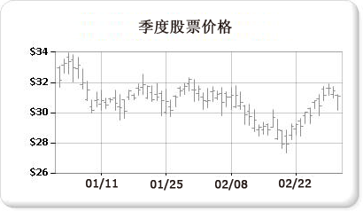

# 股价图（报表生成器和 SSRS）

  股价图是为每个数据点使用多达四个值的财务或科学数据而专门设计的。 这些值与用于绘制财务股价数据的高、低、开盘和收盘值相对应。 这种图表类型通过使用标记（通常为线条或三角形）来显示开盘值和收盘值。 在下例中，开盘值由左侧的标记表示，收盘值由右侧的标记表示。  
  
   
  
 股价图的示例可用作报表生成器报表示例。 有关下载此示例报表和其他内容的详细信息，请参阅 [报表生成器和报表设计器示例报表](http://go.microsoft.com/fwlink/?LinkId=198283)。  
  
> [!NOTE]  
>  [!INCLUDE[ssRBRDDup](../../includes/ssrbrddup-md.md)]  
  
## 变体  
  
-   **K 线图**。 K 线图是一种专用形式的股价图，其中的框用于说明开盘值与收盘值之间的范围。 与股价图相似，K 线图可以针对每个数据点显示多达四个值。  
  
## 股价图的数据注意事项  
  
-   当显示多个股价数据点（例如年股价趋势）时，若要区分每个数据点的每个开盘值、收盘值、高值和低值，这是十分困难的。 此时应考虑使用折线图而不是股价图。  
  
-   当生成轴标签时，标记通常从零开始。  一般而言，股价与其他数据集的波动程度不同。 因此，可能希望禁用从零开始的轴标签，以便获得更好的数据视图。 若要实现此目的，请在 **“轴属性”** 或“属性”窗口中将 **IncludeZero** 设置为 **false** 。 有关图表如何生成轴标签的详细信息，请参阅[设置图表上轴标签的格式（报表生成器和 SSRS）](../../reporting-services/report-design/formatting-axis-labels-on-a-chart-report-builder-and-ssrs.md)。  
  
-   [!INCLUDE[ssRSnoversion](../../includes/ssrsnoversion-md.md)] 提供了许多用于股价图的计算公式，包括价格指标、相对强弱指数、MACD 等。  

## 后续步骤

[全距图](../../reporting-services/report-design/range-charts-report-builder-and-ssrs.md)   
[图表](../../reporting-services/report-design/charts-report-builder-and-ssrs.md)   
[设置图表的格式](../../reporting-services/report-design/formatting-a-chart-report-builder-and-ssrs.md)   
[“轴属性”对话框 ->“轴选项”](http://msdn.microsoft.com/library/b276e210-7a12-48ae-971b-7dabae51df11)  

更多疑问？ [请访问 Reporting Services 论坛](http://go.microsoft.com/fwlink/?LinkId=620231)
