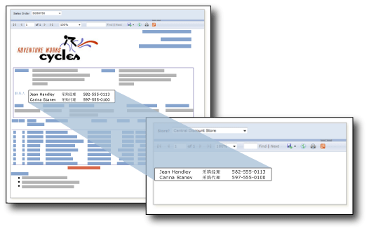

# 子报表（报表生成器和 SSRS）
  子报表是在主报表的表体中显示其他报表的报表项。 从概念上说，报表中的子报表类似于网页中的框架。 子报表用于在报表中嵌入另一个报表。 任何报表都可以用作子报表。 显示为子报表的报表存储在报表服务器上，通常与父报表在同一文件夹中。 您可以设计父报表，以便向子报表传递参数。 可以在数据区域中重复子报表，使用参数在子报表的每个实例中筛选数据。  
  
> [!NOTE]  
>  如果在 Tablix 数据区域中使用子报表，将为每一行处理子报表及其参数。 如果存在多行，可考虑采用钻取报表是否更为合适。  
  
   
  
 在此图中，显示在 Sales Order 主报表中的联系人信息实际上来自于 Contacts 子报表。  
  
> [!NOTE]  
>  [!INCLUDE[ssRBRDDup](../../includes/ssrbrddup-md.md)]  
  
## 比较子报表和嵌套数据区域  
 如果您打算使用子报表来显示单独数据组，请考虑改用数据区域，例如表、矩阵和图表。 仅包含数据区域的报表的性能优于包含子报表的报表。  
  
 使用数据区域可以在一个数据区域内嵌套来自同一数据源的数据组。 使用子报表可以在一个数据区域内嵌套来自不同数据源的数据组、在多个父报表中重复使用某个子报表，或者在另一个报表中显示独立的报表。 例如，通过在另一个报表的表体内放置多个子报表，可以创建“摘要簿”。  
  
 数据区域的功能和灵活性与子报表相差无几，但性能更佳。 由于报表服务器将子报表的每个实例作为独立的报表来处理，因此性能可能会受到影响。 有关详细信息，请参阅 [嵌套数据区域（报表生成器和 SSRS）](../../reporting-services/report-design/nested-data-regions-report-builder-and-ssrs.md)。  
  
## 在子报表中使用参数  
 若要将参数从父报表传递给子报表，请在用作子报表的报表中定义报表参数。 在父报表中放入子报表时，您可以选择报表参数以及要从父报表传递给子报表中的报表参数的值。  
  
> [!NOTE]  
>  从子报表中选择的参数是报表参数，而不是查询参数。  
  
 可以将子报表放入报表的主体或数据区域中。 如果将子报表放在数据区域中，则子报表将重复数据区域中的组或行的每个实例。 若要将值从组或行传递给子报表，则在子报表值属性中，对于包含要传递给子报表参数的值的字段，请使用字段表达式。  
  
 有关使用子报表的详细信息，请参阅[添加子报表和参数（报表生成器和 SSRS）](../../reporting-services/report-design/add-a-subreport-and-parameters-report-builder-and-ssrs.md)。  
  
## 指定子报表的名称和位置  
 您可以设计一个主报表，将子报表的位置指定为同一报表服务器上的不同文件夹。  
  
 用于指定子报表的语法取决于报表服务器是处于本机模式还是 SharePoint 集成模式。 有关详细信息，请参阅[指定外部项的路径（报表生成器和 SSRS）](../../reporting-services/report-design/specifying-paths-to-external-items-report-builder-and-ssrs.md)。  
  
 在报表生成器中，若要预览主报表中的子报表，这两个报表必须位于相同报表服务器中，否则必须指定子报表的完整路径。  
  
## 另请参阅  
 [钻取、深化、子报表和嵌套数据区域（报表生成器和 SSRS）](../../reporting-services/report-design/drillthrough-drilldown-subreports-and-nested-data-regions.md)  
  
  
