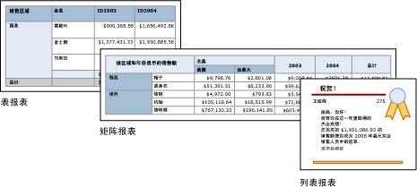

# 表、矩阵和列表（报表生成器和 SSRS）
 在 [!INCLUDE[ssRSnoversion_md](../../includes/ssrsnoversion-md.md)] 中，表、矩阵和列表是在以行和列形式组织的单元中显示分页报表数据的数据区域。 单元通常包含文本数据（如文本、日期和数字），但它们还可以包含仪表、图表或报表项（例如图像）。 表、矩阵和列表常常统称为 Tablix 数据区域。  
  
 表、矩阵和列表模板是在 Tablix 数据区域的基础上建立的，Tablix 数据区域是可以在单元中显示数据的灵活的网格。 在表和矩阵模板中，单元将组织成行和列的形式。 因为模板是一般性的基础 tablix 数据区域的变体，所以，你可以结合模板格式显示数据，并且在你开发报表时更改表、矩阵或列表以便包括其他数据区域的功能。 例如，如果您添加一个表并发现它没有满足您的需要，则可以添加列组以使该表成为矩阵。  
  
 表和矩阵数据区域可以通过包括嵌套的表、矩阵、列表、图表和仪表，显示复杂的数据关系。 表和矩阵具有表格形式的布局，并且其数据来自在单个数据源基础上建立的单个数据集。 表和矩阵之间的主要差异在于，表只能包含行组，而矩阵可具有行组和列组。  
  
 列表则稍有不同。 它们支持可包括多个对等表或矩阵（每个对等表或矩阵都使用来自不同数据集的数据）的自由布局。 列表也可以用于发票之类的表单。  
  
 下图显示具有表、矩阵或列表的简单报表。  
  
   
  
 若要快速开始使用表、矩阵和列表，请参阅[教程：创建基本表报表（报表生成器）](../../reporting-services/tutorial-creating-a-basic-table-report-report-builder.md)、[教程：创建矩阵报表（报表生成器）](../../reporting-services/tutorial-creating-a-matrix-report-report-builder.md)和[教程：创建自由格式的报表（报表生成器）](../../reporting-services/tutorial-creating-a-free-form-report-report-builder.md)。  
  
> [!NOTE]  
>  您可以将表、矩阵和列表作为报表部件与报表分开发布。 阅读有关 [报表部件](../../reporting-services/report-design/report-parts-report-builder-and-ssrs.md)的详细信息。  
  
##   表  
 使用表显示详细信息数据、组织行组中的数据，或者同时用于两种目的。 表模板包含三个列和一个表头行和一个数据详细信息行。 下图显示了在设计图面上选择的初始表模板：  
  
   
  
 可以按单个字段、多个字段或通过编写自己的表达式来对数据进行分组。 可以创建嵌套的组或独立的相邻组和显示分组数据的聚合值，或将合计添加到组。 例如，如果您的表中有一个称为 [类别] 的行组，则可以为每个组添加小计，以及为报表添加总计。 为了改进表的外观和突出显示要强调的数据，可以合并单元并将格式应用于数据和表标题。  
  
 可以在开始时隐藏详细信息数据或分组数据，并包括明细切换以使用户能够交互选择要显示的数据量。  
  
 有关详细信息，请参阅[表（报表生成器和 SSRS）](../../reporting-services/report-design/tables-report-builder-and-ssrs.md)。  
  
##   矩阵  
 使用矩阵显示按行和列进行分组的聚合数据汇总，类似于数据透视表或交叉表。 组的行数和列数由每个行组和列组中的唯一值的个数确定。 下图显示了在设计图面上选择的初始矩阵模板：  
  
   
  
 您可以按行组和列组中的多个字段或表达式对数据进行分组。 在运行时，当组合报表数据和数据区域时，随着为列组添加列和为行组添加行，矩阵将在页面上水平和垂直增长。 矩阵单元显示仅限于单元所属行组和列组的交集的聚合值。 例如，如果您的矩阵具有一个行组（类别）和两个显示销售额之和的列组（区域和年份），则报表中将显示两个单元，其中对于“类别”组中的每个值都显示销售额之和。 单元的作用域是两个交集：类别和区域的交集，以及类别和年份的交集。 矩阵可以包含嵌套组和相邻组。 嵌套组具有父-子关系，相邻组具有对等关系。 您可以添加矩阵内嵌套行组和列组的任何级别和所有级别的小计。  
  
 为使矩阵数据的外观更具可读性和突出显示要强调的数据，可以合并单元或者水平和垂直拆分，并将格式应用于数据和组标题。  
  
 您也可以包括最初隐藏详细信息数据的明细切换，然后用户便可单击该切换以根据需要显示更多或更少的详细信息。  
  
 有关详细信息，请参阅 [创建矩阵](../../reporting-services/report-design/create-a-matrix-report-builder-and-ssrs.md)。  
  
##   列表  
 使用列表创建自由格式布局。 您不受网格布局的限制，而可以在列表内自由放置字段。 可以使用列表设计用于显示多个数据集字段的表单，也可以将其用作容器以便并排显示分组数据的多个数据区域。 例如，您可以为列表定义组；添加表、图表和图像；并显示每组值的表和图形表单中的各个值，正如对雇员或病人记录所执行的操作一样。  
  
   
  
 有关详细信息，请参阅 [创建带列表的发票和表单]。  
  
##   准备数据  
 表、矩阵和列表数据区域显示来自数据集的数据。 您可以在检索数据集数据的查询中准备数据，也可以通过设置表、矩阵或列表中的属性来准备数据。  
  
 您用于为报表数据集检索数据的查询语言（例如 [!INCLUDE[tsql](../../includes/tsql-md.md)]）可通过以下方式准备数据：应用筛选器以便只包括数据的子集，用使报表更具可读性的常量替换 Null 值或空值，以及对数据进行排序和分组。  
  
 如果您选择在报表的表、矩阵或列表数据区域中准备数据，则可以对数据区域或数据区域内的单元设置属性。 如果要筛选数据或对数据进行排序，则对数据区域设置属性。 例如，若要对数据进行排序，则可以指定要依据其进行排序的列以及排序方向。 如果要为某一字段提供可选值，您可以设置显示该字段的单元文本的值。 例如，若要在某一字段为空或 Null 时显示空白，您可以使用筛选器来设置值。  
  
 有关详细信息，请参阅[准备要在 Tablix 数据区域中显示的数据（报表生成器和 SSRS）](../../reporting-services/report-design/preparing-data-for-display-in-a-tablix-data-region-report-builder-and-ssrs.md)。  
  
##   生成和配置表、矩阵或列表  
 在您向报表中添加表或矩阵时，可以使用表和矩阵向导，也可以根据报表生成器和报表设计器提供的模板手动生成它们。 而列表是根据列表模板手动生成的。  
  
 该向导将指导您一步步地快速生成并配置表或矩阵。 在您完成该向导或从头开始生成 Tablix 数据区域后，可以进一步配置和优化它们。 在数据区域的右键单击菜单上提供的对话框可便于您为分页符、页眉和页脚的可重复性和可见性、显示选项、筛选器和排序设置最常用的属性。 但是，Tablix 数据区域提供大量的附加属性，这些属性只能在报表生成器的“属性”窗格中设置。 例如，如果想要在表、矩阵或列表的数据集为空时显示一条消息，则在“属性”窗格的 NoRowsMessage Tablix 属性中指定消息文本。  
  
##   Tablix 模板之间的更改  
 您不受初始 Tablix 模板选择的限制。 添加组、总计和标签时，您可能希望修改 Tablix 设计。 例如，您可能会从表开始，然后删除详细信息行和添加列组。 有关详细信息，请参阅[利用 Tablix 数据区域的灵活性（报表生成器和 SSRS）](../../reporting-services/report-design/exploring-the-flexibility-of-a-tablix-data-region-report-builder-and-ssrs.md)。  
  
 通过添加任何 Tablix 功能，可以继续开发表、矩阵或列表。 Tablix 功能包括显示行和列中的分组数据的详细信息数据或聚合。 可以创建嵌套组、独立的相邻组或递归组。 可以对分组数据进行筛选和排序，并通过在组定义中包括多个组表达式来方便地组合组。  
  
 您还可以为组添加总计，或者为数据区域添加总计。 可以隐藏行或列以简化报表，并使用户能够切换显示隐藏数据，这与明细报表中相同。 有关详细信息，请参阅 [控制 Tablix 数据区域在报表页上的显示（报表生成器和 SSRS）](../../reporting-services/report-design/controlling-the-tablix-data-region-display-on-a-report-page.md)。  
  
##   操作指南主题  
 本节中列出的过程分步向您说明如何在您的报表中使用表、矩阵和列表；如何显示行和列中的数据、添加和删除列、合并单元以及为行组和列组包括小计。  
  
-   [添加详细信息组（报表生成器和 SSRS）](../../reporting-services/report-design/add-a-details-group-report-builder-and-ssrs.md)  
  
-   [向组或 Tablix 数据区域添加总计（报表生成器和 SSRS）](../../reporting-services/report-design/add-a-total-to-a-group-or-tablix-data-region-report-builder-and-ssrs.md)  
  
-   [更改单元中的项（报表生成器和 SSRS）](../../reporting-services/report-design/change-an-item-within-a-cell-report-builder-and-ssrs.md)  
  
-   [更改行高或列宽（报表生成器和 SSRS）](../../reporting-services/report-design/change-row-height-or-column-width-report-builder-and-ssrs.md)  
  
-   [插入或删除列（报表生成器和 SSRS）](../../reporting-services/report-design/insert-or-delete-a-column-report-builder-and-ssrs.md)  
  
-   [插入或删除行（报表生成器和 SSRS）](../../reporting-services/report-design/insert-or-delete-a-row-report-builder-and-ssrs.md)  
  
-   [合并数据区域中的单元（报表生成器和 SSRS）](../../reporting-services/report-design/merge-cells-in-a-data-region-report-builder-and-ssrs.md)  
  
-   [创建一个递归层次结构组（报表生成器和 SSRS）](../../reporting-services/report-design/create-a-recursive-hierarchy-group-report-builder-and-ssrs.md)  
  
-   [在数据区域中添加或删除组（报表生成器和 SSRS）](../../reporting-services/report-design/add-or-delete-a-group-in-a-data-region-report-builder-and-ssrs.md)  
  
-   [与组一起显示组头和组尾（报表生成器和 SSRS）](../../reporting-services/report-design/display-headers-and-footers-with-a-group-report-builder-and-ssrs.md)  
  
-   [创建递阶报表（报表生成器和 SSRS）](../../reporting-services/report-design/create-a-stepped-report-report-builder-and-ssrs.md)  
  
-   [添加、移动或删除表、矩阵或列表（报表生成器和 SSRS）](../../reporting-services/report-design/add-move-or-delete-a-table-matrix-or-list-report-builder-and-ssrs.md)  
  
##   本节内容  
 下列主题提供有关使用 Tablix 数据区域的其他信息。  
  
 [Tablix 数据区域（报表生成器和 SSRS）](../../reporting-services/report-design/tablix-data-region-report-builder-and-ssrs.md)  
 说明与 Tablix 数据区域（例如 Tablix 的区域、详细信息和分组数据、列组和行组以及静态和动态行和列）相关的关键概念。  
  
 [向 Tablix 数据区域添加数据（报表生成器和 SSRS）](../../reporting-services/report-design/adding-data-to-a-tablix-data-region-report-builder-and-ssrs.md)  
 提供与向 Tablix 数据区域添加详细信息和分组数据、小计和总计以及标签有关的详细信息。  
  
 [控制 Tablix 数据区域在报表页上的显示（报表生成器和 SSRS）](../../reporting-services/report-design/controlling-the-tablix-data-region-display-on-a-report-page.md)  
 介绍 Tablix 数据区域的属性，您可以修改这些属性以便更改在报表中查看 Tablix 数据区域时该数据区域的显示方式。  
  
 [控制行标题和列标题（报表生成器和 SSRS）](../../reporting-services/report-design/controlling-row-and-column-headings-report-builder-and-ssrs.md)  
 介绍在表、矩阵或列表数据区域可以水平或垂直跨多页时如何控制行和列标题。  
  
 [创建递归层次结构组（报表生成器和 SSRS）](../../reporting-services/report-design/creating-recursive-hierarchy-groups-report-builder-and-ssrs.md)  
 介绍如何显示递归数据（其中，父级和子级之间的关系由数据集中的字段表示）。  
  
 [了解组（报表生成器和 SSRS）](../../reporting-services/report-design/understanding-groups-report-builder-and-ssrs.md)  
 说明什么是组以及何时使用它们，并介绍可用于不同 Tablix 数据区域的组。  
  
## 另请参阅  
 [添加数据集筛选器、数据区域筛选器和组筛选器（报表生成器和 SSRS）](../../reporting-services/report-design/add-dataset-filters-data-region-filters-and-group-filters.md)   
 [嵌套数据区域（报表生成器和 SSRS）](../../reporting-services/report-design/nested-data-regions-report-builder-and-ssrs.md)   
 [将多个数据区域链接到同一数据集（报表生成器和 SSRS）](../../reporting-services/report-design/linking-multiple-data-regions-to-the-same-dataset-report-builder-and-ssrs.md)   
 [表达式（报表生成器和 SSRS）](../../reporting-services/report-design/expressions-report-builder-and-ssrs.md)   
 [对数据进行筛选、分组和排序（报表生成器和 SSRS）](../../reporting-services/report-design/filter-group-and-sort-data-report-builder-and-ssrs.md)   
 [报表参数（报表生成器和报表设计器）](../../reporting-services/report-design/report-parameters-report-builder-and-report-designer.md)   
 [图表（报表生成器和 SSRS）](../../reporting-services/report-design/charts-report-builder-and-ssrs.md)   
 [仪表（报表生成器和 SSRS）](../../reporting-services/report-design/gauges-report-builder-and-ssrs.md)  
  
  
