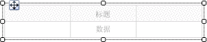
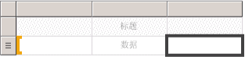
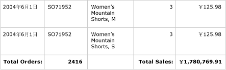
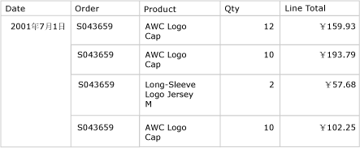
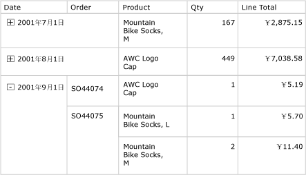

# 表（报表生成器和 SSRS）
 在 [!INCLUDE[ssRSnoversion_md](../../includes/ssrsnoversion-md.md)]中，可以使用表显示详细信息数据或分组数据，也可以使用分页报表同时显示这两种数据。   
   
 可以按单个字段、多个字段或通过编写自己的表达式来对数据进行分组。 可以创建嵌套组或独立的相邻组。 若要显示分组数据的聚合值，可向这些组添加总计。 可设置行和列的格式以突出显示要强调的数据。 可以在开始时隐藏详细信息数据或分组数据，并包括明细切换以使用户能够交互选择要显示的数据量。  
  
 若要快速开始使用表，请参阅[教程：生成基本表报表（报表生成器）](../../reporting-services/tutorial-creating-a-basic-table-report-report-builder.md)或[生成基本表报表（SSRS 教程）](../../reporting-services/create-a-basic-table-report-ssrs-tutorial.md)。  
  
> [!NOTE]  
>  您可以将表作为报表部件与报表分开发布。 阅读有关 [报表部件](../../reporting-services/report-design/report-parts-report-builder-and-ssrs.md)的详细信息。  
  
  
##   添加表以显示详细信息数据  
 从功能区上的“插入”选项卡向设计图面添加一个表。 您可以通过使用表或矩阵向导添加表（包括创建数据源连接和数据集以及配置表），或者基于您手动配置的表模板添加表。  
  
> [!NOTE]  
>  向导仅在报表生成器中可用。  
  
 为了从头至尾描述如何配置表，本主题使用表模板。  
  
 默认情况下，新表具有固定数量的列以及一个标签的表头行和一个详细信息数据的数据行。 下图显示了添加到设计图面的新表。  
  
   
  
 选择表时，行控点和列控点将显示在表的外部而且方括号会显示在单元格内。 行控点显示的图形有助于了解每行的用途。 方括号可指明所选单元格的组成员身份。 下图显示了默认表中的所选空单元格。  
  
   
  
 数据行的行句柄显示详细信息符号（）。 若要显示这些行中的数据，可将字段从“报表数据”窗格拖到表头行或详细信息行中的表单元格。 两行会同时填充。 若要添加其他列，请将字段拖到表中，直到看到插入点。 在将数据集字段添加到表之后，可以更改日期和货币的默认格式以控制它们在报表中的显示方式。 下图展示了包含下面这些字段的表数据区域：“Date”、“Order”、“Product”、“Qty”和“Line Total”。  
  
   
  
 通过在预览中查看报表来检查您的设计。 根据需要，表可在页面内向下扩展。 针对数据集查询结果集中的每一行，每个标签行和详细信息行都显示一次。 订单上售出的每个产品都会在单独一行中列出，后跟项的数量和行总计，如下图所示：  
  
   
  
 您开始使用的表是基于 Tablix 数据区域的模板。 通过添加基础 Tablix 数据区域支持的功能，可以增强表的设计。 有关详细信息，请参阅 [控制 Tablix 数据区域在报表页上的显示（报表生成器和 SSRS）](../../reporting-services/report-design/controlling-the-tablix-data-region-display-on-a-report-page.md)。 通过添加行组、列组以及添加或删除详细信息组，还可以继续开发表。 有关详细信息，请参阅[利用 Tablix 数据区域的灵活性（报表生成器和 SSRS）](../../reporting-services/report-design/exploring-the-flexibility-of-a-tablix-data-region-report-builder-and-ssrs.md)。  
  
### 为详细信息数据添加总计  
 若要添加总计，请选择具有数字数据的单元格，然后使用快捷菜单自动为数值字段的详细信息数据添加标签和总计。 还可以手动指定其他标签和总计。 下图显示了包括自动和手动指定的总计的典型总计行：  
  
   
  
 在预览中，报表将针对数据集查询结果集中的每一行显示一次表头行和详细信息行，并且它会显示总计行。 下图显示了包括总计行的表的最后几行。  
  
   
  
 有关详细信息，请参阅[向组或 Tablix 数据区域添加总计（报表生成器和 SSRS）](../../reporting-services/report-design/add-a-total-to-a-group-or-tablix-data-region-report-builder-and-ssrs.md)。  
  
##   将行组添加到表  
 正如可以将字段从“报表数据”窗格拖到单元格以显示详细信息数据一样，可以将字段拖到“分组”窗格以添加组。 对于表，可将字段拖到“行组”窗格。 在添加组后，表会自动将单元格添加到其中要显示组值的行组区域的新列中。 有关区域的详细信息，请参阅 [Tablix 数据区域（报表生成器和 SSRS）](../../reporting-services/report-design/tablix-data-region-areas-report-builder-and-ssrs.md)。  
  
 下图显示了“设计”视图中具有两个嵌套行组的表。 这两个行组是通过以下方法创建的：依次将 Order 字段和 Date 字段拖到“行组”窗格并将每个组作为现有组的父组插入。 该图显示了基于日期的父组和基于订单号的子组，以及默认情况下定义的详细信息组。  
  
   
  
 在预览中，报表会显示首先按日期、然后按订单分组的订单数据，如下图所示。  
  
   
  
 另一种显示分组数据的方法是：缩进组层次结构以显示组的嵌套关系，而非将每个值都显示在其自己的列中。 此格式设置样式称为递阶报表。 有关如何将组信息格式设置为递阶报表的详细信息，请参阅[创建递阶报表（报表生成器和 SSRS）](../../reporting-services/report-design/create-a-stepped-report-report-builder-and-ssrs.md)。  
  
### 向行组添加总计  
 若要显示某组的总计，可以使用与上下文相关的 **“添加总计”** 命令。 对于某一行组，“添加总计”命令会在该组之外添加一行，以便它相对于该组仅重复一次。 对于嵌套组，子组的总计行位于子组的外部，但在父组的内部。 在这种情况下，为将子组的总计行与详细信息行区分开来，设置子组的总计行的背景色是非常有用的。 也可以使用不同背景色来区分表格的表头行和表尾行。 下图显示了具有为基于订单号的组添加了总计行的表。  
  
   
  
 查看报表时，显示订单小计的行会针对每个订单号重复一次。 表格表尾显示了所有日期的总计。 在下图中，最后几行显示了最后三个详细信息行、最后一个订单号 SO71952 的小计以及表中的所有日期的总计。  
  
   
  
 有关详细信息，请参阅[向组或 Tablix 数据区域添加总计（报表生成器和 SSRS）](../../reporting-services/report-design/add-a-total-to-a-group-or-tablix-data-region-report-builder-and-ssrs.md)。  
  
##   删除或隐藏详细信息行  
 在预览了报表中的表后，您可能会决定删除现有详细信息行。 或者可能决定按默认情况隐藏详细信息行，并允许用户在查看更多或更少详细信息之间切换，就像在明细报表中一样。  
  
 若要从表中删除详细信息行，请使用“分组”窗格。 选择详细信息组，并使用快捷菜单删除显示详细信息数据的组和行。 下图显示了按日期和订单号分组的表的设计视图，但没有详细信息行。 没有向该表添加任何总计行。  
  
   
  
 在删除详细信息行之后，值的作用域为行组。 详细信息数据将不再显示。  
  
> [!NOTE]  
>  验证在删除详细信息行之后，每个单元中的表达式视具体情况指定聚合表达式。 如有必要，请编辑表达式以便根据需要指定聚合函数。  
  
 下图在预览中显示此报表。  
  
   
  
 若要在表中添加或删除行，请参阅[插入或删除行（报表生成器和 SSRS）](../../reporting-services/report-design/insert-or-delete-a-row-report-builder-and-ssrs.md)。  
  
 最初查看报表时，还可以隐藏详细信息行。 为此，可以创建明细报表，其中将仅显示父组数据。 对于每个内部组（包括详细信息组），可为包含组的分组单元格添加可见性切换功能。 例如，对于详细信息组，可为显示订单号组值的文本框添加切换功能。 对于订单号组，可为显示日期组值的文本框添加切换功能。 下图显示了 2001 年 9 月 1 日的行，在展开状态下显示了前几个订单。  
  
   
  
 有关详细信息，请参阅 [为项添加展开或折叠操作（报表生成器和 SSRS）](../../reporting-services/report-design/add-an-expand-or-collapse-action-to-an-item-report-builder-and-ssrs.md)。  
  
## 另请参阅  
 [对数据进行筛选、分组和排序（报表生成器和 SSRS）](../../reporting-services/report-design/filter-group-and-sort-data-report-builder-and-ssrs.md)   
 [表达式（报表生成器和 SSRS）](../../reporting-services/report-design/expressions-report-builder-and-ssrs.md)   
 [表达式示例（报表生成器和 SSRS）](../../reporting-services/report-design/expression-examples-report-builder-and-ssrs.md)   
 [表、矩阵和列表（报表生成器和 SSRS）](../../reporting-services/report-design/tables-matrices-and-lists-report-builder-and-ssrs.md)  
  
  
