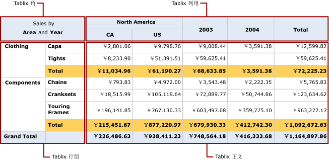

# Tablix 数据区域（报表生成器和 SSRS）
 在 [!INCLUDE[ssRSnoversion_md](../../includes/ssrsnoversion-md.md)] 分页报表中，Tablix 数据区域有四个包含 tablix 单元的区域：   
* 角  
* 行组区  
* 列组区  
* 正文   
  
每个区域中的单元都具有不同功能。 向 Tablix 正文区添加单元可以显示详细信息数据和分组数据。 创建组时，报表生成器和报表设计器向行组区或列组区添加单元，以便显示组实例值。 存在行组和列组时，报表生成器和报表设计器将创建 Tablix 角单元。  
  
在设计图面上，用点线表示选定 Tablix 数据区域中的上述四个区域。 下图显示了 Tablix 区域的相应区域，该 Tablix 区域具有基于 Category 和 Subcategory 的嵌套行组、基于 Geography 和 Country/Region 的嵌套列组，以及基于 Year 的相邻列组。  
  
   
  
 下表对各区域进行了说明：  
  
-   **Tablix 角部区**。 （可选）对于从右到左 (RTL) 的布局，Tablix 角位于左上角或右上角。 向 Tablix 数据区域添加行组和列组时，将自动创建该区域。 您可以在该区域中合并多个单元，并添加标签或嵌入其他报表项。 在该图中，合并后的角单元根据 Area 和 Year 显示标签 Sales。  
  
-   **Tablix 列组区**。 （可选）Tablix 列组位于右上角（对于 RTL 布局，则位于左上角）。 该区域是在添加列组时自动创建的。 该区域中的单元表示列组层次结构的成员，并显示列组实例值。 在该图中，显示 [Geography] 和 [CountryRegion] 的单元为嵌套列组，显示 [Year] 的单元为相邻列组。 [Total] 列显示跨每个行的聚合总计。  
  
-   **Tablix 行组区**。 （可选）Tablix 行组位于左下角（对于 RTL 布局，则位于右下角）。 该区域是在添加行组时自动创建的。 该区域中的单元表示行组层次结构的成员，并显示行组实例值。 在该图中，显示 [Category] 和 [Subcat] 的单元为嵌套行组。 Subcat 下面的 Total 行重复每个类别组，以便显示每个列的聚合小计。 总计行显示所有类别的总计。  
  
-   **Tablix 正文区**。 Tablix 正文位于右下角（对于 RTL 布局，则位于左下角）。 Tablix 正文显示详细信息数据和分组数据。 在本示例中，只使用了聚合数据。 表达式的作用域是通过文本框所属的最内部组确定的。 当 Tablix 正文中的单元是详细信息行成员时，该单元显示详细信息数据；当该单元是与组关联的行或组的成员时，则表示聚合数据。 默认情况下，对于组行或组列中包含不含有聚合函数的简单表达式的单元，其计算结果为组中的第一个值。 在该图中，这些单元显示所有销售订单的行总计的聚合总计。  
  
 当报表运行时，列组向右扩展（如果将 Tablix 数据区域的 Direction 属性设置为 RTL，则向左扩展），组表达式有多少唯一值就扩展多少列。 行组沿页面向下扩展。 有关详细信息，请参阅 [Tablix 数据区域单元、行和列（报表生成器和 SSRS）](../../reporting-services/report-design/tablix-data-region-cells-rows-and-columns-report-builder-and-ssrs.md)。  
  
 下图在预览中显示 Tablix 数据区域。  
  
   
  
 行组区显示 Clothing 和 Components 的两个类别组实例。 列组显示 North America 的地理组实例，其中包括 Canada (CA) 和 United States (US) 两个嵌套国家/地区组实例。 此外，相邻列显示 2003 和 2004 的两个年份组实例。 Total 列显示行总计；总计 (totals) 行重复用于显示子类别总计的类别组，而总计 (grand total) 行对数据区域显示一次类别总计。  
  
## 另请参阅  
 [表、矩阵和列表（报表生成器和 SSRS）](../../reporting-services/report-design/tables-matrices-and-lists-report-builder-and-ssrs.md)   
 [报表生成器教程](../../reporting-services/report-builder-tutorials.md)   
 [表（报表生成器和 SSRS）](../../reporting-services/report-design/tables-report-builder-and-ssrs.md)   
 [创建矩阵](../../reporting-services/report-design/create-a-matrix-report-builder-and-ssrs.md)   
 [创建带列表的发票和表单](../../reporting-services/report-design/create-invoices-and-forms-with-lists-report-builder-and-ssrs.md)   
 [Tablix 数据区域（报表生成器和 SSRS）](../../reporting-services/report-design/tablix-data-region-report-builder-and-ssrs.md)  
  
  
