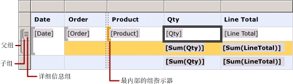
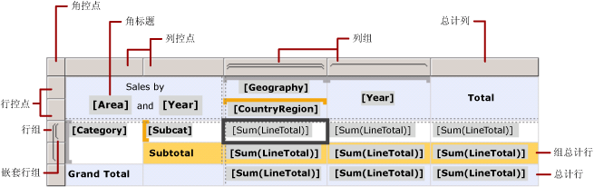
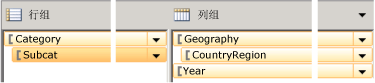
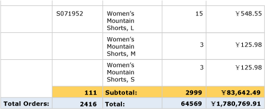

# Tablix 数据区域单元、行和列（报表生成器和 SSRS）
  若要控制 tablix 数据区域的行和列如何在 [!INCLUDE[ssRSnoversion_md](../../includes/ssrsnoversion-md.md)] 分页报表中显示数据，必须了解如何为详细信息数据、组数据和标签与总计指定行和列。 在大多数情况下，可以使用表、矩阵或列表的默认结构来显示数据。 有关详细信息，请参阅[表（报表生成器和 SSRS）](../../reporting-services/report-design/tables-report-builder-and-ssrs.md)、[矩阵](../../reporting-services/report-design/create-a-matrix-report-builder-and-ssrs.md)或[列表](../../reporting-services/report-design/create-invoices-and-forms-with-lists-report-builder-and-ssrs.md)。  
  
 tablix 数据区域在详细信息行和详细信息列中显示详细信息数据，在组行和组列中显示分组数据。 向 tablix 数据区域添加行组和列组时，将自动添加显示数据的行和列。 可以手动添加和删除行和列，以便自定义 tablix 数据区域，并控制数据在报表中的显示方式。  
  
 若要了解如何自定义 tablix 数据区域，应首先了解如何解释在设计图面上选择 tablix 数据区域时所显示的可视化提示。  
  
> [!NOTE]  
>  [!INCLUDE[ssRBRDDup](../../includes/ssrbrddup-md.md)]  
  
## 了解 Tablix 可视化提示  
 tablix 数据区域上的可视化提示可帮助您使用 tablix 数据区域显示所需数据。  
  
### 行控点和列控点  
 选择 tablix 数据区域时，行控点和列控点图形指示每个行和列的目的。 控点指示行和列是位于组内还是组外。 下表显示多种控点显示。  
  
|图标|Description|  
|----------|-----------------|  
||仅表示行组层次结构中的详细信息组|  
||一个外部组和详细信息子组|  
||一个外部组和一个内部组；没有任何详细信息组|  
| 详细信息")|一个外部组、一个内部组和详细信息子组|  
||一个具有表示总计的组尾行的外部组和一个内部组|  
||一个具有表示总计的组尾行的外部组和一个内部组，以及一个详细信息行|  
||一个具有表示标签的组头和表示总计的组尾的外部组和一个内部组；没有任何详细信息组|  
  
### 组行  
 位于组内的行对于每个唯一组值只重复一次，并且通常用于聚合汇总。 位于组外的行对于该组只重复一次，并用于标签或小计。 选择 tablix 单元时，tablix 数据区域内的行控点、列控点和方括号显示该单元所属的组。 下图显示了以下可视化提示：  
  
-   指示组关联的行控点和列控点。  
  
-   突出显示的组指示器显示选定单元的最内部的组成员身份。  
  
-   组指示器显示选定单元的所有组成员身份。  
  
   
  
### 总计行  
 在添加行组和列组之后，可以添加显示列总计的行和显示行总计的列。 下图显示一个矩阵，其中包含行组和列组以及总计行和总计列。  
  
   
  
### “分组”窗格  
 “分组”窗格显示设计图面上当前所选 tablix 数据区域的行组和列组。 下图显示了该 tablix 数据区域的“分组”窗格。  
  
   
  
 “行组”窗格显示父组 Category 和子组 Subcat。 “列组”窗格显示父组 Geography 和子组 CountryRegion，还显示 Geography 组的相邻组 Year。 在“行组”窗格中选择 Subcat 组时，组图条变为深橙色，并在设计图面上选择相应的行组成员单元。  
  
## 在行和列中显示数据  
 行和行组以及列和列组具有相同关系。 以下讨论介绍如何添加在 tablix 数据区域的行中显示详细信息数据和分组数据的行，但其原理同样适用于添加显示详细信息数据和分组数据的列。  
  
 对于 tablix 数据区域中的每个行，行位于每个行组内部或外部。 如果行位于行组内部，该行针对组的每个唯一值只重复一次，该值称为“组实例” 。 如果行位于行组外部，该行相对于该组仅重复一次。 所有行组以外的行都是静态行，并且仅针对数据区域重复一次。 例如，表头行或表尾行是静态行。 至少在一个组内重复的行是动态行。  
  
 如果具有嵌套组，行可以位于父组的内部，但需要位于子组的外部。 行针对父组中的每个组值重复，但只相对于子组显示一次。 若要显示组的标签或总计，请在该组外部添加一个行。 若要显示随每个组实例更改的数据，请在该组内部添加一个行。  
  
 如果具有详细信息组，每个详细信息行则位于详细信息组内部。 该行针对数据集查询结果集中的每个值重复一次。  
  
 有关组层次结构的详细信息，请参阅[了解组（报表生成器和 SSRS）](../../reporting-services/report-design/understanding-groups-report-builder-and-ssrs.md)。  
  
 下图显示一个 tablix 数据区域，其中包含嵌套行组和详细信息组。  
  
   
  
 对于显示详细信息数据的 tablix 数据区域，详细信息组是位于最内部的子组。 在详细信息组中添加的行仅针对链接到该 tablix 数据区域的数据集查询结果集中的每个行重复一次。 下图显示呈现的报表中的最后一页。 在该图中，您可以查看最后一个订单的最后一个详细信息行和小计行。  
  
   
  
 对于 tablix 数据区域中的每个列，该原理同样适用。 例如，列位于每个列组内部或外部；若要显示总计，请在组的外部添加列。  
  
 若要删除与组关联的行和列，可以删除该组。 删除组时，可以选择仅删除组定义，也可以选择删除组及其所有关联的行和列。 通过仅删除组，您可以在数据区域中保留行和列布局。 删除组及其关联的行和列时，您删除的是与该组关联的所有静态行和列（包括组头和组尾）以及动态行和列（包括组实例）。  
  
 有关添加或删除行和列的分步说明，请参阅[插入或删除行（报表生成器和 SSRS）](../../reporting-services/report-design/insert-or-delete-a-row-report-builder-and-ssrs.md)和[插入或删除列（报表生成器和 SSRS）](../../reporting-services/report-design/insert-or-delete-a-column-report-builder-and-ssrs.md)。  
  
## 了解 Tablix 单元  
 tablix 单元属于以下四个 tablix 区域之一：tablix 正文区、tablix 行组区、tablix 列组区或 tablix 角部区。 虽然每个单元可能会显示数据集中的任何值，但是每个单元的默认功能是由其位置确定的。 有关 tablix 区域的详细信息，请参阅 [Tablix 数据区域（报表生成器和 SSRS）](../../reporting-services/report-design/tablix-data-region-areas-report-builder-and-ssrs.md)。  
  
 默认情况下，tablix 行组区和列组区中的单元表示组成员。 组成员在报表定义中组织到多个树结构中。 行组层次结构水平扩展。 列组层次结构垂直扩展。 当创建组时将自动添加这些单元，并在运行时显示组的唯一值。  
  
 当具有行组区和列组区时，将创建 tablix 角单元。 可以合并该区域中的多个单元，以便创建标签或嵌入其他报表项。  
  
 当 tablix 正文区中的单元位于详细信息行或列中时，该单元可以显示详细信息数据；该单元位于组行或组列中时，则显示聚合组数据。 单元中数据的作用域是该单元所属的最内部行组和最内部列组的交集。  
  
> [!NOTE]  
>  每个单元显示的实际数据是该单元所含报表项的计算后的表达式，它通常为文本框。 在属于详细信息行或列的单元中，表达式默认为详细信息数据（例如， **[LineTotal]**。） 在不属于详细信息行或列的单元中，表达式默认为聚合函数（例如， **Sum[LineTotal]**。） 如果表达式未指定聚合函数（即使该单元属于组行或组列），则显示组中的第一个值。 有关聚合的详细信息，请参阅[总计、聚合和内置集合的表达式作用域（报表生成器和 SSRS）](../../reporting-services/report-design/expression-scope-for-totals-aggregates-and-built-in-collections.md)。  
  
### 合并和拆分单元  
 在 tablix 区域内，可以将多个相邻单元合并在一起。 例如，可以为跨越多个列或行的标签创建单元。  
  
 在 tablix 角部区中，一次只能在一个方向上合并多个单元：跨列水平合并或沿行垂直合并。 若要合并单元块，请首先水平合并单元。 在每行中将所有单元合并为一个单元之后，选择并合并相邻单元（可以选择一个列中的所有相邻单元）。  
  
 在 tablix 正文区中，只能以水平方式合并单元。 不支持以垂直方式合并单元。  
  
 有关详细信息，请参阅[在数据区域中合并单元格（报表生成器和 SSRS）](../../reporting-services/report-design/merge-cells-in-a-data-region-report-builder-and-ssrs.md)。  
  
 可以拆分先前合并的单元。 可以跨列水平拆分或沿行垂直拆分单元。 若要将一个单元拆分为单元块，请首先水平拆分单元，然后再根据需要垂直拆分单元。  
  
## 另请参阅  
 [Tablix 数据区域（报表生成器和 SSRS）](../../reporting-services/report-design/tablix-data-region-report-builder-and-ssrs.md)  
  
  
