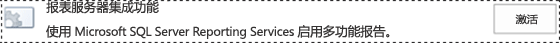
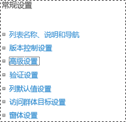
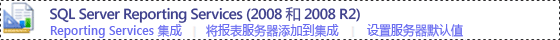

# 将 Reporting Services 内容类型添加到 SharePoint 库

[!INCLUDE[ssrs-appliesto](../../includes/ssrs-appliesto.md)] [!INCLUDE[ssrs-appliesto-2016](../../includes/ssrs-appliesto-2016.md)] [!INCLUDE[ssrs-appliesto-sharepoint-2013-2016i](../../includes/ssrs-appliesto-sharepoint-2013-2016.md)] [!INCLUDE[ssrs-appliesto-not-pbirsi](../../includes/ssrs-appliesto-not-pbirs.md)]

[!INCLUDE [ssrs-previous-versions](../../includes/ssrs-previous-versions.md)]

[!INCLUDE[ssRSnoversion](../../includes/ssrsnoversion-md.md)] 提供预定义的 SharePoint 内容类型，用于管理共享数据源 (.rsds) 文件、报表模型 (.smdl) 和报表生成器报表定义 (.rdl) 文件。 将 **“报表生成器报表”**、 **“报表模型”**和 **“报表数据源”** 内容类型添加到库中将启用 **“新建”** 命令，以便创建对应类型的新文档。

> [!NOTE]
> 与 SharePoint 的 reporting Services 集成 SQL Server 2016 之后将不再可用。

 若要将内容类型添加到库，您必须为站点管理员或拥有“完全控制”级权限。  
  
 将自动在所有文档库中为从以下站点模板类型创建的现有网站集启用 [!INCLUDE[ssRSnoversion](../../includes/ssrsnoversion-md.md)] 内容类型和内容类型管理：  
  
-   **商业智能中心**  
  
 在 [!INCLUDE[ssRSnoversion](../../includes/ssrsnoversion-md.md)] 集成之后创建的站点将不启用 [!INCLUDE[ssRSnoversion](../../includes/ssrsnoversion-md.md)] 内容类型。  
  
> [!TIP]  
>  如果您 **不** 具有为某个库以前配置的内容类型，则首先启用内容类型的管理，然后启用 [!INCLUDE[ssRSnoversion](../../includes/ssrsnoversion-md.md)] 内容类型。 请参阅在单个文档库中启用内容类型管理的过程。  
  
 **简短视频：**[(SSRS) Enabling Content Types in SharePoint2010.wmv](http://www.youtube.com/watch?v=yqhm3DrtT1w)（在 SharePoint2010 中启用内容类型）(http://www.youtube.com/watch?v=yqhm3DrtT1w)。  
  
 **本主题内容：**  
  
-   [在现有商业智能中心的所有文档库中启用内容类型](#bkmk_enable_all)  
  
-   [为单个文档库启用内容类型管理 (SharePoint 2013)](#bkmk_enable_content_management)  
  
-   [添加 Reporting Services 内容类型 (SharePoint 2013)](#bkmk_add_single)  
  
-   [为单个文档库启用内容类型管理 (SharePoint 2010)](#bkmk_enable_content_management_2010)  
  
-   [添加报表服务器内容类型 (SharePoint 2010)](#bkmk_add_single_2010)  
  
-   [为多个商业智能站点启用内容类型和内容管理](#bkmk_enable_multiple_sites)  
  
##   在现有商业智能中心的所有文档库中启用内容类型  
  
1.  若要在现有 **“商业智能中心站点”** 中的所有文档库中启用内容类型和内容管理，您可以切换 [!INCLUDE[ssRSnoversion](../../includes/ssrsnoversion-md.md)] 集成功能。  
  
2.  转到 **“站点设置”**。  
  
    -   在 SharePoint 2013 中，单击 **“设置”** 图标。   
  
    -   在 SharePoint 2010 中，单击 **“网站操作”**，然后单击 **“网站设置”**。  
  
3.  单击 **“网站集功能”**。  
  
4.  找到 **“报表服务器集成功能”** ，然后单击 **“停用”**。  
  
       
  
5.  刷新浏览器，然后为 **“报表服务器集成功能”** 单击 **“激活”**。  
  
       
  
##   为单个文档库启用内容类型管理 (SharePoint 2013)  
  
1.  打开要为其启用多个内容类型的库。  
  
2.  在功能区中单击 **“库”** 。  
  
       
  
3.  在 **“库”** 功能区上单击 **“库设置”**。 如果未看到 **“库设置”** 或按钮被禁用，则说明您无权配置库设置，包括内容类型。  
  
       
  
4.  在 **“常规设置”** 部分中，单击 **“高级设置”**。  
  
       
  
5.  在 **“内容类型”** 部分中，选择 **“是”** 以允许内容类型管理。  
  
6.  单击 **“确定”**。  
  
##   添加 Reporting Services 内容类型 (SharePoint 2013)  
  
1.  打开要添加 Reporting Services 内容类型的库。  
  
2.  在功能区上，单击 **“库”**。  
  
3.  单击 **“库设置”**。  
  
4.  在 **“内容类型”**的下面，单击 **“从现有网站内容类型添加”**。  
  
5.  在 **“从以下列表中选择网站内容类型”**中，选择 **“SQL Server Reporting Services 内容类型”**。  
  
6.  在 **“可用网站内容类型”** 列表中，单击 **“报表生成器”**，然后单击 **“添加”** ，将选定内容类型移到 **“要添加的内容类型”** 列表中。  
  
7.  若要添加“ **报表模型”** 和 **“报表数据源”** 内容类型，请重复执行前面的步骤。  
  
8.  添加完内容类型后，单击 **“确定”**。  
  
    > [!NOTE]  
    >  如果[!INCLUDE[ssRSnoversion](../../includes/ssrsnoversion-md.md)]内容类型组**SQL Server Reporting Services 内容类型**上不可见**添加内容类型**页上，以下条件之一为 true:  
  
    -   尚未安装用于 SharePoint 产品的 [!INCLUDE[ssRSnoversion](../../includes/ssrsnoversion-md.md)] 外接程序。 有关详细信息，请参阅 [安装或卸载适用于 SharePoint 的 Reporting Services 外接程序](../../reporting-services/install-windows/install-or-uninstall-the-reporting-services-add-in-for-sharepoint.md)。 本主题包括有关安装外接程序和单步执行外接程序的“仅文件”安装以解决问题的信息。  
  
    -   安装但网站集功能的外接程序**报表服务器集成功能**处于非活动状态。 在“站点设置” 中验证网站集功能。  
  
    -   所有 [!INCLUDE[ssRSnoversion](../../includes/ssrsnoversion-md.md)] 内容类型都已添加到该库中。 如果所有内容类型都是某个库的一部分，则从 **“添加内容类型”** 页中删除该组。 如果您删除一个或多个 [!INCLUDE[ssRSnoversion](../../includes/ssrsnoversion-md.md)] 内容类型，则组 **“SQL Server Reporting Services 内容类型”** 将在 **“添加内容类型”** 页上可见。  
  
##   为单个文档库启用内容类型管理 (SharePoint 2010)  
  
1.  打开要为其启用多个内容类型的库。 在库的菜单栏上，应能看到以下菜单项： **“新建”**、 **“上载”**、 **“操作”**和 **“设置”**。 如果未看到 **“设置”**，则说明您没有添加内容类型的权限。  
  
2.  在 **“库工具”** 功能区上单击 **“库”**。  
  
       
  
3.  在 **“设置”** 功能区组中，单击 **“库设置”**。  
  
4.  在 **“常规设置”**的下面，单击 **“高级设置”**。  
  
5.  在 **“内容类型”** 部分中，选择 **“是”** 以允许内容类型管理。  
  
6.  单击 **“确定”**。  
  
##   添加报表服务器内容类型 (SharePoint 2010)  
  
1.  打开要添加 Reporting Services 内容类型的库。  
  
2.  在 **“库工具”** 功能区选项卡上，单击 **“库”**选项卡。  
  
3.  在 **“设置”** 功能区组中，单击 **“库设置”**。  
  
4.  在 **“内容类型”**的下面，单击 **“从现有网站内容类型添加”**。  
  
5.  在 **“选择内容类型”** 部分的 **“从列表选择网站内容类型”**中，单击箭头选择 **“SQL Server Reporting Services 内容类型”**。  
  
6.  在 **“可用网站内容类型”** 列表中，单击 **“报表生成器”**，然后单击 **“添加”** ，将选定内容类型移到 **“要添加的内容类型”** 列表中。  
  
7.  若要添加“ **报表模型”** 和 **“报表数据源”** 内容类型，请重复执行前面的步骤。  
  
8.  添加完内容类型后，单击 **“确定”**。  
  
##  若要启用内容类型和为多个的 BI 站点的内容管理  
  
1.  对于 SQL Server Reporting Services 2008 和 2008 R2 报表服务器，您可以为多个商业智能中心站点启用内容类型和内容管理。  
  
2.  在 SharePoint 管理中心中，单击 **“常规应用程序设置”**。 在“SQL Server Reporting Services (2008 和 2008 R2)”部分中，单击“Reporting Services 集成”。  
  
       
  
3.  单击 **“激活现有网站集中的所有功能”**。  
  
       
  
4.  单击 **“确定”**。  
  
## 另请参阅  
 [报表服务器项的 SharePoint 站点和列表权限参考](../../reporting-services/security/sharepoint-site-and-list-permission-reference-for-report-server-items.md)   
 [启动报表生成器](../../reporting-services/report-builder/start-report-builder.md)  
  
  
