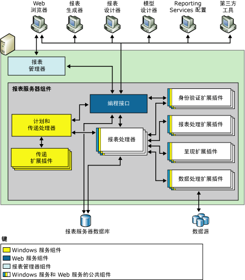
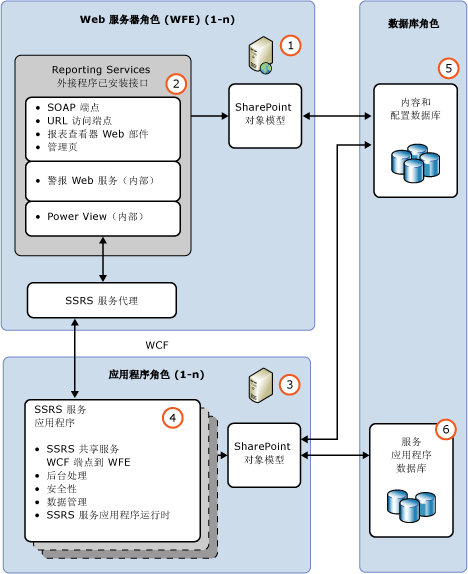

# Reporting Services 报表服务器

[!INCLUDE[ssrs-appliesto](../../includes/ssrs-appliesto.md)] [!INCLUDE[ssrs-appliesto-2016-and-later](../../includes/ssrs-appliesto-2016-and-later.md)] [!INCLUDE[ssrs-appliesto-sharepoint-2013-2016i](../../includes/ssrs-appliesto-sharepoint-2013-2016.md)] [!INCLUDE[ssrs-appliesto-pbirsi](../../includes/ssrs-appliesto-pbirs.md)]

[!INCLUDE [ssrs-previous-versions](../../includes/ssrs-previous-versions.md)]

了解 [!INCLUDE[ssNoVersion](../../includes/ssnoversion-md.md)] Reporting Services 安装的核心部分。 它包含一个处理引擎以及用于添加功能的扩展。

> [!NOTE]
> 自 SQL Server 2016 之后，不再提供 Reporting Services 与 SharePoint 的集成这一功能。

Reporting Services 报表服务器在以下两种部署模式之一下运行：本机模式或 SharePoint 模式。 请参阅功能比较的 [SharePoint 模式和本机模式的功能比较](#bkmk_featuresupport) 部分。  
  
 **安装：** 有关 Reporting Services 安装的信息，请参阅[安装 Reporting Services](../install-windows/install-reporting-services.md)。

## 报表服务器模式概述

 处理引擎（处理器）是报表服务器的核心。 处理器确保报告系统的完整性，但无法修改或扩展。 扩展插件也是处理器，但执行的是非常具体的功能。 Reporting Services 对于支持的每种类型的扩展插件都包含一个或多个默认扩展插件。 您可以向报表服务器中添加自定义扩展插件。 这样做使您可以扩展报表服务器以支持当前不支持的功能；自定义功能的示例包括对单一登录技术的支持、默认呈现扩展插件不能处理的应用程序格式的报表输出，以及到打印机或应用程序的报表传递。  
  
 单个报表服务器实例由完整的处理器和扩展插件集合定义，这些处理器和扩展插件提供从初始请求的处理到已完成报表的显示等端到端的处理。 报表服务器通过子组件来处理报表请求，并使报表可用于按需访问或计划分发。  
  
 从功能上说，报表服务器为多种数据源以及可扩展身份验证和授权架构实现报表创作体验、报表呈现和报表传递体验。 此外，报表服务器还包含报表服务器数据库，用来存储已发布的报表、共享数据源、共享数据集、报表部件、共享计划和订阅、报表定义源文件、模型定义、已编译报表、快照、参数以及其他资源。 报表服务器还支持管理，以便配置报表服务器以处理报表请求，维护快照历史记录，并管理报表、数据源、数据集和订阅的权限。  
  
 Reporting Services 报表服务器支持两种报表服务器实例部署模式：  
  
-   **本机模式**：包括带有 SharePoint Web 部件的本机模式，其中报表服务器作为应用程序服务器运行，并完全通过 Reporting Services 组件提供所有处理和管理功能。 使用 Reporting Services 配置管理器和 SQL Server Management Studio 对本机模式报表服务器进行配置。  
  
-   **SharePoint 模式**：在此情况下，报表服务器作为 SharePoint 服务器场的一部分安装。  通过使用 PowerShell 命令或 SharePoint 内容管理页来部署和配置 SharePoint 模式。  
  
 在 SQL Server Reporting Services 中，不能将报表服务器从一个模式切换到另一个模式。 如果要更改您的环境使用的报表服务器类型，则必须安装所需的报表服务器模式，然后将报表项或报表服务器数据库从旧版本的报表服务器复制或移到新的报表服务器。 此过程通常称为“迁移”。 迁移所需的步骤取决于您要迁移到的模式和迁移前所在的版本。 有关详细信息，请参阅 [Upgrade and Migrate Reporting Services](../../reporting-services/install-windows/upgrade-and-migrate-reporting-services.md)  
  
## SharePoint 模式和本机模式的功能比较
  
|功能或组件|本机模式|SharePoint 模式|  
|--------------------------|-----------------|---------------------|  
|**URL 寻址**|用户帐户控制|在 SharePoint 集成模式下，URL 寻址方式有所不同。 使用 SharePoint URL 引用报表、报表模型、共享数据源和资源。 不使用报表服务器的文件夹层次结构。 如果您的自定义应用程序依赖于本机模式的报表服务器上支持的 URL 访问，则将报表服务器配置为 SharePoint 集成模式时，该功能将不再有效。   有关 URL 访问的详细信息，请参阅 [URL 访问参数引用](../../reporting-services/url-access-parameter-reference.md)。|  
|**自定义安全扩展插件**|用户帐户控制|不能在报表服务器上部署或使用 Reporting Services 自定义安全扩展插件。 报表服务器包括一个特殊用途的安全扩展插件，只要将报表服务器配置为以 SharePoint 集成模式运行，便会使用此插件。 该安全扩展插件是一个内部组件，并且是执行集成操作所必需的组件。|  
|**配置管理器**|用户帐户控制|**\*\* 重要提示 \*\*** 配置管理器不能用于管理 SharePoint 模式报表服务器。 而是使用 SharePoint 管理中心。|  
|**报表管理器**|用户帐户控制|配置管理器不能用于管理 SharePoint 模式。 请使用 SharePoint 应用程序页。 有关详细信息，请参阅 [Reporting Services SharePoint 服务和服务应用程序](../../reporting-services/report-server-sharepoint/reporting-services-sharepoint-service-and-service-applications.md)。|  
|**链接报表**|用户帐户控制|否。|  
|**我的报表**|用户帐户控制|否|  
|**我的订阅** 和批处理方法。|用户帐户控制|否|  
|**数据警报**|否|用户帐户控制|  
|**Power View**|否|用户帐户控制   要求在客户端浏览器中具有 Silverlight。 有关浏览器要求的详细信息，请参阅 [Reporting Services 和 Power View 的浏览器支持](../../reporting-services/browser-support-for-reporting-services-and-power-view.md)|  
|**.RDL 报表**|用户帐户控制|用户帐户控制   .RDL 报表可以在本机模式或 SharePoint 模式下的 Reporting Services 报表服务器上运行。|  
|**.RDLX 报表**|否|用户帐户控制   Power View .RDLX 报表只能在 SharePoint 模式下的 Reporting Services 报表服务器上运行。|  
|**用于 SharePoint 列表扩展的 SharePoint 用户标记凭据**|否|用户帐户控制|  
|**用于面向 internet 的部署的 AAM 区域**|否|用户帐户控制|  
|**SharePoint 备份和恢复**|否|用户帐户控制|  
|**UL 日志支持**|否|用户帐户控制|  
  
## 本机模式

 在本机模式中，报表服务器是独立的应用程序服务器，提供查看、管理、处理和传递报表及报表模型的所有功能。 这是报表服务器实例的默认模式。 可以安装在系统安装期间配置的本机模式的报表服务器，也可以在系统安装完成后配置报表服务器进行本机模式操作。  
  
 下面的关系图显示了 Reporting Services 本机模式部署的三层体系结构。 它显示了数据层中的报表服务器数据库和数据源、中间层中的报表服务器组件，以及表示层中的客户端应用程序和内置或自定义工具。 还显示了服务器组件之间的请求流和数据流，以及哪些组件发送和检索数据存储区中的内容。  
  
   
  
 报表服务器实现为一种称为“报表服务器服务”的 [!INCLUDE[msCoName](../../includes/msconame-md.md)] Windows 服务，该服务承载 Web 服务、后台处理和其他操作。 在“服务”控制台应用程序中，该服务列出为 SQL Server Reporting Services (MSSQLSERVER)。  
  
 第三方开发人员可以创建其他扩展插件，以替代或扩展报表服务器的处理能力。 若要了解有关应用程序开发人员可以使用的编程接口的详细信息，请参阅 [技术参考](../../reporting-services/technical-reference-ssrs.md)。  
  
### 带有 SharePoint Web 部件的本机模式

 Reporting Services 提供了两种 Web 部件，可以在 [!INCLUDE[winSPServ](../../includes/winspserv-md.md)] 2.0 或更高版本、或 SharePoint Portal Server 2003 或更高版本的实例中安装和注册这两种部件。 在 SharePoint 站点上，可以使用这些 Web 部件查找和查看在本机模式下运行的报表服务器上存储和处理的报表。 这些 Web 部件是在较早版本的 Reporting Services 中引入的。  
  
## SharePoint 模式

 在 SharePoint 模式下，报表服务器必须在 SharePoint 服务器场中运行。 报表服务器处理、呈现和管理功能由正在运行 Reporting Services SharePoint 共享服务以及一个或多个 Reporting Services 服务应用程序的 SharePoint 应用程序服务器表示。 SharePoint 站点提供对报表服务器内容和操作的前端访问。  
  
 SharePoint 模式需要：  
  
-   [!INCLUDE[SPF2010](../../includes/spf2010-md.md)] 或 [!INCLUDE[SPS2010](../../includes/sps2010-md.md)]。  
  
-   用于 SharePoint 2010 产品的 Reporting Services 加载项的适当版本。  
  
-   安装了 Reporting Services 共享服务以及至少一个 Reporting Services 服务应用程序的 SharePoint 应用程序服务器。  
  
 下图显示了一个 SharePoint 模式 Reporting Services 环境：  
  
   
  
||描述|  
|-|-----------------|  
|**(1)**|Web 服务器或 Web 前端 (WFE)。 Reporting Services 加载项必须安装在你要利用其 Web 应用程序功能（例如，为管理数据源或订阅之类的任务查看报表或 Reporting Services 管理页）的每个 Web 服务器上。|  
|**(2)**|该加载项将为客户端安装 URL 和 SOAP 终结点，以便通过 Reporting Services 服务代理与应用程序服务器通信。|  
|**(3)**|正在运行 Reporting Services 共享服务的应用程序服务器。 对报表处理的横向扩展作为 SharePoint 场的一部分来管理并且通过将 Reporting Services 服务添加到其他应用程序服务器来进行。|  
|**(4)**|你可以用不同的配置（包括权限、电子邮件、代理和订阅）创建多个 Reporting Services 服务应用程序。|  
|**(5)**|报表、数据源和 SharePoint 内容数据库中存储的其他项。|  
|**(6)**|Reporting Services 服务应用程序为报表服务器、temp 和数据警报功能创建三个数据库。 应用于所有 SSRS 服务应用程序的配置设置存储于 **RSReportserver.config** 文件中。|  
  
## 报表处理以及计划和传递处理

 报表服务器包括两个处理引擎，用于执行初级和中级的报表处理，以及计划的操作和传递操作。 报表处理器可以检索报表定义或模型，将布局信息与数据处理扩展插件的相应数据相结合，再按请求的格式呈现报表。 计划和传递处理可以处理按计划触发的报表，并将报表传递给目标。  
  
## 报表服务器数据库

 报表服务器是一种无状态服务器，它可将所有属性、对象和元数据都存储在 [!INCLUDE[ssNoVersion](../../includes/ssnoversion-md.md)] 数据库中。 存储的数据包括已发布报表、已编译报表、报表模型以及用于对报表服务器管理的所有项进行寻址的文件夹层次结构。 报表服务器数据库可以为单个 Reporting Services 安装或横向扩展部署所涵盖的多个报表服务器提供内部存储位置。 如果将报表服务器配置为在一个较大型的 SharePoint 产品或技术部署中运行，则该报表服务器除了使用报表服务器数据库之外，还将使用 SharePoint 数据库。 有关 Reporting Services 安装中使用的数据存储区的详细信息，请参阅[报表服务器数据库（SSRS 本机模式）](../../reporting-services/report-server/report-server-database-ssrs-native-mode.md)。  
  
## 身份验证、呈现、数据和传递扩展插件

 报表服务器支持以下类型的扩展插件：身份验证扩展插件、数据处理扩展插件、报表处理扩展插件、呈现扩展插件和传递扩展插件。 报表服务器至少分别需要一个身份验证扩展插件、数据处理扩展插件和呈现扩展插件。 传递扩展插件和自定义报表处理扩展插件是可选的，但如果希望支持报表分发或自定义控件，则是必需的。  
  
 Reporting Services 提供了默认扩展插件，以便您无需开发自定义组件就可以使用所有服务器功能。 下表说明了有助于提供完整报表服务器实例的默认扩展插件，该实例将提供可供使用的功能：  
  
|类型|，则“默认”|  
|----------|-------------|  
|身份验证|默认的报表服务器实例支持 Windows 身份验证，包括模拟和委托功能（如果在域中启用了这些功能）。|  
|数据处理|默认报表服务器实例包括 [!INCLUDE[ssNoVersion](../../includes/ssnoversion-md.md)]、 [!INCLUDE[ssASnoversion](../../includes/ssasnoversion-md.md)]、Oracle、Hyperion Essbase、SAPBW、OLE DB、并行数据仓库和 ODBC 数据源的数据处理扩展插件。|  
|呈现|默认报表服务器实例包括 HTML、Excel、CSV、XML、图像、Word、SharePoint 列表和 PDF 的呈现扩展插件。|  
|传递|默认报表服务器实例包含电子邮件传递扩展插件和文件共享传递扩展插件。 如果将报表服务器配置为 SharePoint 集成模式，则可以使用将报表保存到 SharePoint 库中的传递扩展插件。|  
  
> [!NOTE]  
>  Reporting Services 包括一组完整的工具和应用程序，可以使用这些工具和应用程序来管理服务器，创建内容，以及使您单位中的用户可以获取这些内容。  
  
## 相关任务

 以下主题提供了有关安装、使用和维护报表服务器的其他信息：  
  
|任务|链接|  
|----------|----------|  
|查看硬件和软件要求。|[Hardware and Software Requirements for Reporting Services in SharePoint Mode](http://msdn.microsoft.com/library/ed91877d-4f74-4266-a932-b824b4810c99)列中的一个值匹配。|  
|在 SharePoint 模式中安装 Reporting Services。|[安装用于 SharePoint 2010 的 Reporting Services SharePoint 模式](http://msdn.microsoft.com/47efa72e-1735-4387-8485-f8994fb08c8c)|  
|如果您是 Web 开发人员或具备创建级联样式表的专业知识，则可以修改默认样式，以更改工具栏或报表管理器的颜色、字体和布局，但需自行承担相应的风险。 此版本中既没有记录默认样式表，也没有记录修改样式表的说明。|[自定义 HTML 查看器和报表管理器的样式表](http://msdn.microsoft.com/library/df805cff-b1de-4062-b2ac-423f37390fbd)|  
|熟悉 HTML 样式和级联样式表 (CSS) 的 Web 开发人员可以使用本主题中的信息来确定可以对哪些文件进行修改，从而自定义报表管理器的外观。|[配置 Web 门户以传递自定义身份验证 Cookie](assetid:///91aeb053-149e-4562-ae4c-a688d0e1b2ba)|  
|说明如何为报表服务器 Web 服务和 Windows 服务优化内存设置。|[为报表服务器应用程序配置可用内存](../../reporting-services/report-server/configure-available-memory-for-report-server-applications.md)|  
|说明为远程管理配置报表服务器的建议步骤。|[配置报表服务器以进行远程管理](../../reporting-services/report-server/configure-a-report-server-for-remote-administration.md)|  
|提供有关在本机报表服务器实例上配置 **“我的报表”** 的可用性的说明。|[启用和禁用“我的报表”](../../reporting-services/report-server/enable-and-disable-my-reports.md)|  
|提供有关设置 RSClientPrint 控件的说明，该控件在支持的浏览器中提供打印功能。 有关浏览器要求的详细信息，请参阅 [Reporting Services 和 Power View 的浏览器支持](../../reporting-services/browser-support-for-reporting-services-and-power-view.md)。|[启用和禁用 Reporting Services 的客户端打印](../../reporting-services/report-server/enable-and-disable-client-side-printing-for-reporting-services.md)|  

## 后续步骤

[Reporting Services 扩展插件](../../reporting-services/extensions/reporting-services-extensions.md)   
[Reporting Services 工具](../../reporting-services/tools/reporting-services-tools.md)   
[订阅和传递 (Reporting Services)](../../reporting-services/subscriptions/subscriptions-and-delivery-reporting-services.md)   
[报表服务器数据库（SSRS 本机模式）](../../reporting-services/report-server/report-server-database-ssrs-native-mode.md)   
[实现安全扩展插件](../../reporting-services/extensions/security-extension/implementing-a-security-extension.md)   
[实现数据处理扩展插件](../../reporting-services/extensions/data-processing/implementing-a-data-processing-extension.md)   
[Reporting Services 支持的数据源 (SSRS)](../../reporting-services/report-data/data-sources-supported-by-reporting-services-ssrs.md)   

更多疑问？ [请访问 Reporting Services 论坛](http://go.microsoft.com/fwlink/?LinkId=620231)
