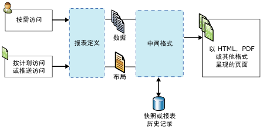

# Reporting Services 概念 (SSRS)
  本文概要介绍 [!INCLUDE[ssNoVersion](../includes/ssnoversion-md.md)] [!INCLUDE[ssRSnoversion](../includes/ssrsnoversion-md.md)] 概念。  
  
 **[!INCLUDE[applies](../includes/applies-md.md)]**  [!INCLUDE[ssRSnoversion](../includes/ssrsnoversion-md.md)] 本机模式 | [!INCLUDE[ssRSnoversion](../includes/ssrsnoversion-md.md)] SharePoint 模式   
  
##   报表服务器概念  
 报表服务器是安装了 [!INCLUDE[ssRSnoversion](../includes/ssrsnoversion-md.md)] 实例的计算机。 报表服务器在内部存储各种项，例如分页和移动报表、报表相关项和资源、计划以及订阅。 报表服务器可以配置为单个独立的服务器，也可以配置为扩展场，或者可与 SharePoint 服务器相集成。 您通过 [!INCLUDE[ssRSnoversion](../includes/ssrsnoversion-md.md)] Web 服务、WMI 提供程序、URL 访问或者以编程方式通过脚本与报表服务器项交互。 您与报表服务器交互的方式依赖于部署拓扑和配置。  
  
### 本机模式报表服务器
 在本机模式下配置的报表服务器是安装了 [!INCLUDE[ssNoVersion](../includes/ssnoversion-md.md)] [!INCLUDE[ssRSnoversion](../includes/ssrsnoversion-md.md)] 并且配置为独立服务器的计算机。 可通过使用具有 [!INCLUDE[ssRSWebPortal](../includes/ssrswebportal.md)] 或 URL 访问命令的浏览器、SQL Server Management Studio 或者以编程方式通过脚本，与报表服务器、报表和报表相关的项交互。 有关详细信息，请参阅 [Reporting Services 报表服务器（本机模式）](../reporting-services/report-server/reporting-services-report-server-native-mode.md)。  
  
### SharePoint 模式报表服务器  
 与 SharePoint 集成的报表服务器具有两个可能的配置。 在 [!INCLUDE[ssRSCurrent](../includes/ssrscurrent-md.md)]中， [!INCLUDE[ssRSnoversion](../includes/ssrsnoversion-md.md)] 作为 SharePoint 共享服务与 SharePoint Server 一起安装。 在早期版本中，通过安装 [!INCLUDE[ssRSnoversion](../includes/ssrsnoversion-md.md)] SharePoint 外接程序，报表服务器与 SharePoint Server 相集成。 在这两种情况下，您通过在 SharePoint 站点上使用应用程序页，与报表服务器、报表和报表相关项交互。 您可以使用 SharePoint 文档库以及为存储与报表相关的内容类型而创建的其他库。 有关详细信息，请参阅 [Reporting Services 报表服务器（SharePoint 模式）](../reporting-services/report-server-sharepoint/reporting-services-report-server-sharepoint-mode.md)。  
  
### 报表服务器项 
 报表服务器项包括你可以发布、上传或保存到报表服务器的分页和移动报表、KPI、共享数据源、共享数据集和其他项。 在本机报表服务器上的报表服务器分层文件夹结构中对项进行组织，或者在 SharePoint 站点上的 SharePoint 内容库中对项进行组织。 有关详细信息，请参阅[报表服务器内容管理（SSRS 本机模式）](../reporting-services/report-server/report-server-content-management-ssrs-native-mode.md)。  
  
### 文件夹
 在本机报表服务器上，文件夹提供了报表服务器中存储的所有可寻址项的分层形式的导航结构和路径。 您使用文件夹层次结构以及站点和文件夹权限来帮助控制对报表服务器项的访问（通称为 *“项级安全性”*）。 默认情况下，您为特定文件夹定义的角色分配由文件夹层次结构中的子文件夹继承。 如果您将特定的角色分配给某一文件夹，则继承规则将不再适用。 文件夹结构由名为 **“主文件夹”** 的根节点和支持可选的 **“我的报表”** 功能的保留文件夹组成。 在浏览器中，该根节点是报表服务器虚拟目录的名称，例如 `http://myreportserver/reports`。 有关更多信息，请参见 [Folders](../reporting-services/report-server/report-server-content-management-ssrs-native-mode.md#bkmk_Folders)。  
  
 在 SharePoint 站点上，在文档库和内容库中使用 SharePoint 文件夹来对项进行组织。  
  
### 角色和权限
 在本机报表服务器上，报表服务器系统管理员可以管理访问权限，配置报表服务器以处理报表请求，维护快照历史记录，并管理针对报表、数据源、数据集和订阅的权限。 例如，发布的报表是通过角色分配进行保护的，这种角色分配使用的是基于 [!INCLUDE[ssRSnoversion](../includes/ssrsnoversion-md.md)] 角色的安全模式。 有关详细信息，请参阅[角色和权限 (Reporting Services)](../reporting-services/security/roles-and-permissions-reporting-services.md)。  
  
 在 SharePoint 站点上，使用 SharePoint 站点管理员页可以管理对报表以及与报表相关站点内容的访问权限。  
  
### “计划”
 在本机报表服务器上，您可以计划分页报表、共享数据集和订阅，以便在特定时间或非高峰时段检索数据并传递报表和数据集查询。 计划可以只运行一次，也可以按一定的时间间隔（小时、天、周或月）持续运行。 有关更多信息，请参见 [Schedules](../reporting-services/subscriptions/schedules.md)。  
  
### 订阅和传递  
 订阅是一种持续存在的请求，它在特定的时间或为响应某个事件以订阅中指定的应用程序文件格式传递报表。 订阅提供了一种可替代按需运行报表的方法。 按需运行报表要求您在每次要查看报表时主动选择报表。 相比之下，订阅可以用于对报表的传递进行计划并使其自动完成。 您可以将报表传递到电子邮件收件箱或文件共享位置。 有关详细信息，请参阅[订阅和传递 (Reporting Services)](../reporting-services/subscriptions/subscriptions-and-delivery-reporting-services.md)。  
  
### 扩展项
 [!INCLUDE[ssNoVersion](../includes/ssnoversion-md.md)] [!INCLUDE[ssRSnoversion](../includes/ssrsnoversion-md.md)] 提供了一种可用于自定义报表解决方案的可扩展体系结构。 报表服务器支持自定义的身份验证扩展插件、数据处理扩展插件、报表处理扩展插件、呈现扩展插件和传递扩展插件，并且支持在 RSReportServer.config 配置文件中向用户提供的可配置的扩展插件。 例如，您可以限制报表查看器允许使用的导出格式。 传递扩展插件和报表处理扩展插件是可选的，但如果希望支持报表分发或自定义控件，则是必需的。 有关详细信息，请参阅 [Reporting Services 扩展插件 (SSRS)](../reporting-services/extensions-ssrs.md)。  
  
### 报表访问 
 通过按需访问，用户可以从报表查看工具中选择报表。 根据报表服务器配置，可以使用 [!INCLUDE[ssRSWebPortal](../includes/ssrswebportal.md)]、 [!INCLUDE[msCoName](../includes/msconame-md.md)] SharePoint 2.0 Web 部件、SharePoint 库（在 SharePoint 集成模式下安装 [!INCLUDE[ssRSnoversion](../includes/ssrsnoversion-md.md)] 时）、嵌入式 ReportViewer 控件或使用 URL 访问的浏览器。 有关按需访问报表的详细信息，请参阅[查找、查看和管理报表（报表生成器和 SSRS）](../reporting-services/report-builder/finding-viewing-and-managing-reports-report-builder-and-ssrs.md)。  
  
 订阅提供了一种可替代按需运行报表的方法。 有关详细信息，请参阅[订阅和传递 (Reporting Services)](../reporting-services/subscriptions/subscriptions-and-delivery-reporting-services.md)。  
  
 有关要用于与报表服务器交互的工具列表，请参阅 [Reporting Services 工具](../reporting-services/tools/reporting-services-tools.md)。  
  
  
##   报表和相关项的概念  
### 报表和报表定义

 **RDL** 
 
 报表定义是符合一种称为报表定义语言 (RDL) 的 XML 语法的 XML 文件。 在 [!INCLUDE[ssRSnoversion](../includes/ssrsnoversion-md.md)]中，您在报表生成器或报表设计器之类的工具中创建报表定义。 它包含用于定义数据源连接的元素、用来检索数据的查询、表达式、参数、图像、文本框、表以及任何其他设计时布局。 有关详细信息，请参阅[报表定义语言 (SSRS)](../reporting-services/reports/report-definition-language-ssrs.md)。  
  
 **RSMOBILE**

在 SQL Server 移动报表发布服务器中创建 Reporting Services 移动报表（.rsmobile 文件）。 它们针对移动设备进行了优化并连接到本地数据，且具有多种类型的数据可视化效果。 阅读有关 [Reporting Services 移动报表](../reporting-services/mobile-reports/create-mobile-reports-with-sql-server-mobile-report-publisher.md)的详细信息。 
  
 **RDLC** 
 
 Visual Studio 报表设计器生成 XML 格式的客户端报表定义 (.rdlc) 文件以供与 ReportViewer 控件结合使用。  
  
### 报表数据连接和数据源 
 当运行查询或处理报表时，报表使用数据连接来检索报表的数据。 在报表定义中，数据连接与数据源相同。 您可以从内置数据连接类型的列表中进行选择，以连接到关系数据库、多维数据库、Web 服务或一些其他数据源。 当描述数据连接时，需要使用以下术语。  
  
-   **数据连接。** 也称为“数据源”。 数据连接包含名称和依赖于连接类型的连接属性。 根据设计，数据源连接不包含凭据。 数据连接不指定从外部数据源中检索哪些数据。 为此，请在创建数据集时指定查询。  
  
-   **数据源定义。** 包含报表数据源的 XML 表示形式的文件。 在发布报表之后，其数据源作为数据源定义（独立于报表定义）保存到报表服务器或 SharePoint 站点上。 例如，报表服务器管理员可以更新连接字符串或凭据。 在本机报表服务器上，文件类型为 .rds。 在 SharePoint 站点上，文件类型为 .rsds。  
  
-   **连接字符串。** 连接字符串是连接到数据源所需的连接属性的字符串版本。 连接属性根据数据连接类型不同而异。  
  
-   **共享数据源。** 报表服务器或 SharePoint 站点上提供的可由多个报表使用的数据源。  
  
     如果您的数据源使用频率较高，就可以采用共享数据源。 建议尽量使用共享数据源。 使用共享数据源可便于对报表和报表访问进行管理，并有助于提高报表和报表所访问数据源的访问安全性。 如果需要共享数据源，可以请求系统管理员为您创建一个。  
  
     在报表生成器中，您不能创建共享数据源。 您可以浏览到报表服务器中的共享数据源并进行选择。  
  
     在报表设计器中，您不能浏览到报表服务器上的共享数据源。 在解决方案资源管理器中，您可以将共享数据源作为项目的一部分创建，并选择是否将它们部署到报表服务器。 您只能选择在本地使用它们，因为您的计算机或报表服务器要求的凭据存在差异。  
  
-   **嵌入数据源。** 也称为 *报表特定的数据源*，嵌入数据源在报表中定义并只由该报表使用。  
  
     嵌入数据源是保存在报表定义中的数据连接。 只有嵌入数据源连接信息所嵌入的报表才能使用这些信息。  
  
-   **凭据。** 凭据是身份验证信息，你必须提供这些信息才能访问外部数据。  
  
     凭据用于创建嵌入数据源、运行查询或在报表处理过程中检索数据。 数据源所有者确定您在访问数据时必须使用的凭据。 凭据在报表服务器、SharePoint 站点或报表创作环境中的本地计算机上独立于数据连接进行管理。 根据数据源的类型，可以保存凭据以避免提醒，也可以将其设置为提醒每个用户。 根据您是从计算机连接到数据源，还是从报表服务器连接到数据源，您需要的凭据可能不同。 有关详细信息，请参阅 [在报表生成器中指定凭据](http://msdn.microsoft.com/library/7412ce68-aece-41c0-8c37-76a0e54b6b53)。  
  
### 报表数据集 
 在报表中，数据集表示通过对外部数据源运行查询而返回的报表数据。 数据集依赖于包含有关外部数据源的信息的数据连接。 数据本身并不包含在报表定义中。 数据集包含查询命令、字段集合、参数、筛选器以及数据选项（包括区分大小写和排序规则）。 有两种类型的数据集：  
  
-   **共享数据集。** 共享数据集发布在报表服务器上，可由多个报表使用。 共享数据集必须基于共享数据源。 可以通过创建缓存刷新计划来对共享数据集进行缓存和计划。  
  
-   **嵌入数据集。** 嵌入数据集在单个报表中定义和使用。  
  
 有关详细信息，请参阅 [报表的嵌入数据集和共享数据集（报表生成器和 SSRS）](../reporting-services/report-data/report-embedded-datasets-and-shared-datasets-report-builder-and-ssrs.md)。  
  
### 报表参数 
 报表参数是报表定义的一部分。 您可以向 Reporting Services 分页和移动报表添加参数，以便链接相关报表、控制报表外观、筛选报表数据或者将报表的作用域缩小到特定用户或位置。 在将分页报表发布到本机报表服务器或 SharePoint 站点时，报表参数将另存为单独的报表服务器项。 可以不通过报表定义单独管理参数。 若要为同一报表创建多组参数，请创建 *“链接报表”*。  
  
### 报表项 
 报表项是 Reporting Services 分页报表定义中的一个内部概念，但也是基本概念。 报表项的属性适用于数据区域、地图、文本框、图像和您添加到报表的其他设计元素。 通过理解报表项的属性，可帮助您设计自定义报表内容和外观。 例如，所有报表项都具有 Hidden 属性，以控制可见性。  
  
### 数据区域和地图 
 数据区域是显示来自 Reporting Services 分页报表中单个数据集中的数据的布局元素。 数据区域类型包括 Tablix、图表、仪表和指示器。 地图是一种特殊类型的数据区域，因为它可以显示来自两个数据集的数据：包含空间数据的数据集和包含分析数据的数据集。  
  
 使用数据区域可实现常见数据的显示：表、矩阵或列表中的数字和文本；图表或仪表中的图形显示；以及根据地图的地理显示。 表、矩阵和列表都基于“Tablix”数据区域，这种数据区域可根据需要扩展以显示数据集中的所有数据。 Tablix 数据区域支持多个行组和列组，还支持静态和动态的行和列。 图表显示各种图表格式的多个序列和类别组。 仪表显示数据集的单个值或聚合值。 地图会将空间数据显示为地图元素，这些地图元素的外观会根据数据集中的聚合数据而变化。  
  
-   **表。** “表”是逐行显示数据的数据区域。 表列是静态的：列数是在设计报表时确定的。 表行是动态的：它们向下扩展以容纳数据。 您可以向表添加组，以按照所选的字段或表达式来组织数据。 有关详细信息，请参阅 [表、矩阵和列表（报表生成器和 SSRS）](http://msdn.microsoft.com/en-us/9dcf3fc8-bf9c-4a14-a03d-e78254aa4098)。  
  
-   **矩阵。** “矩阵”也称为交叉表。 矩阵数据区域包含动态列和行，它们都可以扩展以容纳数据。 矩阵可以具有动态列和行及静态列和行。 列或行可以包含其他列或行，并且可用于对数据进行分组。 有关详细信息，请参阅 [表、矩阵和列表（报表生成器和 SSRS）](http://msdn.microsoft.com/en-us/9dcf3fc8-bf9c-4a14-a03d-e78254aa4098)。  
  
-   **列表。** “列表”是一种数据区域，其中的数据以自由格式排列。 您可以排列这些报表项来创建一个窗体，其中的文本框、图像和其他数据区域可以位于列表中的任何位置。 有关详细信息，请参阅 [表、矩阵和列表（报表生成器和 SSRS）](http://msdn.microsoft.com/en-us/9dcf3fc8-bf9c-4a14-a03d-e78254aa4098)。  
  
-   **图表。** 图表以图形方式显示数据。 图表示例包括条形图、饼图和折线图等，并支持其他多种样式。 有关详细信息，请参阅[图表（报表生成器和 SSRS）](../reporting-services/report-design/charts-report-builder-and-ssrs.md)。  
  
-   **仪表。** 仪表显示某个范围之内的数据，并且带有一个指向该范围内的某个特定值的指示器。 仪表用于显示关键绩效指标 (KPI) 和其他指标。 仪表包括线性仪表和圆形仪表等。 有关详细信息，请参阅 [仪表（报表生成器和 SSRS）](../reporting-services/report-design/gauges-report-builder-and-ssrs.md)。  
  
-   **地图。** 地图用于在地理背景下显示数据。 地图数据可以是 [!INCLUDE[ssNoVersion](../includes/ssnoversion-md.md)] 查询、ESRI 形状文件或 [!INCLUDE[msCoName](../includes/msconame-md.md)] Bing 地图图块中的空间数据。 空间数据由一组坐标组成，这些坐标定义用于表示形状或区域的多边形、表示路线或路径的线条以及由标记表示的点。 您可以将聚合数据与地图元素关联，以自动改变其颜色和大小。 例如，您可以基于销售额改变商店的标记类型，也可以基于速度限制改变公路的颜色。 有关详细信息，请参阅[地图（报表生成器和 SSRS）](../reporting-services/report-design/maps-report-builder-and-ssrs.md)。  
  
 还可以通过以下方式，包括未链接到数据区域的数据集中的值：  
  
-   包括对聚合函数的调用的表达式，这些聚合函数将不同的数据集指定为作用域参数，例如 `=Max(Fields!Sales.Value, "AnnualSales")`。  
  
-   使用函数 **Lookup** 可以从其他数据集内的名称/值对中查找值。  
  
### 报表部件
 报表部件定义 (.rsc) 是作为报表定义文件的 XML 片段的报表服务器项。 您可以通过创建报表定义，然后选择报表中要单独发布为报表部件的报表项，从而创建报表部件。 报表部件包括数据区域、矩形及其包含项以及图像。 您可以保存报表部件及其相关数据集和共享数据源参考，这样它就可以在其他报表中重新使用。 有关详细详细信息，请参阅[报表设计器中的报表部件 (SSRS)](../reporting-services/report-design/report-parts-in-report-designer-ssrs.md)。  
  
### 数据警报 
 数据警报是在警报数据库中内部存储的项。 数据警报定义包括要从现有报表数据馈送使用的数据、要满足的条件、计划以及警报的收件人。 数据警报仅可用于发布到与 SharePoint Server 相集成的报表服务器的报表。 数据警报不可用于本机报表服务器安装。 有关详细信息，请参阅 [Reporting Services 数据警报](../reporting-services/reporting-services-data-alerts.md)。  
  
  
##   Reporting Services 分页报表的类型  
 在 [!INCLUDE[ssRSnoversion](../includes/ssrsnoversion-md.md)]中， *“报表”* 一词可适用于特定类型的报表服务器项、布局设计或解决方案设计。 单个 Reporting Services 分页报表可以具有多种类型的特征；例如，报表可同时是独立报表、主报表引用的子报表、不同主报表中钻取报表的目标和链接报表。  
  
### 明细报表 
 明细报表是一种布局设计，它最初隐藏复杂性，令用户可以切换按条件隐藏报表项，以控制其希望看到的数据量。 明细报表必须检索可在报表中显示的所有可能数据。 对于使用大量数据的报表，请考虑改为使用钻取报表。 有关详细信息，请参阅[深化操作（报表生成器和 SSRS）](../reporting-services/report-design/drilldown-action-report-builder-and-ssrs.md)。  
  
### 子报表
 子报表是作为布局元素添加到报表的报表项。 子报表指向不同的报表并且在主报表的正文内显示为一个子报表实例。 子报表可以使用与主报表不同的数据源。 尽管可以使用参数筛选子报表每个实例的数据，以在数据区域内重复子报表，但子报表通常与主报表一起使用，作为摘要簿或作为相关报表集合的容器。 每个子报表实例都在主报表和子报表之间切换用于报表处理的上下文。 对于使用多个子报表实例的报表，请考虑改为使用钻取报表。 有关详细信息，请参阅[子报表（报表生成器和 SSRS）](../reporting-services/report-design/subreports-report-builder-and-ssrs.md)。  
  
 ### 主/详细信息报表和钻取报表
 主/详细信息报表解决方案包含一个显示摘要信息的主报表，以及指向显示详细信息的一个或多个报表的超链接。  只有在报表读者单击指向该报表的链接时，详细信息报表才运行。 钻取报表脱离主报表单独打开。 可对具有 Action 属性的任何报表项（例如文本框、占位符文本或图表系列）定义超链接。 有关详细信息，请参阅[钻取报表（报表生成器和 SSRS）](../reporting-services/report-design/drillthrough-reports-report-builder-and-ssrs.md)。  
  
### “链接报表” 
 链接报表是一种报表服务器项，它包含指向报表定义的指针，但具有自己的一组报表属性和设置。 这些属性和设置包括安全性、参数、位置、订阅和计划。 因为在服务器上对参数实行单独管理，所以重新发布使用新的参数设置的主报表不会覆盖主报表或链接报表的现有参数设置。  
  
 有关详细信息，请参阅 [创建链接报表](../reporting-services/reports/create-a-linked-report.md)。  
  
### 历史记录报表
 报表历史记录是报表快照的集合。 您可以使用报表历史记录来维护一段时间以来的报表记录。 报表历史记录不适用于包含机密数据或个人数据的报表。 因此，报表历史记录只能包含使用单组凭据查询数据源的那些报表。 或者，您可以通过定义计划和订阅以便将采用导出的文件格式的报表传递到文件共享区，创建报表的历史记录。 有关详细信息，请参阅[性能、快照、缓存 (Reporting Services)](../reporting-services/report-server/performance-snapshots-caching-reporting-services.md)。  
  
### 缓存报表 
 缓存报表是已编译报表和报表数据的保存的副本。 缓存报表用于通过减少对报表处理器的处理请求的数目并减少检索大型报表数据集所需的时间来提高性能。 这些报表有一个强制过期期限，通常以分钟为单位。 有关如何使用缓存报表的详细信息，请参阅[缓存报表 (SSRS)](../reporting-services/report-server/caching-reports-ssrs.md)。  
  
 也可以缓存共享数据集的查询结果。 有关详细信息，请参阅[缓存共享数据集 (SSRS)](../reporting-services/report-server/cache-shared-datasets-ssrs.md)。  
  
### 快照
 报表快照是包含在特定时间点检索到的布局信息以及查询结果的报表。 与在查看报表时获取最新查询结果的按需报表不同，报表服务器将检索已编译的报表以及在创建快照时对于报表而言是最新的数据。 报表快照不以特定的呈现格式进行保存。 相反，将以用户或应用程序发出请求时的最终查看格式（如 HTML）来呈现报表快照。 有关详细信息，请参阅[性能、快照、缓存 (Reporting Services)](../reporting-services/report-server/performance-snapshots-caching-reporting-services.md)。  
   
### 保存的报表  
 保存的分页报表是报表定义 (.rdl) 文件。 可以在本地保存报表定义或将其上载到报表服务器。 如果您上载报表定义，而非发布报表定义，则不会发生版本验证或表达式验证。 在报表运行前，将不会看到错误。 有关详细信息，请参阅 [保存和部署 Reporting Services 报表](../reporting-services/tools/design-reporting-services-paginated-reports-with-report-designer-ssrs.md#bkmk_SaveandDeploy)。  
  
### 发布的报表
 发布的报表是从 [!INCLUDE[ssRSnoversion](../includes/ssrsnoversion-md.md)] 工具发布到报表服务器的报表服务器项。 在本机报表服务器上，您将报表发布到您对其具有权限的文件夹。 在 SharePoint 报表服务器上，可以将报表发布到使用报表内容类型启用的文档库中。 若要向他人共享所使用的报表，这些人士必须已被授予查看报表的权限。 有关详细信息，请参阅 [保存和部署 Reporting Services 报表](../reporting-services/tools/design-reporting-services-paginated-reports-with-report-designer-ssrs.md#bkmk_SaveandDeploy)。  
  
### 升级的报表
 升级的报表是在将报表服务器从某一 [!INCLUDE[ssRSnoversion](../includes/ssrsnoversion-md.md)] 版本升级到更高版本时转换为更新的架构的已发布报表定义。 原始报表定义将保留。 报表将在内存中升级、编译，并且编译后的版本将在内部保存。 有关详细信息，请参阅 [升级 Reporting Services 报表](../reporting-services/install-windows/upgrade-reports.md)。  
  
  
##   Reporting Services 分页报表的阶段  
 报表定义可以创建、发布或保存、编译、处理、缓存、呈现、查看、导出和另存为历史记录。 在您运行报表时，报表服务器将分三个步骤处理报表：报表处理、数据处理和呈现。 数据和报表处理根据报表定义执行；结果将用内部中间格式存储。 中间格式的报表随后将呈现为特定的查看格式。 下图显示了报表处理的阶段和元素。  
  
   
报表处理关系图  
  
### 报表定义  
 存储于报表服务器的报表定义文件 (.rdl)。 有关详细信息，请参阅[报表定义语言 (SSRS)](../reporting-services/reports/report-definition-language-ssrs.md)。  
  
### 已编译的报表和中间报表格式 
 使用计算出的表达式、参数和参数属性的报表。  

### 快照或报表历史记录
 快照是处于特定时间点的报表数据组，并且采用包含报表布局信息的中间格式。 有关详细信息，请参阅[性能、快照、缓存 (Reporting Services)](../reporting-services/report-server/performance-snapshots-caching-reporting-services.md)。  
  
### 已处理报表  
 包含数据和布局信息的完全处理的报表。  
  
### 呈现的报表
 完全处理的报表将发送到报表呈现器，以便合并每页目标呈现格式上的数据和布局。 呈现扩展插件是可定制和可扩展的。 报表的默认呈现格式为 HTML 4.0。 有关详细信息，请参阅[页面布局和呈现方式（报表生成器和 SSRS）](../reporting-services/report-design/page-layout-and-rendering-report-builder-and-ssrs.md)和[扩展插件 (SSRS)](../reporting-services/extensions-ssrs.md)。  
  
### 导出的报表
 导出的报表是以特定文件格式保存的完全分页的报表。 导出格式取决于已安装的呈现扩展插件，并可以进行自定义。 默认情况下，导出格式包括 Excel、Word、XML、PDF、TIFF 和 CSV。 有关详细信息，请参阅[导出报表（报表生成器和 SSRS）](../reporting-services/report-builder/export-reports-report-builder-and-ssrs.md)。  
  
  
## 另请参阅  
 [Reporting Services 功能和任务 (SSRS)](../reporting-services/reporting-services-features-and-tasks-ssrs.md)   
 [技术参考 (SSRS)](../reporting-services/technical-reference-ssrs.md)   
 [Reporting Services (SSRS)](../reporting-services/create-deploy-and-manage-mobile-and-paginated-reports.md)  
  
  
