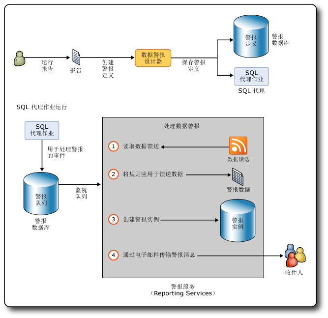

# Reporting Services 数据警报

[!INCLUDE [ssrs-appliesto](../includes/ssrs-appliesto.md)] [!INCLUDE [ssrs-appliesto-2016](../includes/ssrs-appliesto-2016.md)] [!INCLUDE [ssrs-appliesto-not-2017](../includes/ssrs-appliesto-not-2017.md)] [!INCLUDE[ssrs-appliesto-sharepoint-2013-2016i](../includes/ssrs-appliesto-sharepoint-2013-2016.md)] [!INCLUDE [ssrs-appliesto-not-pbirs](../includes/ssrs-appliesto-not-pbirs.md)]

[!INCLUDE [ssrs-previous-versions](../includes/ssrs-previous-versions.md)]

SQL Server Reporting Services 数据警报是一种数据驱动的警报解决方案，用于在恰当的时间向你通知令你感兴趣或对你重要的报表数据。 通过使用数据警报，您不必再找寻信息，它会直接送达您处。

数据警报消息是通过电子邮件发送的。 根据信息的重要程度，您可以选择发送消息的频率以及仅当结果变化时才发送。 您可以指定多个电子邮件收件人，这可让他人知情以改善效率和协作。

> [!NOTE]
> 自 SQL Server 2016 之后，不再提供 Reporting Services 与 SharePoint 的集成这一功能。

##   数据警报体系结构和工作流

下面概述了 [!INCLUDE[ssRSnoversion](../includes/ssrsnoversion-md.md)] 数据警报的主要方面：

-   **定义和保存数据警报定义**：您运行一个报表，创建标识感兴趣的数据值的规则，定义用于发送数据警报消息的重复执行模式，并且指定警报消息的收件人。  
  
-   **运行数据警报定义**：警报服务在计划的时间处理警报定义，检索报表数据，基于警报定义中的规则创建数据警报实例。  
  
-   **向收件人递送数据警报消息**：警报服务创建警报实例，并通过电子邮件将警报消息发送给收件人。  
  
 此外，作为数据警报所有者，您可以查看有关数据警报的信息，删除和编辑您的数据警报定义。 每个警报只有一个所有者，即创建该警报的人员。  
  
 警报管理员：具有 SharePoint 管理警报权限的用户，可以在站点级别管理数据警报。 他们可以按各站点用户查看警报列表和删除警报。  
  
 [!INCLUDE[ssRSnoversion](../includes/ssrsnoversion-md.md)] 数据警报与 SharePoint 警报不同。 您可以针对任何文档类型（包括报表）定义 SharePoint 警报。 SharePoint 警报在文档发生更改时将发送。 例如，您向报表中的表添加列。 而数据警报则相反，它们是在报表中显示的数据满足警报定义中的规则时发送的。 该规则通常将引用在报表中显示的数据。  
  
 通过创建针对报表的数据警报，您可以监视报表数据的更改，并在报表数据满足定义您和他人感兴趣的数据的规则时，通过电子邮件发送数据警报消息，并且按照符合您的业务需要的间隔进行发送。 也可以按需运行数据警报。 如果您具有 SharePoint 创建警报权限，则可以对您有权查看的任何报表创建警报。 您可以针对某个报表创建多个警报，并且多个用户可以对某个报表创建相同或不同的警报。 若要与他人协作，您可以将他们指定为您创建的数据警报定义中警报消息的收件人。  
  
 下图显示了一个工作流，该工作流包括以下任务：创建并保存数据警报定义；创建 SQL 代理作业以便开始处理数据警报实例；以及通过电子邮件发送数据警报消息，该消息包含对一个或多个收件人触发警报的报表数据。  
  
   
  
### 数据警报支持的报表  
 您可以针对以报表定义语言 (RDL) 编写并在报表设计器或报表生成器中创建的所有类型的专业报表创建数据警报。 包含数据区域（如表和图表）的报表、具有子报表的报表以及具有多个并行列组和嵌套数据区域的复杂报表。 唯一要求是该报表至少包含一个任何类型的数据区域，并且报表数据源配置为使用存储凭据或没有凭据。 如果在报表中没有数据区域，则无法对其创建警报。  
  
 您不能对使用 [!INCLUDE[ssCrescent](../includes/sscrescent-md.md)]创建的报表创建数据警报。  
  
 当您在本机模式或 SharePoint 模式下安装 [!INCLUDE[ssRSnoversion](../includes/ssrsnoversion-md.md)] 或者使用报表生成器的独立版本时，可以将报表保存到报表服务器、您的计算机或 SharePoint 库。 若要创建针对报表的数据警报，这些报表必须保存或上载到某一 SharePoint 库中。 这意味着，您不能针对保存到本机模式下的报表服务器或您计算机中的报表创建警报。 此外，您不能创建嵌入在自定义应用程序中的警报。  
  
 [!INCLUDE[ssRSnoversion](../includes/ssrsnoversion-md.md)] 支持报表中多种不同的凭据类型。 您可以针对具有配置为使用 Windows 存储凭据或没有凭据的数据源的报表创建数据警报。 不能针对配置为使用集成的安全凭据或提示凭据的报表创建警报。 报表作为警报定义处理的一部分运行，并且在没有凭据的情况下处理将失败。 有关详细信息，请参见以下内容：  
  
-   [为报表数据源指定凭据和连接信息](../reporting-services/report-data/specify-credential-and-connection-information-for-report-data-sources.md)  
  
-   [角色和权限 (Reporting Services)](../reporting-services/security/roles-and-permissions-reporting-services.md)  
  
-   [针对报表服务器的身份验证](../reporting-services/security/authentication-with-the-report-server.md)  
  
### 运行报表  
 创建数据警报定义的第一步是在 SharePoint 库中查找所需的报表，然后运行该报表。 如果在您运行报表时报表中不包含任何数据，则无法在该时间对报表创建警报。  
  
 如果报表已参数化，则指定运行此报表时要使用的参数值。 参数值将保存在针对报表创建的数据警报定义中。 在重新运行报表时，将作为处理数据警报定义的步骤使用这些值。 如果您要更改参数值，则需要使用这些参数值重新运行此报表，并针对该报表的版本创建一个警报定义。  
  
### 创建数据警报定义  
 [!INCLUDE[ssRSnoversion](../includes/ssrsnoversion-md.md)] 数据警报功能包括用于创建数据警报定义的数据警报设计器。  
  
 若要创建数据警报定义，请运行此报表，然后从 SharePoint 报表查看器的 **“操作”** 菜单中打开数据警报设计器。 将为报表生成报表数据馈送，并且数据馈送中的前 100 行将显示在数据警报设计器的数据预览表中。 只要您在数据警报设计器中处理警报定义，来自某个报表的所有数据馈送都将缓存。 缓存使您可以在数据馈送之间快速切换。 当您在数据警报设计器中重新打开警报定义时，将刷新数据馈送。  
  
 数据警报定义由以下各项构成：规则和子句，报表数据必须满足该条件才能触发数据警报消息；计划，用于定义发送警报消息的频率以及开始和停止发送警报消息的日期（可选）；诸如主题行及要包含在警报消息中的说明的信息；消息的收件人。 在创建警报定义后，将其保存到 SQL Server 警报数据库中。  
  
### 保存数据警报定义和警报元数据  
 当您在 SharePoint 集成模式下安装 [!INCLUDE[ssRSnoversion](../includes/ssrsnoversion-md.md)] 时，将自动创建 SQL Server 警报数据库。  
  
 数据警报定义和警报元数据保存在警报数据库中。 默认情况下，该数据库将命名为 ReportingServices\<GUID>_Alerting。  
  
 当您保存数据警报定义时，警报功能将为该警报定义创建一个 SQL Server 代理作业。 作业包含一个作业计划。 该计划基于您在警报定义中定义的重复执行模式。 运行该作业将启动数据警报定义的处理。  
  
### 处理数据警报定义  
 在 SQL Server 代理作业的计划启动该警报定义的处理时，运行该报表以便刷新报表数据馈送。 警报服务将读取数据馈送，并将数据警报定义指定的规则应用于数据值。 如果一个或多个数据值符合规则，则将创建一个数据警报实例，并通过电子邮件将数据警报消息及警报结果发送给所有收件人。 结果是在创建警报实例时满足所有规则的报表数据行。 为了避免多个警报消息具有相同结果，您可以指定仅当结果更改时才发送消息。 在此情况下，创建一个警报实例，并将其保存到警报数据库中，但不生成警报消息。 如果出现错误，则也将警报实例保存到警报数据库中，并且将具有错误详细信息的警报消息发送给收件人。 本主题后面的诊断和日志记录部分包含有关日志记录和故障排除的详细信息。  
  
### 发送数据警报消息  
 数据警报消息是通过电子邮件发送的。  
  
 **“从”** 行包含 [!INCLUDE[ssRSnoversion](../includes/ssrsnoversion-md.md)] 电子邮件传递配置所提供的值。 **“收件人”** 行列出当您在数据警报设计器中创建该警报时指定的收件人。  
  
 除了在数据警报设计器中指定的电子邮件主题行之外，数据警报消息还包括以下信息：  
  
-   数据警报定义创建者的姓名。  
  
-   如果您在报表定义中提供了说明，则它会在电子邮件文本顶部显示。  
  
-   警报结果，由满足在警报定义中指定的规则的报表数据馈送中的行组成。  
  
-   指向警报定义所基于的报表的链接。  
  
-   警报定义中的规则。  
  
-   用于运行报表的参数和值。  
  
-   来自报表数据区域之外的报表项的上下文值。  
  
 如果无法创建数据警报实例或数据警报消息，则会向所有收件人发送一条错误消息。 消息包括一个错误说明，而不是警报结果。  
  
 有关详细信息，请参阅 [Data Alert Messages](../reporting-services/data-alert-messages.md)。  
  
##   安装数据警报  
 数据警报功能仅当在 SharePoint 模式下安装 [!INCLUDE[ssRSnoversion](../includes/ssrsnoversion-md.md)] 时才可用。 在 SharePoint 模式下安装 [!INCLUDE[ssRSnoversion](../includes/ssrsnoversion-md.md)] 时，安装程序会自动创建警报数据库（用于存储数据警报定义和警报元数据）和两个 SharePoint 页（用于管理警报和向 SharePoint 站点添加数据警报设计器）。 没有要执行的特殊步骤或在安装过程中为警报设置的选项。  
  
 如果要了解有关在 SharePoint 模式下安装 [!INCLUDE[ssRSnoversion](../includes/ssrsnoversion-md.md)] 的详细信息（包括 [!INCLUDE[ssRSnoversion](../includes/ssrsnoversion-md.md)] 中新增的 [!INCLUDE[ssSQL11](../includes/sssql11-md.md)] 共享服务和在可使用 [!INCLUDE[ssRSnoversion](../includes/ssrsnoversion-md.md)] 功能之前必须创建和配置的 [!INCLUDE[ssRSnoversion](../includes/ssrsnoversion-md.md)] 服务应用程序），请参阅 MSDN 库中的 [安装用于 SharePoint 2010 的 Reporting Services SharePoint 模式](http://msdn.microsoft.com/en-us/47efa72e-1735-4387-8485-f8994fb08c8c) 。  
  
 如本主题前面的示意图所示，数据警报使用 SQL Server 代理作业。 若要创建这些作业，SQL Server 代理必须运行。 您可能已经配置 SQL Server 代理以在安装 [!INCLUDE[ssRSnoversion](../includes/ssrsnoversion-md.md)]时自动启动。 如果没有，您可以手动启动 SQL Server 代理。 有关详细信息，请参阅 [配置 SQL Server 代理](http://msdn.microsoft.com/library/2e361a62-9e92-4fcd-80d7-d6960f127900) 和 [启动、停止、暂停、继续、重启数据库引擎、SQL Server 代理或 SQL Server Browser 服务](../database-engine/configure-windows/start-stop-pause-resume-restart-sql-server-services.md)。  
  
 可以使用 SharePoint 管理中心中的 **“设置订阅和警报”** 页来查看 SQL Server 代理是否正在运行，并创建和下载之后要运行以向 SQL Server 代理授予权限的自定义的 [!INCLUDE[tsql](../includes/tsql-md.md)] 脚本。 通过使用 PowerShell 还可以生成 [!INCLUDE[tsql](../includes/tsql-md.md)] 脚本。 有关详细信息，请参阅[用于 SSRS 服务应用程序的设置订阅和警报](../reporting-services/install-windows/provision-subscriptions-and-alerts-for-ssrs-service-applications.md)。  
  
##   配置数据警报  
 从 [!INCLUDE[ssSQL11](../includes/sssql11-md.md)] 开始，只要在 SharePoint 模式下安装 [!INCLUDE[ssRSnoversion](../includes/ssrsnoversion-md.md)] ， [!INCLUDE[ssRSnoversion](../includes/ssrsnoversion-md.md)] 功能的设置（包括数据警报）就将在报表服务器配置文件 (rsreportserver.config) 和 SharePoint 配置数据库之间分布。 当您将创建服务应用程序作为安装和配置 [!INCLUDE[ssRSnoversion](../includes/ssrsnoversion-md.md)]的一个步骤时，会自动创建 SharePoint 配置数据库。 有关详细信息，请参阅 [RsReportServer.config 配置文件](../reporting-services/report-server/rsreportserver-config-configuration-file.md) 和 [Reporting Services 配置文件](../reporting-services/report-server/reporting-services-configuration-files.md)。  
  
 [!INCLUDE[ssRSnoversion](../includes/ssrsnoversion-md.md)] 数据警报的设置包括清除警报数据和元数据的间隔和通过电子邮件发送数据警报消息的重试次数。 您可以更新配置文件和配置数据库，以便为数据警报设置使用不同的值。  
  
 直接更新报表服务器配置文件。 通过使用 Windows PowerShell cmdlet 更新 SharePoint 配置数据库。  
  
 下表列出了用于数据警报的配置元素、其默认值、说明和位置。  
  
|设置|默认值|Description|位置|  
|-------------|-------------------|-----------------|--------------|  
|AlertingCleanupCycleMinutes|20|清理周期开始之间的分钟数。|报表服务器配置文件|  
|AlertingExecutionLogCleanupMinutes|10080|要保留执行日志条目的分钟数。|报表服务器配置文件|  
|AlertingDataCleanupMinutes|360|要保留临时数据的分钟数。|报表服务器配置文件|  
|AlertingMaxDataRetentionDays|180|天数，经过该天数后，将删除警报执行元数据、警报实例和执行结果。|报表服务器配置文件|  
|MaxRetries|3|重试处理数据警报的次数。|服务配置数据库|  
|SecondsBeforeRetry|900|在每次重试之前等待的秒数。|服务配置数据库|  
  
 默认情况下，MaxRetries 和 SecondsBeforeRetry 设置应用于数据警报激发的所有事件。 如果要更精细地控制重试次数和重试延迟，可为任何事件处理程序以及所有事件处理程序添加指定不同 MaxRetries 和 SecondsBeforeRetry 值的元素。  
  
### 事件处理程序和重试  
 事件处理程序如下所示：  
  
|事件处理程序|Description|  
|-------------------|-----------------|  
|FireAlert|在数据警报管理器中单击“运行”   ，以立即启动对警报定义的处理。|  
|FireSchedule|SQL Server 代理为警报定义启动作业计划。|  
|CreateSchedule|创建一个数据警报定义，然后根据在警报定义中指定的频率间隔创建一个 SQL Server 代理作业计划。|  
|UpdateSchedule|更新数据警报定义的频率间隔，并更新 SQL Server 代理作业计划。|  
|DeleteSchedule|删除数据警报定义，同时也将删除其 SQL Server 代理作业。|  
|GenerateAlert|警报运行时处理报表数据馈送，应用数据警报定义中指定的规则，确定是否创建数据警报实例，以及根据需要创建数据警报实例。|  
|DeliverAlert|运行时创建数据警报消息，并通过电子邮件将其发送给所有收件人。|  
  
 下表总结了事件处理程序和激发重试的时间：  
  
|错误类别|<|\<|事件类型||>|>|>|  
|--------------------|--------|--------|----------------|-|--------|--------|--------|  
||**FireAlert**|**FireSchedule**|**CreateSchedule**|**UpdateSchedule**|**DeleteSchedule**|**GenerateAlert**|**DeliverAlert**|  
|内存不足|X|X|X|X|X|X|X|  
|线程中止|X|X|X|X|X|X|X|  
|SQL 代理未运行|X||X|X|X|||  
|暂时。 主要因为连接问题、超时和锁定。|X|X|X|X|X|X|X|  
|IOException|||||||X|  
|WebException|||||||X|  
|SocketException|||||||X|  
|SMTPException **(\*)**|||||||X|  
  
 **(\*)** 将触发重试的 SMTP 错误：  
  
-   SmtpStatusCode.ServiceNotAvailable  
  
-   SmtpStatusCode.MailboxBusy  
  
-   SmtpStatusCode.MailboxUnavailable  
  
###   禁用数据警报  
 如果您要禁用数据警报功能，则更新配置文件的“Service”部分。 下面的代码显示该配置文件的“Service”部分：  
  
 `<Service>`  
  
 `<IsSchedulingService>True</IsSchedulingService>`  
  
 `<IsNotificationService>True</IsNotificationService>`  
  
 `<IsEventService>True</IsEventService>`  
  
 `<IsAlertingService>True</IsAlertingService>`  
  
 `…`  
  
 `</Service>`  
  
 要禁用警报，则在 `<IsAlertingService>True</IsAlertingService>`中将 True 更改为 False。  
  
##   数据警报的权限  
 在可以针对报表创建数据警报前，必须有权在 SharePoint 站点上运行该报表和创建警报。 若要了解有关报表权限的详细信息，请参见以下内容。  
  
-   [基于报表生成数据馈送（报表生成器和 SSRS）](../reporting-services/report-builder/generating-data-feeds-from-reports-report-builder-and-ssrs.md)  
  
-   [在 SharePoint 站点上为报表服务器项设置权限（SharePoint 集成模式下的 Reporting Services）](../reporting-services/security/set-permissions-for-report-server-items-on-a-sharepoint-site.md)  
  
 [!INCLUDE[ssRSnoversion](../includes/ssrsnoversion-md.md)] 数据警报支持两个权限级别：信息工作者和警报管理员。 下表列出了相关的 SharePoint 权限和用户任务。  
  
|用户类型|SharePoint 权限|任务说明|  
|---------------|---------------------------|----------------------|  
|信息工作者|查看项   创建通知|查看报表之类的项和针对报表创建数据警报。 编辑和删除警报。|  
|警报管理员|管理警报|查看在 SharePoint 站点上保存的所有数据警报的列表，以及删除警报。|  
  
##   诊断和日志记录  
 数据警报提供了多种方法来帮助信息工作者和管理员跟踪警报以及了解警报失败的原因，并帮助管理员利用日志来了解哪些警报消息已发送给谁以及已发送的警报实例的数目等等。  
  
### 数据警报管理器  
 数据警报管理器列出警报定义以及帮助信息工作者和管理员了解发生故障的原因的错误信息。 失败的一些常见原因包括：  
  
-   报表数据馈送发生了更改并且在数据警报定义规则中使用的列不再包括在数据馈送中。  
  
-   用于查看报表的权限已被吊销。  
  
-   基础数据源中的数据类型发生了更改并且警报定义将不再有效。  
  
### 日志  
 [!INCLUDE[ssRSnoversion](../includes/ssrsnoversion-md.md)] 提供若干日志，有助于您了解在处理数据警报定义、创建的数据警报实例等时运行的报表的详细信息。 三个日志特别有用：警报执行日志、报表服务器执行日志和报表服务器跟踪日志。  
  
 有关其他 [!INCLUDE[ssRSnoversion](../includes/ssrsnoversion-md.md)] 日志的信息，请参阅 [Reporting Services 日志文件和源](../reporting-services/report-server/reporting-services-log-files-and-sources.md)。  
  
#### 警报执行日志  
 警报运行时服务在警报数据库的 ExecutionLogView 表中写入条目。 您可以查询表或运行以下存储过程，获取与保存到警报数据库的数据警报有关的更丰富的诊断信息。  
  
-   ReadAlertData  
  
-   ReadAlertHistory  
  
-   ReadAlertInstances  
  
-   ReadEventHistory  
  
-   ReadFeedPollHistory  
  
-   ReadFeedPools  
  
-   ReadPollData  
  
-   ReadSentAlerts  
  
 可以使用 SQL 代理来按计划运行存储过程。 有关详细信息，请参阅 [SQL Server Agent](http://msdn.microsoft.com/library/8d1dc600-aabb-416f-b3af-fbc9fccfd0ec)。  
  
#### 报表服务器执行日志  
 运行报表以生成数据警报定义所基于的数据馈送。 报表服务器数据库中的报表服务器执行日志在每次运行报表时捕获信息。 你可以在数据库中的 ExecutionLog2 视图中查询详细信息。 有关详细信息，请参阅 [报表服务器 ExecutionLog 和 ExecutionLog3 视图](../reporting-services/report-server/report-server-executionlog-and-the-executionlog3-view.md)。  
  
#### 报表服务器跟踪日志  
 报表服务器跟踪日志包含报表服务器服务操作的非常详细的信息，包括由报表服务器 Web 服务和后台处理执行的操作。 如果要调试包括报表服务器的应用程序或调查已写入事件日志或执行日志中的特定问题，跟踪日志信息可能非常有用。 有关详细信息，请参阅 [Report Server Service Trace Log](../reporting-services/report-server/report-server-service-trace-log.md)。  
  
##   性能计数器  
 数据警报提供自己的性能计数器。 除性能计数器之外，其他内容都与一个作为警报运行时服务的一部分的事件相关。 与事件队列相关的性能计数器告知所有活动事件的队列长度。  
  
|事件或事件队列|性能计数器|  
|--------------------------|-------------------------|  
|ALERTINGQUEUESIZE|警报：事件队列长度|  
|FireAlert|警报：处理的事件数 - FireAlert|  
|FireSchedule|警报：处理的事件数 - FireSchedule|  
|CreateSchedule|警报：处理的事件数 - CreateSchedule|  
|UpdateSchedule|警报：处理的事件数 - UpdateSchedule|  
|DeleteSchedule|警报：处理的事件数 - DeleteSchedule|  
|GenerateAlert|警报：处理的事件数 - GenerateAlert|  
|DeliverAlert|警报：处理的事件数 - DeliverAlert|  
  
 [!INCLUDE[ssRSnoversion](../includes/ssrsnoversion-md.md)] 提供其他 [!INCLUDE[ssRSnoversion](../includes/ssrsnoversion-md.md)] 功能的性能计数器。 有关详细信息，请参阅 [ReportServer:Service 和 ReportServerSharePoint:Service 性能对象的性能计数器](../reporting-services/report-server/performance-counters-reportserver-service-performance-objects.md)、[MSRS 2011 Web Service 和 MSRS 2011 Windows Service 性能对象的性能计数器（本机模式）](../reporting-services/report-server/performance-counters-msrs-2011-web-service-performance-objects.md)和 [MSRS 2011 Web Service SharePoint Mode 性能对象和 MSRS 2011 Windows Service SharePoint Mode 性能对象的性能计数器（SharePoint 模式）](../reporting-services/report-server/performance-counters-msrs-2011-sharepoint-mode-performance-objects.md)。  
  
##   对 SSL 的支持  
 [!INCLUDE[ssRSnoversion](../includes/ssrsnoversion-md.md)] 可以使用 HTTP SSL（安全套接字层）服务建立到报表服务器或 SharePoint 站点的加密连接。  
  
 警报运行时服务和数据警报用户界面支持 SSL，无论使用 SSL 或 HTTP，它们的用法都类似，但是存在一些细微差别。 当使用 SSL 连接创建数据警报定义时，从数据警报消息链接回 SharePoint 库的 URL 也使用 SSL。 您可以标识此 SSL 连接，因为它在其 URL 中使用的是 HTTPS，而不是 HTTP。 同样，如果使用 HTTP 连接创建数据警报定义，则链回到 SharePoint 站点的链接使用 HTTP。 不管警报定义是使用 SSL 还是 HTTP 创建的，在使用数据警报设计器或数据警报管理器时，用户和警报管理员的体验都完全相同。 如果在从创建警报定义到后来更新并重新保存警报定义的这段时间内应更改此协议（HTTP 或 SSL），则保留原始协议，并在链接 URL 中使用。  
  
 如果在配置为使用 SSL 的 SharePoint 站点上创建数据警报，然后删除 SSL 要求，则该警报在该站点上仍将正常工作。 如果删除该站点，则会改用默认区域站点。  
  
##   数据警报用户界面  
 数据警报提供用于管理警报的 SharePoint 页以及用于创建和编辑数据警报定义的设计器。  
  
-   **数据警报设计器** ，在其中创建或编辑数据警报定义。 有关详细信息，请参阅 [数据警报设计器](../reporting-services/data-alert-designer.md)、 [在数据警报设计器中创建数据警报](../reporting-services/create-a-data-alert-in-data-alert-designer.md) 和 [在警报设计器中编辑数据警报](../reporting-services/edit-a-data-alert-in-alert-designer.md)。  
  
-   **数据警报管理器** ，在其中查看数据警报列表、删除警报以及打开警报以进行编辑。 数据警报管理器有两个版本：一个可供用户管理他们创建的警报，另一个可供管理员管理属于站点用户的警报。  
  
     有关管理所创建的数据警报的详细信息，请参阅 [SharePoint 用户的数据警报管理器](../reporting-services/data-alert-manager-for-sharepoint-users.md) 和 [在数据警报管理器中管理我的数据警报](../reporting-services/manage-my-data-alerts-in-data-alert-manager.md)。  
  
     有关管理站点上所有数据警报的详细信息，请参阅 [向管理员提出警报的数据警报管理器](../reporting-services/data-alert-manager-for-alerting-administrators.md) 和 [在数据警报管理器中管理 SharePoint 站点上的所有数据警报](../reporting-services/manage-all-data-alerts-on-a-sharepoint-site-in-data-alert-manager.md)。  
  
-   **设置订阅和数据警报** ，在其中查看 Reporting Services 是否可以针对数据警报使用 SQL Server 代理，是否可以下载允许访问 SQL Server 代理的脚本。 有关详细信息，请参阅[用于 SSRS 服务应用程序的设置订阅和警报](../reporting-services/install-windows/provision-subscriptions-and-alerts-for-ssrs-service-applications.md)。  
  
##   全球化数据警报  
 某些书写方式（如阿拉伯语和希伯莱语）是自右至左书写。 数据警报支持从右到左书写以及从左到右书写。 数据警报检测区域性，并相应地更改用户界面的外观和行为及数据警报消息的布局。 此区域性派生自用户计算机上操作系统的区域设置。 在每次更新并重新保存数据警报定义时保存此区域性。  
  
 满足警报定义中的规则的数据是否可能受警报定义中区域性的影响。 字符串比较最常受区域性设置特定的规则影响。  
  
 确定满足警报定义中的规则的报表数据是否会受到警报定义中区域性的影响。 此类情况在字符串中最常出现。 例如，在具有德语区域性的警报定义中，将不会满足比较英文字母“o”和德文字母“ö”的规则。 在使用英语区域性的相同警报定义中，应符合此规则。  
  
 数据格式也是基于警报定义的区域性。 例如，如果此区域性使用句点作为小数符号，则该值显示为 45.67；而使用逗号作为小数符号的区域性将显示 45,67。  
  
 根据您所使用的数据警报用户界面，对于从右到左的支持将有所不同。 数据警报设计器支持文本框中的从右到左书写，但设计器的布局却不是从右到左的。 其布局与其他工具类似，也是从左到右的。 如果一个警报定义是使用从右到左文本方向创建的，但在从左到右的环境编辑中进行，则在保存此警报定义时，会保留从右到左文本方向。 数据警报管理器在行为上与 SharePoint 页相同。 其布局是从右到左，就像其他 SharePoint 页一样。 基于从右到左数据警报定义的数据警报消息将从右到左显示消息文本，但消息布局却是从左到右。  
  
##   相关任务  
  
-   [将报表保存到 SharePoint 库（报表生成器）](../reporting-services/report-builder/save-a-report-to-a-sharepoint-library-report-builder.md)  
  
-   [在数据警报设计器中创建数据警报](../reporting-services/create-a-data-alert-in-data-alert-designer.md)  
  
-   [在警报设计器中编辑数据警报](../reporting-services/edit-a-data-alert-in-alert-designer.md)  
  
-   [在数据警报管理器中管理我的数据警报](../reporting-services/manage-my-data-alerts-in-data-alert-manager.md)  
  
-   [在数据警报管理器中管理 SharePoint 站点上的所有数据警报](../reporting-services/manage-all-data-alerts-on-a-sharepoint-site-in-data-alert-manager.md)  
  
-   [向用户和警报管理员授予权限](../reporting-services/grant-permissions-to-users-and-alerting-administrators.md)  
  
## 另请参阅

[数据警报设计器](../reporting-services/data-alert-designer.md)   
[向管理员提出警报的数据警报管理器](../reporting-services/data-alert-manager-for-alerting-administrators.md)   
[SharePoint 用户的数据警报管理器](../reporting-services/data-alert-manager-for-sharepoint-users.md)  

更多疑问？ [请访问 Reporting Services 论坛](http://go.microsoft.com/fwlink/?LinkId=620231)
