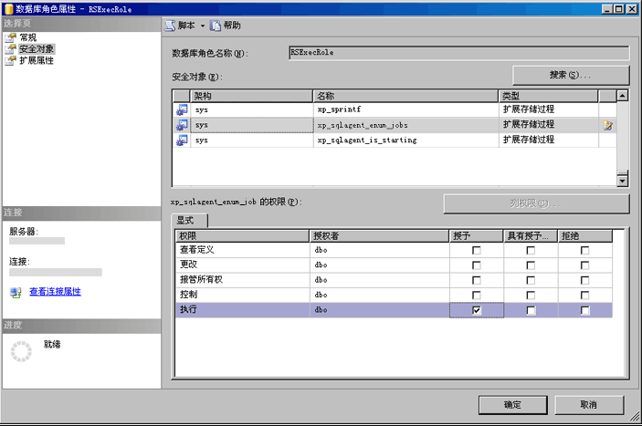

# 创建 RSExecRole

  [!INCLUDE[ssRSnoversion](../../includes/ssrsnoversion-md.md)] 使用称为 **RSExecRole** 的预定义数据库角色向报表服务器数据库授予报表服务器权限。 为报表服务器数据库自动创建了 **RSExecRole** 角色。 通常，始终不应修改该角色或将其他用户分配给该角色。 但是，将报表服务器数据库移到新的或其他 [!INCLUDE[ssNoVersion](../../includes/ssnoversion-md.md)] [!INCLUDE[ssDE](../../includes/ssde-md.md)]时，必须在 Master 和 MSDB 系统数据库中重新创建该角色。  
  
 使用以下说明，您将执行下列步骤：  
  
-   在 Master 系统数据库中创建和设置 **RSExecRole** 。  
  
-   在 MSDB 系统数据库中创建和设置 **RSExecRole** 。  
  
> [!NOTE]  
>  本主题中的说明针对的是不需要运行脚本或编写 WMI 代码来设置报表服务器数据库的用户。 如果管理大型部署并且要例行移动数据库，则应编写脚本来自动执行这些步骤。 有关详细信息，请参阅 [访问 Reporting Services WMI 提供程序](../../reporting-services/tools/access-the-reporting-services-wmi-provider.md)。  
  
## 开始之前  
  
-   备份加密密钥，以便可以在数据库移动之后对其进行还原。 这是不会直接影响您创建和设置 **RSExecRole**的能力的步骤，不过您必须有密钥备份才能验证您的工作。 有关详细信息，请参阅 [Back Up and Restore Reporting Services Encryption Keys](../../reporting-services/install-windows/ssrs-encryption-keys-back-up-and-restore-encryption-keys.md)。  
  
-   验证你是以具有 **实例上的** sysadmin [!INCLUDE[ssNoVersion](../../includes/ssnoversion-md.md)] 权限的用户帐户身份登录的。  
  
-   验证 [!INCLUDE[ssNoVersion](../../includes/ssnoversion-md.md)] 代理服务已安装在计划使用的 [!INCLUDE[ssDE](../../includes/ssde-md.md)] 实例上并且正在运行。  
  
-   附加 reportservertempdb 和 reportserver 数据库。 不要求您附加这些数据库来创建实际的角色，不过必须要先附加它们才可以测试您的工作。  
  
 关于手动创建 **RSExecRole** 的说明是供迁移报表服务器安装的上下文中使用的。 备份和移动报表服务器数据库等重要任务均不在本主题中讲述，但是会记录在数据库引擎文档中。  
  
## 在 Master 中创建 RSExecRole  
 [!INCLUDE[ssRSnoversion](../../includes/ssrsnoversion-md.md)] 使用 [!INCLUDE[ssNoVersion](../../includes/ssnoversion-md.md)] 代理服务的扩展存储过程来支持计划操作。 下列步骤说明如何向 **RSExecRole** 角色授予这些过程的执行权限。  
  
#### 使用 Management Studio 在 Master 系统数据库中创建 RSExecRole  
  
1.  启动 [!INCLUDE[ssNoVersion](../../includes/ssnoversion-md.md)] [!INCLUDE[ssManStudio](../../includes/ssmanstudio-md.md)] 并连接到承载报表服务器数据库的 [!INCLUDE[ssDE](../../includes/ssde-md.md)] 实例。  
  
2.  打开 **“数据库”**。  
  
3.  打开 **“系统数据库”**。  
  
4.  打开 **Master**。  
  
5.  打开 **“安全性”**。  
  
6.  打开 **“角色”**。  
  
7.  右键单击“数据库角色”，然后选择“新建数据库角色”。 将显示“常规”页。  
  
8.  在 **“角色名称”**中，键入 **RSExecRole**。  
  
9. 在 **“所有者”**中，键入 **DBO**。  
  
10. 单击 **“安全对象”**。  
  
11. 单击 **“搜索”**。 此时，将显示 **“添加对象”** 对话框。 **“指定对象”** 选项默认情况下处于选中状态。  
  
12. 单击 **“确定”**。 此时，将显示 **“选择对象”** 对话框。  
  
13. 单击 **“对象类型”**。  
  
14. 单击 **“扩展存储过程”**。  
  
15. 单击 **“确定”**。  
  
16. 单击 **“浏览”**。  
  
17. 向下滚动扩展存储过程列表，然后选择下列各项：  
  
    1.  xp_sqlagent_enum_jobs  
  
    2.  xp_sqlagent_is_starting  
  
    3.  xp_sqlagent_notify  
  
18. 单击 **“确定”**，然后再次单击 **“确定”** 。  
  
19. 在 **“执行”** 一行的 **“授予”** 列中，单击复选框，然后单击 **“确定”**。  
  
20. 对于其余的每个存储过程，重复此操作。 必须向**RSExecRole** 授予全部三个存储过程的执行权限。  
  
   
  
## 在 MSDB 中创建 RSExecRole  
 Reporting Services 使用 SQL Server 代理服务的存储过程并从系统表中检索作业信息，以支持计划操作。 下列步骤说明如何向 RSExecRole 授予这些过程的执行权限和对表的选择权限。  
  
#### 在 MSDB 系统数据库中创建 RSExecRole  
  
1.  重复相似的步骤，授予 MSDB 中存储过程和表的权限。 若要简化这些步骤，需要单独设置存储过程和表。  
  
2.  打开 **MSDB**。  
  
3.  打开 **“安全性”**。  
  
4.  打开 **“角色”**。  
  
5.  右键单击“数据库角色”，然后选择“新建数据库角色”。 将显示“常规”页。  
  
6.  在“角色名称”中，键入 **RSExecRole**。  
  
7.  在“所有者”中，键入 **DBO**。  
  
8.  单击 **“安全对象”**。  
  
9. 单击 **“添加”**。 此时，将显示 **“添加对象”** 对话框。 **“指定对象”** 选项默认情况下处于选中状态。  
  
10. 单击 **“确定”**。  
  
11. 单击 **“对象类型”**。  
  
12. 单击 **“存储过程”**。  
  
13. 单击 **“确定”**。  
  
14. 单击 **“浏览”**。  
  
15. 向下滚动项目列表，然后选择下列各项：  
  
    1.  sp_add_category  
  
    2.  sp_add_job  
  
    3.  sp_add_jobschedule  
  
    4.  sp_add_jobserver  
  
    5.  sp_add_jobstep  
  
    6.  sp_delete_job  
  
    7.  sp_help_category  
  
    8.  sp_help_job  
  
    9. sp_help_jobschedule  
  
    10. sp_verify_job_identifiers  
  
16. 单击 **“确定”**，然后再次单击 **“确定”** 。  
  
17. 选择第一个存储过程：sp_add_category。  
  
18. 在 **“执行”** 一行的 **“授予”** 列中，单击复选框，然后单击 **“确定”**。  
  
19. 对于其余的每个存储过程，重复此操作。 必须向 RSExecRole 授予全部十个存储过程的执行权限。  
  
20. 在“安全对象”选项卡上，再次单击 **“添加”** 。 此时，将显示 **“添加对象”** 对话框。 **“指定对象”** 选项默认情况下处于选中状态。  
  
21. 单击 **“确定”**。  
  
22. 单击 **“对象类型”**。  
  
23. 单击 **“表”**。  
  
24. 单击 **“确定”**。  
  
25. 单击 **“浏览”**。  
  
26. 向下滚动项目列表，然后选择下列各项：  
  
    1.  syscategories  
  
    2.  sysjobs  
  
27. 单击 **“确定”**，然后再次单击 **“确定”** 。  
  
28. 选择第一个表：syscategories。  
  
29. 在 **“选择”** 一行的 **“授予”** 列中，单击复选框，然后单击 **“确定”**。  
  
30. 对于 sysjobs 表重复此操作。 必须向 RSExecRole 授予这两个表的选择权限。  
  
## 移动报表服务器数据库  
 创建角色之后，可以将报表服务器数据库移到新的 SQL Server 实例。 有关详细信息，请参阅[将报表服务器数据库移至其他计算机](../../reporting-services/report-server/moving-the-report-server-databases-to-another-computer-ssrs-native-mode.md)。  
  
 如果要将 [!INCLUDE[ssDE](../../includes/ssde-md.md)] 升级到 SQL Server 2016，可以在数据库移动之前或之后进行升级。  
  
 当报表服务器连接到报表服务器数据库时，该数据库将自动升级。 数据库升级不要求任何特定的步骤。  
  
## 还原加密密钥和验证您的工作  
 如果已附加报表服务器数据库，则现在应可以完成以下步骤来验证您的工作。  
  
#### 数据库移动后验证报表服务器的可操作性  
  
1.  启动 Reporting Services 配置工具，然后连接到报表服务器。  
  
2.  单击 **“数据库”**。  
  
3.  单击 **“更改数据库”**。  
  
4.  单击 **“选择现有报表服务器数据库”**。  
  
5.  输入数据库引擎的服务器名称。 如果将报表服务器数据库附加到命名实例，则必须按以下格式键入实例名称：\<servername>\\<instancename\>。  
  
6.  单击 **“测试连接”**。  
  
7.  单击 **“下一步”**。  
  
8.  在“数据库”上，选择报表服务器数据库。  
  
9. 单击 **“下一步”** 并完成向导。  
  
10. 单击 **“加密密钥”**。  
  
11. 单击 **“还原”**。  
  
12. 选择强文件 (.snk)，该文件拥有用来对报表服务器数据库中存储的凭据和连接信息进行解密的对称密钥的备份副本。  
  
13. 输入密码，然后单击 **“确定”**。  
  
14. 单击 **“报表管理器 URL”**。  
  
15. 单击链接打开报表管理器。 您应看到报表服务器数据库中的报表服务器项。  

## 后续步骤

[将报表服务器数据库移至其他计算机（SSRS 本机模式）](../../reporting-services/report-server/moving-the-report-server-databases-to-another-computer-ssrs-native-mode.md)   
[Reporting Services Configuration Manager（本机模式）](../../reporting-services/install-windows/reporting-services-configuration-manager-native-mode.md)   
[创建本机模式报表服务器数据库（SSRS 配置管理器）](../../reporting-services/install-windows/ssrs-report-server-create-a-native-mode-report-server-database.md)   
[备份和还原 Reporting Services 加密密钥](../../reporting-services/install-windows/ssrs-encryption-keys-back-up-and-restore-encryption-keys.md)  

更多疑问？ [请访问 Reporting Services 论坛](http://go.microsoft.com/fwlink/?LinkId=620231)