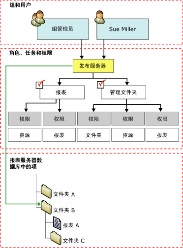

# 角色分配
  在 [!INCLUDE[ssRSnoversion](../../includes/ssrsnoversion-md.md)]中，“角色分配”  确定对报表服务器上的存储项和报表服务器自身的访问权限。 角色分配由以下几部分组成：  
  
-   要控制其访问权限的安全对象。 安全对象的示例包括文件夹、报表和资源。  
  
-   可由 Windows 安全性或其他身份验证机制进行身份验证的用户帐户或组帐户。  
  
-   定义一组任务的角色定义。 角色定义的示例包括“系统管理员” 、“内容管理员” 和“发布者” 。  
  
 角色分配在文件夹层次结构中可以继承。 文件夹中包含的所有报表、共享数据源、资源和子文件夹将自动继承为文件夹定义的角色分配。 您可以通过为各项分别定义角色分配来覆盖继承的安全性。 文件夹层次结构的所有部分都必须至少由一个角色分配进行保护。 不能创建不安全的项，而且在处理设置时应采用安全的方式，以避免创建不安全的项。  
  
 下图显示了一个角色分配，它将一个组和一个特定用户映射到文件夹 B 的“发布者”  角色：  
  
   
角色分配关系图  
  
## 系统级和项级角色分配  
 [!INCLUDE[ssRSnoversion](../../includes/ssrsnoversion-md.md)] 中基于角色的安全性归为以下级别：  
  
-   项级角色分配控制对报表服务器文件夹层次结构中报表、文件夹、报表模型、共享数据源和资源的访问权限。 对特定项或主文件夹创建角色分配时，定义的就是项级角色分配。  
  
-   系统角色分配将授予涉及整个服务器范围的操作（例如，管理作业就是一个系统级操作）。 系统角色分配与系统管理员并不相同。 它不能授予可分配对报表服务器的完全控制权限的高级权限。  
  
 系统角色分配并不授予对文件夹层次结构中的项的访问权限。 系统安全性和项安全性是互斥的。 对于任何给定的用户或组，您可能需要同时创建系统级和项级角色分配，才可为其提供对报表服务器的充分访问权限。  
  
## 角色分配中的用户和组  
 您在角色分配中指定的用户帐户或组帐户都是域帐户。 报表服务器可以引用 [!INCLUDE[msCoName](../../includes/msconame-md.md)] Windows 域（如果使用的是自定义安全扩展插件，则可以是其他安全模式）中的用户和组，但不能创建或管理其中的用户和组。  
  
 在应用于任何给定项的所有角色分配中，任意两个角色分配所指定的用户或组都不得相同。 如果某个用户帐户也是组帐户的成员，而您为该用户和组都指定了角色分配，那么，该用户将可以使用这两个角色分配的任务。  
  
 当您将用户添加到已指定角色分配的组时，必须重置 Internet Information Services (IIS)，新的角色分配才会对该用户生效。  
  
## 预定义角色分配  
 默认情况下，将实现预定义角色分配，以允许本地管理员管理报表服务器。 您必须添加其他角色分配，才可向其他用户授予访问权限。  
  
 有关提供默认安全性的预定义角色分配的详细信息，请参阅 [预定义角色](../../reporting-services/security/role-definitions-predefined-roles.md)。  
  
## 另请参阅  
 [创建、 删除或修改角色 &#40;Management Studio &#41;](../../reporting-services/security/role-definitions-create-delete-or-modify.md)   
 [向报表服务器 &#40; 授予用户访问权限报表管理器 &#41;](../../reporting-services/security/grant-user-access-to-a-report-server-report-manager.md)   
 [修改或删除角色分配 &#40;报表管理器 &#41;](../../reporting-services/security/role-assignments-modify-or-delete.md)   
 [在 SharePoint 站点 &#40; 上设置为报表服务器项的权限Reporting Services SharePoint 集成模式 &#41;](../../reporting-services/security/set-permissions-for-report-server-items-on-a-sharepoint-site.md)   
 [授予对本机模式报表服务器的权限](../../reporting-services/security/granting-permissions-on-a-native-mode-report-server.md)  
  
  

