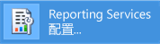
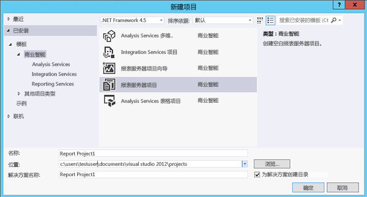

# 教程：如何查找并启动 Reporting Services 工具 (SSRS)

  本教程介绍了用于配置报表服务器、管理报表服务器内容和操作以及创建并发布分页和移动 [!INCLUDE[ssRSnoversion](../../includes/ssrsnoversion-md.md)] 报表的工具。 如果你已经熟悉了这些工具，你可以转到其他教程学习有关使用 [!INCLUDE[ssRSnoversion](../../includes/ssrsnoversion-md.md)]的技能。 有关其他教程，请参阅 [Reporting Services 教程 (SSRS)](../../reporting-services/reporting-services-tutorials-ssrs.md)的技能。  
  
  
##   Reporting Services 配置管理器（本机节点）  
 使用本机模式配置管理器完成以下任务：  
  
-   指定服务帐户。  
-   创建或升级报表服务器数据库。  
-   修改连接属性。  
-   指定 URL。  
-   管理加密密钥。  
-   配置无人参与的报表处理和电子邮件报表传递。  
  
 **Installation:** [!INCLUDE[ssRSnoversion](../../includes/ssrsnoversion-md.md)] Configuration Manager is installed when you install [!INCLUDE[ssRSnoversion](../../includes/ssrsnoversion-md.md)] Native mode. 有关详细信息，请参阅 [安装 Reporting Services 本机模式报表服务器](assetid:///8f25e6dc-b753-400e-9e9a-50f4f35bf6c4)。  
  
### 启动 Reporting Services 配置管理器  
  
1.  在 Windows“开始”屏幕上，键入 **reporting** ，然后在“应用”  搜索结果中，单击“Reporting Services 配置管理器” 。  
  
       
  
     **Or**  
  
     单击 **“开始”**，然后依次单击 **“程序”**、“ [!INCLUDE[ssCurrentUI](../../includes/sscurrentui-md.md)]”、 **“配置工具”**、 **“Reporting Services 配置管理器”**。  
  
     此时将出现 **“选择报表服务器安装实例”** 对话框，可以选择要配置的报表服务器实例。  
  
2.  在 **“服务器名称”**中，指定安装报表服务器实例的计算机的名称。 指定的默认值是本地计算机名称，但也可以键入远程 [!INCLUDE[ssNoVersion](../../includes/ssnoversion-md.md)] 实例的名称。  
  
     如果指定远程计算机，请单击 **“查找”** 以建立一个连接。 必须事先配置报表服务器，以便进行远程管理。 有关详细信息，请参阅 [配置报表服务器以进行远程管理](../../reporting-services/report-server/configure-a-report-server-for-remote-administration.md)。  
  
3.  在 **在stance Name**中，选择要配置的 [!INCLUDE[ssNoVersion](../../includes/ssnoversion-md.md)] [!INCLUDE[ssRSnoversion](../../includes/ssrsnoversion-md.md)] 实例。 仅 SQL Server 2008 和更高版本的报表服务器实例出现在列表中。 不能配置较早版本的 [!INCLUDE[ssRSnoversion](../../includes/ssrsnoversion-md.md)]。  
  
4.  单击 **“连接”**。  
  
5.  若要验证是否已启动工具，请将您的结果与下图进行比较：  
  
       
  
 **后续步骤：**[配置和管理报表服务器（SSRS 本机模式）](../../reporting-services/report-server/configure-and-administer-a-report-server-ssrs-native-mode.md)和 [Reporting Services Configuration Manager（本机模式）](../../reporting-services/install-windows/reporting-services-configuration-manager-native-mode.md)。  
  
##  Web 门户（本机模式）  
 使用 [Web portal (SSRS Native Mode)](../../reporting-services/web-portal-ssrs-native-mode.md) 可设置权限、管理订阅和计划以及处理报表。 还可以使用 Web 门户查看报表。  
  
 **安装：**Web 门户在安装 [!INCLUDE[ssRSnoversion](../../includes/ssrsnoversion-md.md)] 本机模式时进行安装：[安装 Reporting Services 本机模式报表服务器](assetid:///8f25e6dc-b753-400e-9e9a-50f4f35bf6c4)  
  
 必须拥有足够的权限才能打开 Web 门户（最初，只有本地 Administrators 组的成员拥有访问 Web 门户功能的权限）。 Web 门户根据当前用户的角色分配提供不同的页和选项。 没有权限的用户将得到一个空页。 拥有查看报表权限的用户将获得链接，用户点击这些链接可以打开报表。 若要了解有关权限的详细信息，请参阅[角色和权限 (Reporting Services)](../../reporting-services/security/roles-and-permissions-reporting-services.md)。  
  
### 启动 Web 门户  
  
1.  打开浏览器。 有关支持的浏览器和浏览器版本的信息，请参阅 [Reporting Services 和 Power View 的浏览器支持](../../reporting-services/browser-support-for-reporting-services-and-power-view.md)。  
  
2.  在 Web 浏览器的地址栏中，输入 Web 门户 URL。 默认情况下，URL 为 `http://<serverName>/reports`。 可以使用 Reporting Services 配置工具确认服务器名称和 URL。 有关 [!INCLUDE[ssRSnoversion](../../includes/ssrsnoversion-md.md)] 中使用的 URL 的详细信息，请参阅[配置报表服务器 URL（SSRS 配置管理）](../../reporting-services/install-windows/configure-report-server-urls-ssrs-configuration-manager.md)。  
  
3.  Web 门户将在浏览器窗口中打开。 引导页为主文件夹。 根据权限，您可能看到引导页中的其他文件夹、指向报表的超链接和资源文件。 也可能在工具栏上看到其他按钮和命令。  
  
4.  如果在本地报表服务器上运行 Web 门户，请参阅[为本地管理配置本机模式报表服务器 (SSRS)](../../reporting-services/report-server/configure-a-native-mode-report-server-for-local-administration-ssrs.md)。  
   
##   Management Studio  
 报表服务器管理员可以使用 [!INCLUDE[ssManStudio](../../includes/ssmanstudio-md.md)] 来管理报表服务器及其他 [!INCLUDE[ssNoVersion](../../includes/ssnoversion-md.md)] 组件服务器。 有关详细信息，请参阅 [Use SQL Server Management Studio](http://msdn.microsoft.com/library/f289e978-14ca-46ef-9e61-e1fe5fd593be)。  
  
### 启动 SQL Server Management Studio  
  
1.  在 Windows“开始”屏幕上，键入 **sql server** ，然后在“应用”  搜索结果中，单击“SQL Server Management Studio” 。  
  
       
  
     **Or**  
  
     依次单击“开始” 、“所有程序” 、“ [!INCLUDE[ssCurrentUI](../../includes/sscurrentui-md.md)]”和“SQL Server Management Studio” 。 此时，将显示 **“连接到服务器”** 对话框。  
  
2.  如果没有出现 **“连接到服务器”** 对话框，请在 **“对象资源管理器”**中单击 **“连接”** ，然后选择 **Reporting Services**。  
  
3.  在 **“服务器类型”** 列表中，选择 **Reporting Services**。 如果 [!INCLUDE[ssRSnoversion](../../includes/ssrsnoversion-md.md)] 不在列表中，则说明没有安装它。  
  
4.  在 **“服务器名称”** 列表中，选择一个报表服务器实例。 本地实例将显示在列表中。 您还可以键入远程 [!INCLUDE[ssNoVersion](../../includes/ssnoversion-md.md)] 实例的名称。  
  
5.  单击 **“连接”**。 可以扩展根节点以设置服务器属性，修改角色定义或关闭报表服务器功能。  
  
##   具有报表设计器和报表向导的 SQL Server Data Tools  
 你可以选择两种不同的工具来创建 [!INCLUDE[ssNoVersion](../../includes/ssnoversion-md.md)] 分页报表：报表设计器和 [报表生成器](#bkmk_report_builder)。  
  
 在 [!INCLUDE[ssBIDevStudioFull](../../includes/ssbidevstudiofull-md.md)] -Visual Studio 中可以找到报表设计器。 报表设计器的设计图面包括选项卡式窗口、向导和用于访问报表创建功能的菜单。 在 [!INCLUDE[ssBIDevStudioFull](../../includes/ssbidevstudiofull-md.md)]中选择 Report Server 项目或者 Report Server 向导模板后，即可使用此报表设计器工具。 若要了解详细信息，请参阅 [SQL Server Data Tools 中的 Reporting Services (SSDT)](../../reporting-services/tools/reporting-services-in-sql-server-data-tools-ssdt.md)。 
 
下载 [SQL Server Data Tools](http://go.microsoft.com/fwlink/?LinkID=616714)。  
  
### 启动报表设计器  
  
1.  打开 **SQL Server Data Tools**。  
  
2.  在 **“文件”** 菜单上，指向 **“新建”**，再单击 **“项目”**。  
  
3.  在 **“项目类型”** 列表中，单击 **“商业智能项目”**。  
  
4.  在 **“模板”** 列表中，单击 **“报表服务器项目”**。 下图显示了对话框中显示的项目模板的外观：  
  
       
  
5.  为项目键入名称和位置，或单击 **“浏览”** 并选择位置。  
  
6.  [!INCLUDE[clickOK](../../includes/clickok-md.md)] [!INCLUDE[ssBIDevStudioFull](../../includes/ssbidevstudiofull-md.md)] ，并显示 [!INCLUDE[vsprvs](../../includes/vsprvs-md.md)] 起始页。 解决方案资源管理器提供用来创建报表和数据源的类别。 可以使用这些类别来创建新的报表和数据源。 创建报表定义时将显示选项卡式窗口。 选项卡式窗口包括“数据”、“布局”和“预览”。  
  
 若要掌握有关创建报表的入门知识，请参阅[创建基本表报表（SSRS 教程）](../../reporting-services/create-a-basic-table-report-ssrs-tutorial.md)。 若要了解有关在报表设计器中可以使用的查询设计器的详细信息，请参阅 [查询设计工具 (SSRS)](../../reporting-services/report-data/query-design-tools-ssrs.md)的技能。  
  
##   [!INCLUDE[ssRBnoversion](../../includes/ssrbnoversion-md.md)]  
 [SQL Server 2016 中的报表生成器](../../reporting-services/report-builder/report-builder-in-sql-server-2016.md) 是一个独立的应用程序，可用于在 [!INCLUDE[ssNoVersion](../../includes/ssnoversion-md.md)]外部创建分页报表。 你可以自定义和更新所有的现有报表，无论这些报表是在报表设计器中还是在早期版本的 [!INCLUDE[ssRBnoversion](../../includes/ssrbnoversion-md.md)]中创建的。 你可以从 [!INCLUDE[ssNoVersion](../../includes/ssnoversion-md.md)] Web 门户或从 Microsoft 下载中心安装此应用程序。  
  
 从 Microsoft 下载中心[下载报表生成器](http://go.microsoft.com/fwlink/?LinkID=219138) 。  
  
### 启动 [!INCLUDE[ssRBnoversion](../../includes/ssrbnoversion-md.md)]  
  
1.  在 [!INCLUDE[ssNoVersion](../../includes/ssnoversion-md.md)] Web 门户中，在“新建”   菜单上选择“分页报表” 。  
  
       
  
2.  如果未在此计算机上安装 [!INCLUDE[ssRBnoversion](../../includes/ssrbnoversion-md.md)]，请选择“获取 [!INCLUDE[ssRBnoversion](../../includes/ssrbnoversion-md.md)]”。  
  
     或  
  
     从 Microsoft 下载中心[下载报表生成器](http://go.microsoft.com/fwlink/?LinkID=219138) 。  
  
3.  [!INCLUDE[ssRBnoversion](../../includes/ssrbnoversion-md.md)] ，你可以创建或打开分页报表了。  
  
##   [!INCLUDE[SS_MobileReptPub_Long](../../includes/ss-mobilereptpub-long-md.md)]  
 使用 [SQL Server 移动报表发布服务器](http://msdn.microsoft.com/library/e23cf095-cb9a-4631-ab46-10413d8e3a7c) 可创建可以在 [!INCLUDE[ssNoVersion](../../includes/ssnoversion-md.md)] Web 门户和移动设备（例如 iPad 和 iPhone）中查看的移动报表。   你可以从 [!INCLUDE[ssNoVersion](../../includes/ssnoversion-md.md)] Web 门户或从 Microsoft 下载中心安装此应用程序。  
  
 从 Microsoft 下载中心[下载 SQL Server 移动报表发布服务器](http://go.microsoft.com/fwlink/?LinkID=733527) 。  
  
### 启动 [!INCLUDE[SS_MobileReptPub_Short](../../includes/ss-mobilereptpub-short-md.md)]  
  
1.  在 [!INCLUDE[ssNoVersion](../../includes/ssnoversion-md.md)] Web 门户中，在“新建”   菜单上选择“移动报表” 。  
  
       
  
2.  如果未在此计算机上安装 [!INCLUDE[SS_MobileReptPub_Short](../../includes/ss-mobilereptpub-short-md.md)]，请选择“获取 [!INCLUDE[SS_MobileReptPub_Short](../../includes/ss-mobilereptpub-short-md.md)]”。  
  
     或  
  
     从 Microsoft 下载中心[下载 SQL Server 移动报表发布服务器](http://go.microsoft.com/fwlink/?LinkID=733527) 。  
  
3.  [!INCLUDE[SS_MobileReptPub_Short](../../includes/ss-mobilereptpub-short-md.md)] ，你可以创建或打开移动报表了。  

## 后续步骤

[下载 SQL Server 移动报表发布服务器](http://go.microsoft.com/fwlink/?LinkID=733527)   
[下载报表生成器](http://go.microsoft.com/fwlink/?LinkID=219138)  
[下载 SQL Server Data Tools](http://go.microsoft.com/fwlink/?LinkID=616714) 
[安装 Reporting Services SharePoint 模式](../../reporting-services/install-windows/install-reporting-services-sharepoint-mode.md)   
[Reporting Services 报表服务器](../../reporting-services/report-server-sharepoint/reporting-services-report-server.md)   
[查询设计工具](../../reporting-services/report-data/query-design-tools-ssrs.md)   
[Reporting Services 教程](../../reporting-services/reporting-services-tutorials-ssrs.md)  

更多问题？ [尝试的 Reporting Services 论坛](http://go.microsoft.com/fwlink/?LinkId=620231)
