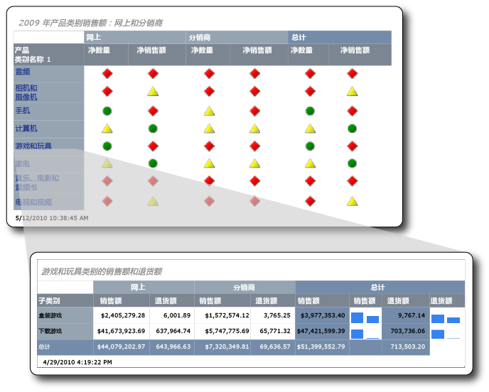

# <a name="tutorial-creating-drillthrough-and-main-reports-report-builder"></a>教程：创建钻取报表和主报表（报表生成器）
本教程教授如何创建两种 [!INCLUDE[ssRSnoversion_md](../includes/ssrsnoversion-md.md)] 分页报表：钻取报表和主报表。 这些报表中使用的示例销售数据可从 Analysis Services 多维数据集检索。 

下图显示将创建的报表，以及主报表中的字段值“游戏和玩具”如何在钻取报表的标题中显示。 钻取报表中的数据与“游戏和玩具”产品类别有关。  
  
  
   
本教程的预计学时：30 分钟。  
  
## <a name="requirements"></a>要求  
本教程要求钻取报表和主报表具有访问 Contoso Sales 多维数据集的权限。 此数据集由 ContosoDW 数据仓库和 Contoso_Retail 联机分析处理 (OLAP) 数据库组成。 您将在此教程中创建的报表从 Contoso Sales 多维数据集检索报表数据。 Contoso_Retail OLAP 数据库可以从 [Microsoft 下载中心](https://go.microsoft.com/fwlink/?LinkID=191575)下载。 您只需要下载文件 ContosoBIdemoABF.exe。 它包含 OLAP 数据库。  
  
另一个文件 ContosoBIdemoBAK.exe 用于 ContosoDW 数据仓库，在此教程中不使用它。  
  
网站包含将 ContosoRetail.abf 备份文件提取和还原到 Contoso_Retail OLAP 数据库的说明。  

您必须具有访问安装 OLAP 数据库的 [!INCLUDE[ssASnoversion](../includes/ssasnoversion-md.md)] 实例的权限。  
    
有关一般要求的详细信息，请参阅[教程先决条件（报表生成器）](../reporting-services/prerequisites-for-tutorials-report-builder.md)。  
  
## <a name="DMatrixAndDataset"></a>1.使用表或矩阵向导创建钻取报表  
使用“表或矩阵向导”从“入门”对话框创建一个矩阵报表。 该向导提供两种模式：报表设计模式和共享数据集设计模式。 在本教程中，您将使用报表设计模式。  
  
#### <a name="to-create-a-new-report"></a>创建新的报表  
  
1.  通过计算机、[Web 门户或 SharePoint 集成模式](../reporting-services/report-builder/start-report-builder.md) 启动报表生成器 [!INCLUDE[ssRSnoversion_md](../includes/ssrsnoversion-md.md)] 。  
  
    将打开“新建报表或数据集”对话框。  
  
    如果未出现“新建报表或数据集”对话框，请通过“文件”菜单转至“新建”。  
  
2.  在左窗格中，确认已选中 **“新建报表”** 。  
  
3.  在右窗格中，确认已选中“表或矩阵向导”。  
  
## <a name="DConnection"></a>1a. 指定数据连接  
数据连接包含连接到外部数据源（如 Analysis Services 多维数据集或 [!INCLUDE[ssNoVersion](../includes/ssnoversion-md.md)] 数据库）所需的信息。 若要指定数据连接，可以从报表服务器使用共享数据源或创建仅在此报表中使用的嵌入数据源。 在本教程中，您将使用嵌入数据源。 若要了解有关使用共享数据源的详细信息，请参阅[获取数据连接的备选方式（报表生成器）](../reporting-services/alternative-ways-to-get-a-data-connection-report-builder.md)。  
  
#### <a name="to-create-an-embedded-data-source"></a>创建嵌入数据源  
  
1.  在“选择数据集”页上，选择“创建数据集”，然后单击“下一步”。 将打开“选择数据源的连接”页面。  
  
2.  单击 **“新建”**。 此时将打开 **“数据源属性”** 对话框。  
  
3.  在“名称”中，键入“Online and Reseller Sales Detail”作为数据源的名称。  
  
4.  在“选择连接类型”中，选择“Microsoft SQL Server Analysis Services”，然后单击“生成”。  
  
5.  在“数据源”中，确认数据源是“Microsoft SQL Server Analysis Services (AdomdClient)”。  
  
6.  在“服务器名称”中，键入安装 Analysis Services 实例所在服务器的名称。  
  
7.  在“选择或输入数据库名称”中，选择 Contoso 多维数据集。  
  
8.  [!INCLUDE[clickOK](../includes/clickok-md.md)]  
  
9. 确认“连接字符串”包含以下语法：  
  
    ```  
    Data Source=<servername>; Initial Catalog = Contoso  
    ```  
  
    `<servername>` 是安装 [!INCLUDE[ssNoVersion](../includes/ssnoversion-md.md)] Analysis Services 的实例名称。  
  
10. 单击“凭据类型”。  
  
    > [!NOTE]  
    > 您可能需要更改默认身份验证选项，具体取决于在数据源上配置权限的方式。 有关详细信息，请参阅 [安全性（报表生成器）](../reporting-services/report-builder/security-report-builder.md)中所创建的移动报表中使用。  
  
11. [!INCLUDE[clickOK](../includes/clickok-md.md)]  
  
    将显示“选择数据源的连接”页面。  
  
12. 若要验证是否能连接到数据源，请单击“测试连接”。  
  
    将显示消息“已成功地创建连接”。  
  
13. [!INCLUDE[clickOK](../includes/clickok-md.md)]  
  
14. 单击“下一步” 。  
  
## <a name="DMDXQuery"></a>1b. 创建 MDX 查询  
在报表中，可以使用具有预定义查询的共享数据集，也可以创建仅在报表中使用的嵌入数据集。 在本教程中，将创建一个嵌入数据集。  
  
#### <a name="to-create-query-filters"></a>创建查询筛选器  
  
1.  在“元数据”窗格的“设计查询”页上，单击按钮“(…)”。  
  
2.  在“选择多维数据集”对话框中，依次单击“Sales”和“确定”。  
  
    > [!TIP]  
    > 如果不想手动生成 MDX 查询，请单击  图标，将查询设计器切换到“查询”模式，将已完成的 MDX 粘贴到查询设计器，然后继续执行[创建数据集](#DSkip)中的步骤 6。  
  
    ```  
    SELECT NON EMPTY { [Measures].[Sales Amount], [Measures].[Sales Return Amount] } ON COLUMNS, NON EMPTY { ([Channel].[Channel Name].[Channel Name].ALLMEMBERS * [Product].[Product Category Name].[Product Category Name].ALLMEMBERS * [Product].[Product Subcategory Name].[Product Subcategory Name].ALLMEMBERS ) } DIMENSION PROPERTIES MEMBER_CAPTION, MEMBER_UNIQUE_NAME ON ROWS FROM ( SELECT ( { [Date].[Calendar Year].&[2009] } ) ON COLUMNS FROM ( SELECT ( { [Sales Territory].[Sales Territory Group].&[North America] } ) ON COLUMNS FROM ( SELECT ( STRTOSET(\@ProductProductCategoryName, CONSTRAINED) ) ON COLUMNS FROM ( SELECT ( { [Channel].[Channel Name].&[2], [Channel].[Channel Name].&[4] } ) ON COLUMNS FROM [Sales])))) WHERE ( [Sales Territory].[Sales Territory Group].&[North America], [Date].[Calendar Year].&[2009] ) CELL PROPERTIES VALUE, BACK_COLOR, FORE_COLOR, FORMATTED_VALUE, FORMAT_STRING, FONT_NAME, FONT_SIZE, FONT_FLAGS  
    ```  
  
3.  在“度量值组”窗格中，展开“Channel”，然后将“Channel Name”拖到筛选器窗格中的“层次结构”列。  
  
    维度名称“Channel”会自动添加到“维度”列。 不要更改“维度”或“运算符”列。  
  
4.  若要打开“筛选表达式”列表，请单击“筛选表达式”列中的向下箭头。  
  
5.  在筛选表达式列表中，展开“所有渠道”，依次单击“在线”、“分销商”和“确定”。  
  
    查询现在包含一个筛选器以只包括这些渠道：“在线”和“分销商”。  
  
6.  展开“Sales Territory”维度，然后将“Sales Territory Group”拖到“层次结构”列（在“Channel Name”下面）。  
  
7.  打开“筛选表达式”列表，展开“所有销售区域”，单击“北美洲”，然后单击“确定”。  
  
    查询现在具有一个筛选器以只包括北美洲的销售额。  
  
8.  在“度量值组”窗格中，展开“Date”，然后将“Calendar Year”拖到筛选器窗格中的“层次结构”列。  
  
    维度名称“Date”会自动添加到“维度”列。 不要更改“维度”或“运算符”列。  
  
9. 若要打开“筛选表达式”列表，请单击“筛选表达式”列中的向下箭头。  
  
10. 在筛选表达式列表中，展开“所有日期”，单击“2009 年”，然后单击“确定”。  
  
    查询现在具有一个筛选器以只包括日历 2009 年的销售额。  
  
#### <a name="to-create-the-parameter"></a>创建参数  
  
1.  展开“Product”维度，然后将“Product Category Name”成员拖到“Calendar Year”下面的“层次结构”列。  
  
2.  打开“筛选表达式”列表，单击“所有产品”，然后单击“确定”。  
  
3.  单击“参数”复选框。 查询现在包含参数 ProductProductCategoryName。  
  
    > [!NOTE]  
    > 该参数包含产品类别的名称。 单击主报表中的产品类别名称时，通过使用此参数将它的名称传递给钻取报表。  
  
### <a name="DSkip"></a>创建数据集  
  
1.  从“Channel”维度将“Channel Name”拖到数据窗格。  
  
2.  从“Product”维度将“Product Category Name”拖到数据窗格，然后将它放到“Channel Name”的右侧。  
  
3.  从“Product”维度将“Product Subcategory Name”拖到数据窗格，然后将它放到“Product Category Name”的右侧。  
  
4.  在“元数据”窗格中，展开“度量值”，然后展开“Sales”。  
  
5.  将“Sales Amount”度量值拖到数据窗格，然后将它放到“Product Subcategory Name”的右侧。  
  
6.  在查询设计器工具栏中，单击“运行(!)”。  
  
7.  单击“下一步” 。  
  
## <a name="DLayout"></a>1c. 将数据组织到组中  
在选择要对数据分组的字段时，可以设计一个矩阵，其中的行和列显示了详细数据和聚合数据。  
  
#### <a name="to-organize-data-into-groups"></a>将数据组织到组中  
  
1.  若要切换到设计视图，请单击“设计”。  
  
2.  在“排列字段”页上，将“Product_Subcategory_Name”拖到“行组”中。  
  
    > [!NOTE]  
    > 用下划线 (_) 来替代名称中的空格。 例如，“Product Category Name”为“Product_Category_Name”。  
  
3.  将 Channel_Name 拖到“列组”。  
  
4.  将“Sales_Amount”拖到“值”中。  
  
    “Sales_Amount”由 Sum 函数（即数值字段的默认聚合函数）自动聚合。 该值为 `[Sum(Sales_Amount)]`。  
  
    若要查看其他可用聚合函数，请打开下拉列表（不要更改聚合函数）。  
  
5.  将“Sales_Return_Amount”拖到“值”中，然后将它放到“`[Sum(Sales_Amount)]`”下面。  
  
    步骤 4 和 5 指定要在矩阵中显示的数据。  
  
6.  单击“下一步” 。  
  
## <a name="DTotals"></a>1d. 添加小计和总计  
创建组后，可以添加用于显示字段的聚合值的行并设置其格式。 还可以选择是显示所有数据还是允许用户以交互方式展开和折叠已分组数据。  
  
#### <a name="to-add-subtotals-and-totals"></a>添加小计和总计  
  
1.  在“选择布局”页的“选项”下，确认已选择“显示小计和总计”。  
  
    向导的“预览”窗格将显示包含四行的矩阵。  
  
2.  单击“下一步” 。  
  
2.  单击 **“完成”**。  
  
    表将添加到设计图面中。  
  
3.  若要预览报表，请单击“运行 (!)”。  
  
## <a name="DFormat"></a>2.将数据格式设置为货币  
将货币格式应用到钻取报表中的销售额字段。  
  
#### <a name="to-format-data-as-currency"></a>将数据格式设置为货币格式  
  
1.  若要切换到设计视图，请单击“设计”。  
  
2.  若要同时选择多个单元并设置其格式，请按 Ctrl 键，然后选择包含数值销售数据的单元。  
  
3.  在“主文件夹”选项卡上的“数字”组中，单击“货币”。  
  
## <a name="DSparkline"></a>3.添加要在迷你图中显示销售值的列  
报表不将销售额和销售退货额显示为货币值，而是在迷你图中显示这些值。  
  
#### <a name="to-add-sparklines-to-columns"></a>将迷你图添加到列  
  
1.  若要切换到设计视图，请单击“设计”。  
  
2.  在矩阵的“总计”组中，右键单击“销售额”列，单击“插入列”，然后单击“右侧”。  
  
    一个空列会添加到“销售额”的右侧。  
  
3.  在功能区上，单击“矩形”，然后单击 [Product_Subcategory] 行组中 `[Sum(Sales_Amount)]` 单元右侧的空单元。  
  
4.  在功能区上单击“迷你图”图标，然后单击添加了矩形的单元。  
  
5.  在“选择迷你图类型”对话框中，确认已选中“列”类型。  
  
6.  [!INCLUDE[clickOK](../includes/clickok-md.md)]  
  
7.  右键单击该迷你图。  
  
8.  在“图表数据”窗格中，单击“添加字段”图标，然后单击“Sales_Amount”。  
  
9. 右键单击 `Sales_Return_Amount` 列，然后将一个列添加到它的右侧。  
  
10. 重复步骤 2 到步骤 6。  
  
11. 右键单击该迷你图。  
  
12. 在“图表数据”窗格中，单击“添加字段”图标，然后单击“Sales_Return_Amount”。  
  
13. 若要预览报表，请单击“运行”。  
  
## <a name="DReportTitle"></a>4.添加包含产品类别名称的报表标题  
报表标题将出现在报表的顶部。 可以将报表标题置于报表表头中或置于表体顶部的文本框中（如果报表未使用表头）。 在本教程中，您将使用自动放置在表体顶部的文本框。  
  
#### <a name="to-add-a-report-title"></a>添加报表标题  
  
1.  若要切换到设计视图，请单击“设计”。  
  
2.  在设计图面上，单击“单击以添加标题”。  
  
3.  键入 **Sales and Returns for Category:**。  
  
4.  右键单击，然后单击“创建占位符”。  
  
5.  单击“值”列表右侧的“(fx)”按钮。  
  
6.  在“表达式”对话框的“类别”窗格中，单击“数据集”，然后在“值”列表中双击 `First(Product_Category_Name)`。  
  
    “表达式”框包含以下表达式：  
  
    ```  
    =First(Fields!Product_Category_Name.Value, "DataSet1")  
    ```  
  
7.  若要预览报表，请单击“运行”。  
  
报表标题包含第一个产品类别的名称。 以后，在您将此报表作为钻取报表运行时，产品类别名称将动态更改，以反映在主报表中单击的产品类别的名称。  
  
## <a name="DParameter"></a>5.更新参数属性  
默认情况下，参数是可见的，但是这对此报表不合适。 您将更新钻取报表的参数属性。  
  
#### <a name="to-hide-a-parameter"></a>隐藏参数  
  
1.  在“报表数据”窗格中，展开“参数”。  
  
2.  右键单击“\@ProductProductCategoryName”，再单击“参数属性”。  
  
    > [!NOTE]  
    > 名称旁边的 \@ 字符指明这是参数。  
  
3.  在“常规”选项卡中，单击“隐藏”。  
  
4.  在“提示”框中，键入“Product Category”。  
  
    > [!NOTE]  
    > 因为参数是隐藏的，所以从不使用此提示。  
  
5.  或者，可以单击“可用值”和“默认值”，然后查看它们的选项。 不更改这些选项卡上的任何选项。  
  
6.  [!INCLUDE[clickOK](../includes/clickok-md.md)]  
  
## <a name="DSave"></a>6.将报表保存到 SharePoint 库  
可以将报表保存到 SharePoint 库、报表服务器或您的计算机。 如果将报表保存到您的计算机，则许多 [!INCLUDE[ssRSnoversion](../includes/ssrsnoversion-md.md)] 功能（如报表部件和子报表）将不可用。 在本教程中，您将把报表保存到 SharePoint 库。  
  
#### <a name="to-save-the-report"></a>保存报表  
  
1.  从“报表生成器”按钮，单击 **“保存”**。 “另存为报表”对话框将打开。  
  
    > [!NOTE]  
    > 如果正在重新保存报表，会自动将其重新保存到以前的位置。 若要更改位置，请使用“另存为”选项。  
  
2.  若要显示最近使用的报表服务器和 SharePoint 站点的列表，请单击“最近使用的站点和服务器”。  
  
3.  选择或键入您拥有保存报表权限的 SharePoint 站点的名称。  
  
    SharePoint 库的 URL 具有以下语法：  
  
    ```  
    Http://<ServerName>/<Sites>/  
    ```  
  
4.  单击 **“保存”**。  
  
    “最近使用的站点和服务器”列出 SharePoint 站点上的库。  
  
5.  导航到您将保存报表的库。  
  
6.  在“名称”框中，用 ResellerVSOnlineDrillthrough 替换默认名称。  
  
    > [!NOTE]  
    > 您将主报表保存到同一位置。 如果要将主报表和钻取报表保存到不同的站点或库，必须在主报表中更新“转到报表”操作的路径。  
  
7.  单击 **“保存”**。  
  
## <a name="MMatrixAndDataset"></a>1.使用表或矩阵向导创建主报表  
使用“表或矩阵向导”从“入门”对话框创建一个矩阵报表。  
  
#### <a name="to-create-the-main-report"></a>创建主报表  
  
1.  通过计算机、[Web 门户或 SharePoint 集成模式](../reporting-services/report-builder/start-report-builder.md) 启动报表生成器 [!INCLUDE[ssRSnoversion_md](../includes/ssrsnoversion-md.md)] 。  
  
    将打开“新建报表或数据集”对话框。  
  
    如果未出现“新建报表或数据集”对话框，请通过“文件”菜单转至“新建”。  
 
2.  在“入门”对话框中，确认已选中“新建报表”，然后单击“表或矩阵向导”。  
  
## <a name="MConnection"></a>1a. 指定数据连接  
您将嵌入数据源添加到主报表。  
  
#### <a name="to-create-an-embedded-data-source"></a>创建嵌入数据源  
  
1.  在“选择数据集”页上，选择“创建数据集”，然后单击“下一步”。  
  
2.  单击 **“新建”**。  
  
3.  在“名称”中，键入“Online and Reseller Sales Main”作为数据源名称。  
  
4.  在“选择连接类型”中，选择“Microsoft SQL Server Analysis Services”，然后单击“生成”。  
  
5.  在“数据源”中，确认数据源是“Microsoft SQL Server Analysis Services (AdomdClient)”。  
  
6.  在“服务器名称”中，键入安装 [!INCLUDE[msCoName](../includes/msconame-md.md)] 实例所在服务器的名称[!INCLUDE[ssASnoversion](../includes/ssasnoversion-md.md)]。  
  
7.  在“选择或输入数据库名称”中，选择 Contoso 多维数据集。  
  
8.  [!INCLUDE[clickOK](../includes/clickok-md.md)]  
  
9. 确认“连接字符串”包含以下语法：  
  
    ```  
    Data Source=<servername>; Initial Catalog = Contoso  
    ```  
  
10. 单击“凭据类型”。  
  
    您可能需要更改默认身份验证，具体取决于在数据源上配置权限的方式。  
  
11. [!INCLUDE[clickOK](../includes/clickok-md.md)]  
  
12. 若要验证是否能连接到数据源，请单击“测试连接”。  
  
13. [!INCLUDE[clickOK](../includes/clickok-md.md)]  
  
14. 单击“下一步” 。  
  
## <a name="MMDXQuery"></a>1b. 创建 MDX 查询  
接下来将创建嵌入数据集。 为此，您将使用查询设计器来创建筛选器、参数和计算成员以及数据集本身。  
  
#### <a name="to-create-query-filters"></a>创建查询筛选器  
  
1.  在“元数据”窗格的“设计查询”页上的多维数据集部分中，单击省略号按钮“(…)”。  
  
2.  在“选择多维数据集”对话框中，依次单击“Sales”和“确定”。  
  
    > [!TIP]  
    > 如果不想手动生成 MDX 查询，请单击  图标，将查询设计器切换到“查询”模式，将已完成的 MDX 粘贴到查询设计器，然后继续执行[创建数据集](#MSkip)中的步骤 5。  
  
    ```  
    WITH MEMBER [Measures].[Net QTY] AS [Measures].[Sales Quantity] -[Measures].[Sales Return Quantity] MEMBER [Measures].[Net Sales] AS [Measures].[Sales Amount] - [Measures].[Sales Return Amount] SELECT NON EMPTY { [Measures].[Net QTY], [Measures].[Net Sales] } ON COLUMNS, NON EMPTY { ([Channel].[Channel Name].[Channel Name].ALLMEMBERS * [Product].[Product Category Name].[Product Category Name].ALLMEMBERS ) } DIMENSION PROPERTIES MEMBER_CAPTION, MEMBER_UNIQUE_NAME ON ROWS FROM ( SELECT ( { [Date].[Calendar Year].&[2009] } ) ON COLUMNS FROM ( SELECT ( STRTOSET(\@ProductProductCategoryName, CONSTRAINED) ) ON COLUMNS FROM ( SELECT ( { [Sales Territory].[Sales Territory Group].&[North America] } ) ON COLUMNS FROM ( SELECT ( { [Channel].[Channel Name].&[2], [Channel].[Channel Name].&[4] } ) ON COLUMNS FROM [Sales])))) WHERE ( [Sales Territory].[Sales Territory Group].&[North America], [Date].[Calendar Year].&[2009] ) CELL PROPERTIES VALUE, BACK_COLOR, FORE_COLOR, FORMATTED_VALUE, FORMAT_STRING, FONT_NAME, FONT_SIZE, FONT_FLAGSQuery text: Code.  
    ```  
  
3.  在“度量值组”窗格中，展开“Channel”，然后将“Channel Name”拖到筛选器窗格中的“层次结构”列。  
  
    维度名称“Channel”会自动添加到“维度”列。 不要更改“维度”或“运算符”列。  
  
4.  若要打开“筛选表达式”列表，请单击“筛选表达式”列中的向下箭头。  
  
5.  在筛选表达式列表中，展开“所有渠道”，依次单击“在线”、“分销商”和“确定”。  
  
    查询现在包含一个筛选器以只包括这些渠道：“在线”和“分销商”。  
  
6.  展开“Sales Territory”维度，然后将“Sales Territory Group”拖到“层次结构”列（在“Channel Name”下面）。  
  
7.  打开“筛选表达式”列表，展开“所有销售区域”，单击“北美洲”，然后单击“确定”。  
  
    查询现在具有一个筛选器以只包括北美洲的销售额。  
  
8.  在“度量值组”窗格中，展开“Date”，然后将“Calendar Year”拖到筛选器窗格中的“层次结构”列。  
  
    维度名称“Date”会自动添加到“维度”列。 不要更改“维度”或“运算符”列。  
  
9. 若要打开“筛选表达式”列表，请单击“筛选表达式”列中的向下箭头。  
  
10. 在筛选表达式列表中，展开“所有日期”，单击“2009 年”，然后单击“确定”。  
  
    查询现在具有一个筛选器以只包括日历 2009 年的销售额。  
  
#### <a name="to-create-the-parameter"></a>创建参数  
  
1.  展开“Product”维度，然后将“Product Category Name”成员拖到“Sales Territory Group”下面的“层次结构”列。  
  
2.  打开“筛选表达式”列表，单击“所有产品”，然后单击“确定”。  
  
3.  单击“参数”复选框。 查询现在包含参数 ProductProductCategoryName。  
  
#### <a name="to-create-calculated-members"></a>创建计算成员  
  
1.  将光标置于“计算成员”窗格内，右键单击，然后单击“新建计算成员”。  
  
2.  在“元数据”窗格中，依次展开“度量值”和“Sales”。  
  
3.  将“Sales Quantity”度量值拖到“表达式”框，键入减号字符 (-)，然后将“Sales Return Quantity”度量值拖到“表达式”框；将它放到减号字符后面。  
  
    以下代码显示了该表达式：  
  
    ```  
    [Measures].[Sales Quantity] - [Measures].[Sales Return Quantity]  
    ```  
  
4.  在“名称”框中，键入 Net QTY，然后单击“确定”。  
  
    “计算成员”窗格将列出“Net QTY”计算成员。  
  
5.  右键单击“计算成员”，然后单击“新建计算成员”。  
  
6.  在“元数据”窗格中，依次展开“度量值”和“Sales”。  
  
7.  将“Sales Amount”度量值拖到“表达式”框，键入减号字符 (-)，然后将“Sales Return Amount”度量值拖到“表达式”框；将它放到减号字符后面。  
  
    以下代码显示了该表达式：  
  
    ```  
    [Measures].[Sales Amount] - [Measures].[Sales Return Amount]  
    ```  
  
8.  在“名称”框中，键入 **Net Sales**，然后单击“确定”。“计算成员”窗格将列出“Net Sales”计算成员。  
  
### <a name="MSkip"></a>创建数据集  
  
1.  从“Channel”维度将“Channel Name”拖到数据窗格。  
  
2.  从“Product”维度将“Product Category Name”拖到数据窗格，然后将它放到“Channel Name”的右侧。  
  
3.  从“计算成员”，将“`Net QTY`”拖到数据窗格，然后将它放到“Product Category Name”的右侧。  
  
4.  从“计算成员”，将“Net Sales”拖到数据窗格，然后将它放到“ `Net QTY`”的右侧。  
  
5.  在查询设计器工具栏中，单击“运行(!)”。  
  
    查看查询结果集。  
  
6.  单击“下一步” 。  
  
## <a name="MLayout"></a>1c. 将数据组织到组中  
在选择要对数据分组的字段时，可以设计一个矩阵，其中的行和列显示了详细数据和聚合数据。  
  
#### <a name="to-organize-data-into-groups"></a>将数据组织到组中  
  
1.  在“排列字段”页上，将“Product_Category_Name”拖到“行组”中。  
  
2.  将 Channel_Name 拖到“列组”。  
  
3.  将“`Net_QTY`”拖到“值”。  
  
    `Net_QTY` 由 Sum 函数（即数值字段的默认聚合函数）自动聚合。 该值为 `[Sum(Net_QTY)]`。  
  
    若要查看其他可用聚合函数，请打开下拉列表。 不要更改聚合函数。  
  
4.  将“`Net_Sales_Return`”拖到“值”，然后将它放在“`[Sum(Net_QTY)]`”下面。  
  
    步骤 3 和 4 指定要在矩阵中显示的数据。  
  
## <a name="MTotals"></a>1d. 添加小计和总计  
可以在报表中显示小计和总计。 主报表中的数据作为指示器显示；在完成向导后将删除总计。  
  
#### <a name="to-add-subtotals-and-grand-totals"></a>添加小计和总计  
  
1.  在“选择布局”页的“选项”下，确认已选择“显示小计和总计”。  
  
    向导的“预览”窗格将显示包含四行的矩阵。  运行报表时，将通过以下方式显示每个行：第一行为列组，第二行包含列标题，第三行包含产品类别数据（`[Sum(Net_ QTY)]` 和 `[Sum(Net_Sales)]`），第四行包含总计。  
  
2.  单击“下一步” 。  
  
3.  单击 **“完成”**。  
  
3.  若要预览报表，请单击“运行”。  
  
## <a name="MGrandTotal"></a>2.删除总计行  
数据值作为指示器状态显示，包括列组总计。 删除显示总计的行。  
  
#### <a name="to-remove-the-grand-total-row"></a>删除总计行  
  
1.  若要切换到设计视图，请单击“设计”。  
  
2.  单击“总计”行（矩阵中的最后一行），右键单击，然后单击“删除行”。  
  
3.  若要预览报表，请单击“运行”。  
  
## <a name="MDrillthrough"></a>3.配置用于钻取的文本框操作  
若要启用钻取，请在主报表中指定文本框的操作。  
  
#### <a name="to-enable-an-action"></a>启用操作  
  
1.  若要切换到设计视图，请单击“设计”。  
  
2.  右键单击包含 Product_Category_Name 单元，然后单击“文本框属性”。  
  
3.  单击“操作”选项卡。  
  
4.  选择“转到报表”。  
  
5.  在“指定报表”中，单击“浏览”，然后查找名为 ResellerVSOnlineDrillthrough 的钻取报表。  
  
6.  若要添加用于运行钻取报表的参数，请单击“添加”。  
  
7.  在“名称”列表中，选择“ProductProductCategoryName”。  
  
8.  在“值”中，键入 `[Product_Category_Name.UniqueName]`。  
  
    “Product_Category_Name”是数据集中的字段。  
  
    > [!IMPORTANT]  
    > 必须包含 UniqueName 属性，因为钻取操作需要唯一值。  
  
9. [!INCLUDE[clickOK](../includes/clickok-md.md)]  
  
#### <a name="to-format-the-drillthrough-field"></a>设置钻取字段的格式  
  
1.  右键单击包含 `Product_Category_Name` 的单元，然后单击“文本框属性”。  
  
2.  单击 **“字体”** 选项卡。  
  
3.  在“效果”列表中，选择“下划线”。  
  
4.  在“颜色”列表中，选择“蓝色”。  
  
5.  [!INCLUDE[clickOK](../includes/clickok-md.md)]  
  
6.  若要预览报表，请单击 **“运行”**。  
  
这些产品类别名称采用常见的链接格式（蓝色带下划线）。  
  
## <a name="MIndicators"></a>4.使用指示器替换数值  
使用指示器显示“在线”和“分销商”渠道的数量和销售额的情况。  
  
#### <a name="to-add-an-indicator-for-net-qty-values"></a>添加 Net QTY 值的指示器  
  
1.  若要切换到设计视图，请单击“设计”。  
  
2.  在功能区上，单击“矩形”图标，然后在 `Channel_Name` 列组的 `[Product_Category_Name]` 行组中的 `[Sum(Net QTY)]` 单元内单击。  
  
3.  在功能区上，单击“指示器”图标，然后在矩形内单击。 “选择指示器类型”对话框将打开，其中选择了“方向”指示器。  
  
4.  单击“3 个符号”类型，然后单击“确定”。  
  
5.  右键单击该指示器，然后在“仪表数据”窗格中单击“(未指定)”旁边的向下箭头。 选择 `Net_QTY`。  
  
6.  对“总计”内 `[Product_Category_Name]` 行组中的 `[Sum(Net QTY)]` 单元重复步骤 2 到 5。  
  
#### <a name="to-add-an-indicator-for-net-sales-values"></a>添加 Net Sales 值的指示器  
  
1.  在功能区上，单击“矩形”图标，然后在 `Channel_Name` 列组的 `[Product_Category_Name]` 行组中的 `[Sum(Net_Sales)]` 单元内单击。  
  
2.  在功能区上，单击“指示器”图标，然后在矩形内单击。  
  
3.  单击“3 个符号”类型，然后单击“确定”。  
  
4.  右键单击该指示器，然后在“仪表数据”窗格中单击“(未指定)”旁边的向下箭头。 选择 `Net_Sales`。  
  
5.  对“总计”内 `[Product_Category_Name]` 行组中的 `[Sum(Net_Sales)]` 单元重复步骤 1 到 4。  
  
6.  若要预览报表，请单击 **“运行”**。  
  
## <a name="MParameter"></a>5.更新参数属性  
默认情况下，参数是可见的，但是这对此报表不合适。 您将更新参数属性以便使参数为内部参数。  
  
#### <a name="to-make-the-parameter-internal"></a>使参数为内部参数  
  
1.  在“报表数据”窗格中，展开“参数”。  
  
2.  右键单击“`@ProductProductCategoryName,`”，然后单击“参数属性”。  
  
3.  在“常规”选项卡中，单击“内部”。  
  
4.  或者，可以单击“可用值”和“默认值”选项卡，然后查看它们的选项。 不更改这些选项卡上的任何选项。  
  
5.  [!INCLUDE[clickOK](../includes/clickok-md.md)]  
  
## <a name="MTitle"></a>6.添加报表标题  
将标题添加到主报表。  
  
#### <a name="to-add-a-report-title"></a>添加报表标题  
  
1.  在设计图面上，单击“单击以添加标题”。  
  
2.  键入 **2009 Product Category Sales: Online and Reseller Category:**。  
  
3.  选择键入的文本。  
  
4.  在功能区的“主文件夹”选项卡上，在“字体”组中选择“Times New Roman”字体、“16pt”字号以及“加粗”和“倾斜”样式。  
  
5.  若要预览报表，请单击 **“运行”**。  
  
## <a name="MSave"></a>7.将主报表保存到 SharePoint 库  
将主报表保存到 SharePoint 库。  
  
#### <a name="to-save-the-report"></a>保存报表  
  
1.  若要切换到设计视图，请单击“设计”。  
  
2.  从“报表生成器”按钮，单击 **“保存”**。  
  
3.  或者，单击“最近使用的站点和服务器”以显示最近使用的报表服务器和 SharePoint 站点的列表。  
  
4.  选择或键入您拥有保存报表权限的 SharePoint 站点的名称。 SharePoint 库的 URL 具有以下语法：  
  
    ```  
    Http://<ServerName>/<Sites>/  
    ```  
  
5.  导航到您要保存报表的库。  
  
6.  在“名称”中，用 ResellerVSOnlineMain 替换默认名称。  
  
    > [!IMPORTANT]  
    > 将主报表保存到保存钻取报表的同一位置。 若要将主报表和钻取报表保存到不同的站点或库，请确保主报表中的“转到报表”操作指向正确的钻取报表位置。  
  
7.  单击 **“保存”**。  
  
## <a name="MRunReports"></a>8.运行主报表和钻取报表  
运行主报表，然后单击产品类别列中的值以运行钻取报表。  
  
#### <a name="to-run-the-reports"></a>运行报表  
  
1.  打开保存报表的 SharePoint 库。  
  
2.  双击 ResellerVSOnlineMain。  
  
    将运行该报表并显示产品类别销售信息。  
  
3.  单击包含产品类别名称的列中的“游戏和玩具”链接。  
  
    将运行钻取报表，并只显示“游戏和玩具”产品类别的值。  
  
4.  若要返回到主报表，请单击 Internet Explorer 返回按钮。  
  
5.  也可以通过单击其名称来浏览其他产品类别（可选）。  
  
## <a name="see-also"></a>另请参阅  
[报表生成器教程](../reporting-services/report-builder-tutorials.md)  
  
