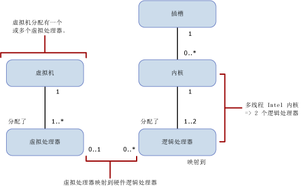

# 按 SQL Server 版本划分的计算能力限制
[!INCLUDE[sqlserver](../includes/applies-to-version/sqlserver.md)]
  本文讨论不同 [!INCLUDE[ssCurrent](../includes/sscurrent-md.md)] 版本的计算能力限制，以及在具有超线程处理器的物理和虚拟化环境中计算能力限制有何不同。  
  
   
  
 下表描述上图中的表示法：  
  
|值|说明|  
|-----------|-----------------|  
|0..1|零个或 1 个|  
|1|恰好一个|  
|1..\*|一个或更多|  
|0..\*|零个或更多|  
|1..2|1 个或 2 个|  
  
> [!IMPORTANT]  
> 进一步详细阐述：  
>   
> - 每个虚拟机 (VM) 有一个或多个虚拟处理器。  
> - 一个或多个虚拟处理器被分配给恰好一个虚拟机。  
> - 零个或一个虚拟处理器映射到零个或多个逻辑处理器。 如果虚拟处理器到逻辑处理器的映射为： 
>     -   一对零，则表示来宾操作系统未使用未绑定的逻辑处理器。  
>     -   一对多，则表示过度提交。  
>     -   零对多，则表示主机系统上没有虚拟机。 因此 VM 不使用任何逻辑处理器。  
> - 插槽映射到零个或多个内核。 如果插槽到内核的映射为：  
>     -   一对零，则表示一个空插槽。 未安装芯片。  
>     -   一对一，则表示在插槽中安装了单核芯片。 这种映射现在已经非常罕见。  
>     -   一对多，则表示在插槽中安装了多核芯片。 典型值为 2、4 或 8。  
> - 内核映射到一个或两个逻辑处理器。 如果内核到逻辑处理器的映射为：  
>     -   一对一，则超线程处于关闭状态。  
>     -   一对二，则超线程处于打开状态。  
  
 下列定义适用于本文中使用到的术语：  
  
-   从 [!INCLUDE[ssNoVersion](../includes/ssnoversion-md.md)]、操作系统、应用程序或驱动程序的角度理解，线程或逻辑处理器是一种逻辑计算引擎。  
  
-   内核是一个处理器单元。 它可以包含一个或多个物理处理器。  
  
-   物理处理器可包含一个或多个内核。 物理处理器等同于处理器包或插槽。  
  
具有多个物理处理器的系统或是具有含多个内核和/或超线程的物理处理器的系统，可支持操作系统同时执行多项任务。 每个执行线程都显示为一个逻辑处理器。 例如，如果计算机具有两个启用超线程的四核处理器，且每个内核两个线程，则有 16 个逻辑处理器：2 个处理器 x 每个处理器 4 个内核 x 每个内核 2 个线程。 值得注意的是：  
  
-   来自超线程内核的单线程的逻辑处理器计算能力不及来自禁用超线程的同一内核的逻辑处理器计算能力。  
  
-   超线程内核中两个逻辑处理器的计算能力超过了禁用超线程的同一内核的计算能力。  
  
每个 [!INCLUDE[ssNoVersion](../includes/ssnoversion-md.md)] 版本都有以下两种计算能力限制：  
  
- 插槽（或物理处理器或处理包）的最大数目  
  
- 操作系统报告的最大内核数  
  
这些限制适用于单个 [!INCLUDE[ssNoVersion](../includes/ssnoversion-md.md)]实例。 它们代表单个实例将使用的最大计算能力。 它们不会限制可能部署该实例的服务器。 实际上，在同一物理服务器上部署多个 [!INCLUDE[ssNoVersion](../includes/ssnoversion-md.md)] 实例可以有效使用物理服务器的计算能力，因为插槽和/或内核超出了容量限制允许的数量。  
  
下表指定每个版本的 [!INCLUDE[ssCurrent](../includes/sscurrent-md.md)]的单个实例的计算能力限制：  
  
|[!INCLUDE[ssNoVersion](../includes/ssnoversion-md.md)] 版本|单个实例的最大计算能力 ([!INCLUDE[ssNoVersion](../includes/ssnoversion-md.md)][!INCLUDE[ssDE](../includes/ssde-md.md)])|单个实例的最大计算能力（AS、RS）|  
|---------------------------------------|--------------------------------------------------------------------------------------------------------|-------------------------------------------------------------------|  
|Enterprise Edition：基于内核的许可\*|操作系统支持的最大值|操作系统支持的最大值|  
|开发人员|操作系统支持的最大值|操作系统支持的最大值|  
|Standard|限制为 4 个插槽或 24 核，取二者中的较小值|限制为 4 个插槽或 24 核，取二者中的较小值|  
|Express|限制为 1 个插槽或 4 核，取二者中的较小值|限制为 1 个插槽或 4 核，取二者中的较小值|  

\*Enterprise Edition 配合服务器+客户端访问许可证 (CAL) 授权将每个 [!INCLUDE[ssNoVersion](../includes/ssnoversion-md.md)] 实例的最大内核数限制为 20。 （此授权不可用于新协议。）基于内核的服务器许可模型没有限制。  
  
在虚拟环境中，计算能力的限制基于逻辑处理器的数量，而不是内核数。 这是因为处理器体系结构对来宾应用程序不可见。 

例如，如果服务器的四个插槽中插入了四核处理器，同时该服务器每个内核可支持两个超线程，这样在启用超线程时就有 32 个逻辑处理器。 但在禁用超线程时只有 16 个逻辑处理器。 可以将这些逻辑处理器映射至服务器上的虚拟机。 这些虚拟机在该逻辑处理器上的计算负载会映射到主机服务器中物理处理器上的执行线程。  
  
如果每个虚拟处理器的性能很重要，最好禁用超线程。 可以在 BIOS 安装期间为处理器进行 BIOS 设置，从而启用或禁用超线程。 但这通常是服务器范围的操作，会影响服务器上运行的所有工作负荷。 这就可能要求要在虚拟环境中运行的工作负荷与受益于物理操作系统环境中的超线程性能提升的工作负荷分隔开。  
  
## 另请参阅  
 [SQL Server 2016 的版本和组件](../sql-server/editions-and-components-of-sql-server-2016.md)   
 [SQL Server 2016 各个版本支持的功能](~/sql-server/editions-and-supported-features-for-sql-server-2016.md)   
 [SQL Server 的最大容量规范](../sql-server/maximum-capacity-specifications-for-sql-server.md)   
 [SQL Server 2016 安装快速入门](../database-engine/install-windows/install-sql-server.md)  

[!INCLUDE[get-help-options](../includes/paragraph-content/get-help-options.md)]

[!INCLUDE[contribute-to-content](../includes/paragraph-content/contribute-to-content.md)]