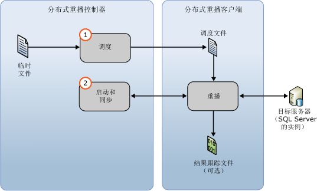

# 重播跟踪数据
[!INCLUDE[appliesto-ss-xxxx-xxxx-xxx-md](../../includes/appliesto-ss-xxxx-xxxx-xxx-md.md)]
  准备好输入跟踪数据之后，可以使用 [!INCLUDE[msCoName](../../includes/msconame-md.md)] [!INCLUDE[ssNoVersion](../../includes/ssnoversion-md.md)] Distributed Replay 功能启动分布式重播。 有关详细信息，请参阅 [准备输入跟踪数据](../../tools/distributed-replay/prepare-the-input-trace-data.md)。  
  
 使用管理工具 **replay** 选项启动分布式重播的事件重播阶段。 此阶段包含两个部分：跟踪数据调度和分布式重播的启动与同步。  
  
   
  
 您可以以两种顺序模式之一重播跟踪数据：压力模式或同步模式。 默认行为是在压力模式下重播跟踪数据。 有关事件重播阶段和顺序模式的详细信息，请参阅 [SQL Server Distributed Replay](../../tools/distributed-replay/sql-server-distributed-replay.md)。  
  
> [!NOTE]  
>  输入跟踪数据必须在与分布式重播兼容的 [!INCLUDE[ssNoVersion](../../includes/ssnoversion-md.md)] 版本中捕获。 输入跟踪数据还必须与要对其重播跟踪数据的目标服务器兼容。 有关版本要求的详细信息，请参阅 [Distributed Replay Requirements](../../tools/distributed-replay/distributed-replay-requirements.md)。  
  
### 重播跟踪  
  
1.  **（可选）修改重播配置设置**：若要修改重播配置设置（例如，顺序模式和各种缩放值），必须修改基于 XML 的重播配置文件 `<ReplayOptions>` 的 `DReplay.exe.replay.config`元素。 还可以修改 `<OutputOptions>` 元素以指定输出设置，例如是否记录行计数。 如果要修改重播配置文件，建议您修改副本而非原始版本。 若要修改设置，请执行以下步骤：  
  
    1.  制作默认重播配置文件 `DReplay.exe.replay.config`的副本并重命名此新文件。 默认重播配置文件位于管理工具安装文件夹中。  
  
    2.  在新的配置文件中修改重播配置设置。  
  
    3.  启动事件重播阶段（下一步）时，使用“重播”  选项的 **config_file** 参数指定修改后的配置文件的位置。  
  
     有关重播配置文件的详细信息，请参阅 [配置分布式重播](../../tools/distributed-replay/configure-distributed-replay.md)。  
  
2.  **启动事件重播阶段**：若要启动分布式重播，必须使用 **replay** 选项运行管理工具。 有关详细信息，请参阅[重播选项（分布式重播管理工具）](../../tools/distributed-replay/replay-option-distributed-replay-administration-tool.md)。  
  
    1.  打开 Windows 命令提示符实用工具 (**CMD.exe**)，然后导航到 Distributed Replay 管理工具 (**DReplay.exe**) 的安装位置。  
  
    2.  （可选）如果控制器服务不是在运行管理工具的计算机上运行，则使用 *controller* 参数 **-m**指定控制器。  
  
    3.  使用 *controller_working_directory* 参数 **-d**指定在预处理阶段，中间文件在控制器上的保存位置。  
  
    4.  （可选）使用 **-o** 参数捕获每个客户端上结果跟踪文件中的重播活动。  
  
    5.  （可选）使用 *target_server* 参数 **-s**指定分布式重播客户端应在其中重播跟踪工作负荷的 [!INCLUDE[ssNoVersion](../../includes/ssnoversion-md.md)] 实例。 如果使用 `<Server>` 元素指定重播配置文件的 `<ReplayOptions>` 元素中的目标服务器，则此参数不是必需的。  
  
    6.  使用 *clients* 参数 **-w**指定应参与重播的分布式重播客户端。 列出客户端计算机名称，由逗号分隔。 注意：不允许使用 IP 地址。  
  
    7.  （可选）使用 *config_file* 参数 **-c**指定重播配置文件的位置。 如果您修改了默认重播配置文件的副本，则使用此参数来指向新的配置文件。  
  
    8.  （可选）使用 *status_interval* 参数 **-f**指定是否希望管理工具以 30 秒之外的其他频率显示状态消息。  
  
     例如，下面的语法在控制器服务所在的同一计算机上启动重播阶段，使用位于 `c:\WorkingDir`的控制器工作目录，捕获每个参与客户端上的重播活动，使用客户端 `client1` 和 `client2` 执行重播，并从位于 `c:\modifiedreplay.config`的经过修改的重播配置文件中获得其余的重播配置设置：  
  
     `dreplay replay -d c:\WorkingDir -o -w client1,client2 -c c:\modifiedreplay.config`  
  
3.  完成分布式重播时，管理工具将返回摘要信息。 如果指定 **-o** 选项，则重播活动已保存在每个客户端上的结果跟踪文件中。 有关结果跟踪文件的详细信息，请参阅 [查看重播结果](../../tools/distributed-replay/review-the-replay-results.md)。  
  
## 另请参阅  
 [Distributed Replay Requirements](../../tools/distributed-replay/distributed-replay-requirements.md)   
 [管理工具命令行选项（Distributed Replay 实用工具）](../../tools/distributed-replay/administration-tool-command-line-options-distributed-replay-utility.md)   
 [配置 Distributed Replay](../../tools/distributed-replay/configure-distributed-replay.md)  
  
  
