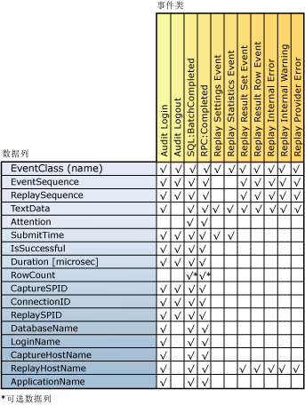

# 查看重播结果

 [!INCLUDE [SQL Server](../../includes/applies-to-version/sqlserver.md)]

在 [!INCLUDE[msCoName](../../includes/msconame-md.md)] [!INCLUDE[ssNoVersion](../../includes/ssnoversion-md.md)] Distributed Replay 功能完成一个分布式重播之后，可以在每个客户端上的结果跟踪文件中捕获和保存每个客户端的重播活动。 为了捕获此活动，使用“重播”选项运行管理工具时，必须使用 **-o** 参数。 有关“重播”选项的详细信息，请参阅[“重播”选项（Distributed Replay 管理工具）](../../tools/distributed-replay/replay-option-distributed-replay-administration-tool.md)。  
  
 存储结果跟踪文件的位置由位于每个客户端上的客户端配置文件 `<ResultDirectory>` 中的 XML 元素 `DReplayClient.xml`指定。 每次重播时，都将覆盖客户端结果目录中的跟踪文件。  
  
 若要指定在结果跟踪文件中应捕获哪种类型的输出，请修改重播配置文件 `DReplay.exe.replay.config`。 您可以使用 `<OutputOptions>` XML 元素以指定是应记录行计数还是应记录结果集内容。  
  
 有关这些配置设置的详细信息，请参阅 [配置 Distributed Replay](../../tools/distributed-replay/configure-distributed-replay.md)。  
  
## 在结果跟踪文件中捕获的事件类  
 下表列出了在结果跟踪数据中捕获的所有事件类。  
  
|类别|EventClass 名称|捕获频率|捕获点|  
|--------------|---------------------|-----------------------|----------------------|  
|可重播的事件|审核登录|针对原始跟踪数据中的每个审核登录事件捕获一次|在成功完成事件或事件失败后|  
||审核注销|针对原始跟踪数据中的每个审核退出事件捕获一次|在成功完成事件或事件失败后|  
||SQL:BatchCompleted|针对原始跟踪数据中的每个 SQL:BatchStarting 事件捕获一次|在成功完成事件或事件失败后|  
||RPC:Completed|针对原始跟踪数据中的每个 RPC:Starting 事件捕获一次|在成功完成事件或事件失败后|  
|统计信息和结果|重播设置事件|一次性|结果跟踪的第一个事件|  
||重播统计信息事件|一次性|结果跟踪的最后一个事件|  
||重播结果集事件|针对每个 SQL:BatchStarting 和 RPC:Starting 事件捕获一次。   仅当重播配置文件中的 `<RecordResultSet>` 选项的值为 `Yes`时才捕获。||  
||重播结果行事件|针对 SQL:BatchStarting 和 RPC:Starting 事件的结果集中的每行捕获一次。   仅当重播配置文件中的 `<RecordResultSet>` 选项的值为 `Yes`时才捕获。||  
|错误和警告|重播内部错误|针对每个内部错误捕获一次|在出现内部错误条件时|  
||重播提供程序错误|针对每个提供程序错误捕获一次|在出现提供程序错误条件时|  
  
 注意以下事项：  
  
-   对于在目标服务器上成功重播的每个事件，都有一个对应的输出事件类。  
  
-   对于每个事件失败或取消，可能生成多个错误。  
  
## 事件类列映射  
 下图列出了哪些结果跟踪列可用于在重播期间捕获的每种事件类。  
  
   
  
## 跟踪结果的列说明  
 下表说明了结果跟踪数据的各列。  
  
|数据列名称|数据类型|说明|列 ID|  
|----------------------|---------------|-----------------|---------------|  
|EventClass|**nvarchar**|事件类的名称。|1|  
|EventSequence|**bigint**|对于提供程序错误、内部错误和警告，这是对应于错误或警告的捕获事件序列。   对于所有其他事件类，这是原始跟踪数据中的事件序列。|2|  
|ReplaySequence|**bigint**|对于提供程序错误、内部错误和警告，这是对应于错误或警告的重播事件序列。   对于所有其他事件类，这是在重播期间分配的事件的序列。|3|  
|TextData|**ntext**|TextData 的内容取决于 EventClass。   对于审核登录和 ExistingConnection，这是用于连接的设置选项。   对于 SQL:BatchStarting，这是批处理请求的正文。   对于 RPC:Starting，这是调用的存储过程。   对于重播设置事件，此列包含在重播配置文件中定义的设置。   对于重播统计信息事件，这包含以下信息：   -重播目标 SQL Server   -可重播事件的总数   -提供程序错误的数量   -内部错误的数量   -内部警告   -总错误数   -整体通过率   -重播时间 (HH:MM:SS:MMM)   对于重播结果集事件，这将显示返回结果列标题的列表。   对于重播结果行事件，这将显示该行所有列的返回值。   对于重播内部警告和重播提供程序错误，此列包含提供程序警告或错误。|4|  
|Attention|**bigint**|事件的关注持续时间（微秒）。 这从捕获跟踪中的 Attention 事件计算得出。 如果没有为事件指定查询超时，则不填充此列 (null)。|5|  
|SubmitTime|**datetime**|将事件提交到 [!INCLUDE[ssNoVersion](../../includes/ssnoversion-md.md)]的时间。|6|  
|IsSuccessful|**int**|一个布尔型标志，指示特定事件是否已成功执行以及结果集是否已返回到客户端。   生成警告的事件（例如，当由于 Attention 或用户指定的超时而取消某个事件时）被认为已获得成功。   IsSuccessful 可以是下列值之一：   1 = 成功   0 = 失败|7|  
|Duration [微秒]|**bigint**|事件的响应时间持续时间（微秒）。 当将登录/注销/RPC/语言事件提交到 [!INCLUDE[ssNoVersion](../../includes/ssnoversion-md.md)]时，将开始测量。   如果事件成功，则测量将在用完了完整结果集时结束。   如果事件不成功，则测量将在事件失败或取消时结束。|8|  
|RowCount|**bigint**|根据重播配置文件中 `<RecordRowCount>` 的值进行填充：   如果 `<RecordRowCount>` 等于“Yes”，则此单元包含结果集中由 [!INCLUDE[ssNoVersion](../../includes/ssnoversion-md.md)]返回的行数。   如果 `<RecordRowCount>` 等于“No”，则不填充此单元 (null)。|9|  
|CaptureSPID|**int**|此事件的捕获会话的 ID。|10|  
|ConnectionID|**int**|此事件的捕获连接的 ID。|11|  
|ReplaySPID|**int**|此事件的重播会话的 ID。|12|  
|DatabaseName|**nvarchar**|正在运行用户语句的数据库的名称。|13|  
|LoginName|**nvarchar**|用户的登录名。 这可能是 [!INCLUDE[ssNoVersion](../../includes/ssnoversion-md.md)] 安全登录名或 Microsoft Windows 登录凭据，格式为： *domain_name*\\*user_name*。|14|  
|CaptureHostName|**nvarchar**|在捕获期间运行此客户端服务的计算机的名称。|15|  
|ReplayHostName|**nvarchar**|在重播期间运行客户端的计算机的名称。|16|  
|ApplicationName|**nvarchar**|在捕获期间创建了 [!INCLUDE[ssNoVersion](../../includes/ssnoversion-md.md)] 连接的客户端应用程序的名称。|17|  
  
## 另请参阅  
 [SQL Server 分布式重播](../../tools/distributed-replay/sql-server-distributed-replay.md)   
 [Distributed Replay Requirements](../../tools/distributed-replay/distributed-replay-requirements.md)   
 [管理工具命令行选项（Distributed Replay 实用工具）](../../tools/distributed-replay/administration-tool-command-line-options-distributed-replay-utility.md)   
 [配置 Distributed Replay](../../tools/distributed-replay/configure-distributed-replay.md)  
  
  
