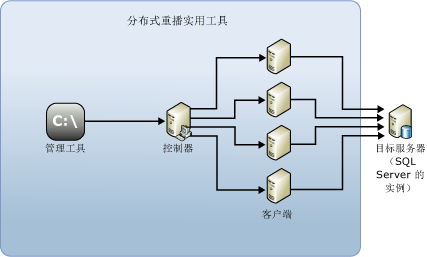

# SQL Server 分布式重播
[!INCLUDE[appliesto-ss-xxxx-xxxx-xxx-md](../../includes/appliesto-ss-xxxx-xxxx-xxx-md.md)]
  [!INCLUDE[msCoName](../../includes/msconame-md.md)] [!INCLUDE[ssNoVersion](../../includes/ssnoversion-md.md)] 分布式重播功能可帮助您评估即将进行的 [!INCLUDE[ssNoVersion](../../includes/ssnoversion-md.md)] 升级的影响。 您还可以使用它来帮助评估硬件和操作系统升级以及 [!INCLUDE[ssNoVersion](../../includes/ssnoversion-md.md)] 优化的影响。  
  
## 分布式重播的优点  
 与 [!INCLUDE[ssSqlProfiler](../../includes/sssqlprofiler-md.md)]类似，您可以使用分布式重播针对升级后的测试环境重播捕获的跟踪。 与 [!INCLUDE[ssSqlProfiler](../../includes/sssqlprofiler-md.md)]不同的是，分布式重播并不仅限于从单台计算机重播工作负荷。  
  
 与 [!INCLUDE[ssSqlProfiler](../../includes/sssqlprofiler-md.md)] 相比，分布式重播提供了一个更具伸缩性的解决方案。 使用分布式重播，您可以从多台计算机重播工作负荷，并更好地模拟关键任务型工作负荷。  
  
 [!INCLUDE[msCoName](../../includes/msconame-md.md)] [!INCLUDE[ssNoVersion](../../includes/ssnoversion-md.md)] 分布式重播功能可以从多台计算机重播跟踪数据，并模拟关键任务型工作负荷。 可使用分布式重播进行应用程序兼容性测试、性能测试或容量规划。  
  
## 何时使用分布式重播  
 [!INCLUDE[ssSqlProfiler](../../includes/sssqlprofiler-md.md)] 和分布式重播在功能上有些重复。  
  
 您可以使用 [!INCLUDE[ssSqlProfiler](../../includes/sssqlprofiler-md.md)] 针对已升级的测试环境重播捕获的跟踪。 还可以分析重播结果以查找潜在的功能和性能不兼容问题。 但是， [!INCLUDE[ssSqlProfiler](../../includes/sssqlprofiler-md.md)] 只能从单台计算机重播工作负荷。 重播具有许多活动的并发连接或较高吞吐量的密集型 OLTP 应用程序时， [!INCLUDE[ssSqlProfiler](../../includes/sssqlprofiler-md.md)] 可能会成为资源瓶颈。  
  
 与 [!INCLUDE[ssSqlProfiler](../../includes/sssqlprofiler-md.md)] 相比，分布式重播提供了一个更具伸缩性的解决方案。 使用分布式重播可以从多台计算机重播工作负荷，并更好地模拟关键任务型工作负荷。  
  
 下表介绍了适当使用每种工具的情况。  
  
|工具|使用场景|  
|----------|---------------|  
|[!INCLUDE[ssSqlProfiler](../../includes/sssqlprofiler-md.md)]|您希望在单台计算机上使用传统的重播机制。 特别是，你需要逐行调试功能，如“步骤”、“运行至光标处”和“切换断点”命令。   您要重播 [!INCLUDE[ssASnoversion](../../includes/ssasnoversion-md.md)] 跟踪。|  
|分布式重播|您要评估应用程序兼容性。 例如，您要测试 [!INCLUDE[ssNoVersion](../../includes/ssnoversion-md.md)] 和操作系统升级方案、硬件升级或索引优化。   捕获的跟踪中的并发率过高，以致于单个重播客户端不足以对其进行模拟。|  
  
## 分布式重播概念  
 以下组件组成分布式重播环境：  
  
-   **分布式重播管理工具**：一个控制台应用程序 **DReplay.exe**, 可用来与分布式重播控制器进行通信。 使用管理工具可控制分布式的重播。  
  
-   **分布式重播控制器**：运行名为 [!INCLUDE[ssNoVersion](../../includes/ssnoversion-md.md)] 分布式重播控制器的 Windows 服务的一台计算机。 Distributed Replay 控制器协调分布式的重播客户端的操作。 在每个 Distributed Replay 环境中只能有一个控制器实例。  
  
-   **分布式重播客户端**：运行名为 [!INCLUDE[ssNoVersion](../../includes/ssnoversion-md.md)] 分布式重播客户端的 Windows 服务的一台或多台计算机（物理或虚拟）。 多个 Distributed Replay 客户端一起来模拟 [!INCLUDE[ssNoVersion](../../includes/ssnoversion-md.md)]实例的工作负荷。 在每个 Distributed Replay 环境中可以有一个或多个客户端。  
  
-   **目标服务器**：分布式重播客户端可用于重播跟踪数据的 [!INCLUDE[ssNoVersion](../../includes/ssnoversion-md.md)] 实例。 建议将目标服务器置于测试环境中。  
  
 分布式重播管理工具、控制器和客户端可安装在不同计算机或同一计算机上。 一台计算机上只能运行分布式重播控制器或客户端服务的一个实例。  
  
 下图展示了 [!INCLUDE[ssNoVersion](../../includes/ssnoversion-md.md)] 分布式重播物理体系结构：  
  
   
  
## 分布式重播任务  
  
|任务说明|主题|  
|----------------------|-----------|  
|介绍如何配置分布式重播。|[配置分布式重播](../../tools/distributed-replay/configure-distributed-replay.md)|  
|介绍如何准备输入跟踪数据。|[准备输入跟踪数据](../../tools/distributed-replay/prepare-the-input-trace-data.md)|  
|介绍如何重播跟踪数据。|[重播跟踪数据](../../tools/distributed-replay/replay-trace-data.md)|  
|介绍如何查看分布式重播跟踪数据结果。|[查看重播结果](../../tools/distributed-replay/review-the-replay-results.md)|  
|介绍如何使用管理工具以启动、监视和取消控制器上的操作。|[管理工具命令行选项（Distributed Replay 实用工具）](../../tools/distributed-replay/administration-tool-command-line-options-distributed-replay-utility.md)|  
  
## 另请参阅  
 [SQL Server 分布式重播论坛](http://social.technet.microsoft.com/Forums/sl/sqldru/)   
 [使用 Distributed Replay 对 SQL Server 进行负载测试 – 第 2 部分](http://blogs.msdn.com/b/mspfe/archive/2012/11/14/using-distributed-replay-to-load-test-your-sql-server-part-2.aspx)   
 [使用 Distributed Replay 对 SQL Server 进行负载测试 – 第 1 部分](http://blogs.msdn.com/b/mspfe/archive/2012/11/08/using-distributed-replay-to-load-test-your-sql-server-part-1.aspx)  
  
  
