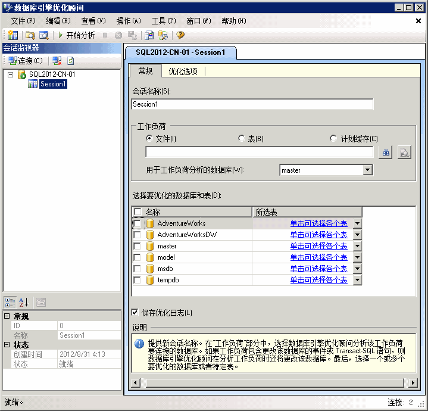

# 第 1-1 课 - 启动数据库引擎优化顾问
[!INCLUDE[appliesto-ss-xxxx-xxxx-xxx-md](../../includes/appliesto-ss-xxxx-xxxx-xxx-md.md)]
开始前，请先打开数据库引擎优化顾问图形用户界面 (GUI)。 第一次使用时，必须由 **sysadmin** 固定服务器角色的成员来启动数据库引擎优化顾问，以初始化应用程序。 初始化后， **db_owner** 固定数据库角色的成员便可使用数据库引擎优化顾问来优化他们拥有的数据库。 有关初始化数据库引擎优化顾问的详细信息，请参阅 [启动并使用数据库引擎优化顾问](../../relational-databases/performance/start-and-use-the-database-engine-tuning-advisor.md)。  
  
### 打开数据库引擎优化顾问 GUI  
  
1.  在 Windows“开始”菜单中，依次指向“所有程序”、[!INCLUDE[ssCurrentUI](../../includes/sscurrentui-md.md)] 和“性能工具”，然后单击“数据库引擎优化顾问”。  
  
2.  在“连接到服务器”对话框中，确认默认设置，再单击“连接”。  
  
默认情况下，数据库引擎优化顾问将打开下图所示的配置：  
  
  
  
> [!NOTE]  
> 选项卡和“会话名称”框中显示连接到的计算机和实例的名称。 选项卡和框将显示当前日期和时间。  
  
第一次打开时，数据库引擎优化顾问 GUI 中将显示两个主窗格。  
  
-   左窗格包含会话监视器，其中列出已对此 [!INCLUDE[msCoName](../../includes/msconame-md.md)] [!INCLUDE[ssNoVersion](../../includes/ssnoversion-md.md)] 实例执行的所有优化会话。 打开数据库引擎优化顾问时，在窗格顶部将显示一个新会话。 可在相邻窗格中对此会话命名。 最初，仅列出默认会话。 这是数据库引擎优化顾问为您自动创建的默认会话。 对数据库进行优化后，您所连接的 [!INCLUDE[ssNoVersion](../../includes/ssnoversion-md.md)] 实例的所有优化会话都将在新会话下面列出。 可右键单击优化会话以对其重命名、关闭、删除或克隆。 如果在列表中单击右键，则可按照名称、状态或创建时间对会话排序，或创建新会话。 在此窗格的底部将显示选定优化会话的详细信息。 可以选择使用“按类别显示”按钮，以显示按类别分组的详细信息；也可使用“按字母显示”按钮，在按字母排序的列表中显示详细信息。 也可以通过将右窗格边框拖动到窗口的左侧来隐藏会话监视器。 若要再次查看，请将窗格边框重新拖动回右侧。 利用会话监视器可以查看以前的优化会话，或使用这些会话来创建具有类似定义的新会话。 还可以使用会话监视器来评估优化建议。 有关详细信息，请参阅[查看和使用数据库引擎优化顾问的输出](../../relational-databases/performance/view-and-work-with-the-output-from-the-database-engine-tuning-advisor.md)。 使用浏览器中的“后退”按钮可返回到本教程。  
  
-   右窗格包含“常规”和“优化选项”选项卡。 在此可以定义数据库引擎优化会话。 在“常规”选项卡中，键入优化会话的名称，指定要使用的工作负荷文件或表，并选择要在该会话中优化的数据库和表。 工作负荷是对要优化的一个或多个数据库执行的一组 [!INCLUDE[tsql](../../includes/tsql-md.md)] 语句。 优化数据库时，数据库引擎优化顾问使用跟踪文件、跟踪表、[!INCLUDE[tsql](../../includes/tsql-md.md)] 脚本或 XML 文件作为工作负荷输入。 在“优化选项”选项卡上，可以选择希望数据库引擎优化顾问在分析过程中考虑的物理数据库设计结构（索引或索引视图）和分区策略。 在此选项卡上，还可以指定数据库引擎优化顾问优化工作负荷使用的最大时间。 默认情况下，数据库引擎优化顾问优化工作负荷的时间为一个小时。  
  
> [!NOTE]  
> 从 [!INCLUDE[tsql](../../includes/tsql-md.md)] 查询编辑器中导入 [!INCLUDE[msCoName](../../includes/msconame-md.md)][!INCLUDE[ssManStudioFull](../../includes/ssmanstudiofull-md.md)] 脚本时，数据库引擎优化顾问可接受 XML 文件作为输入。 有关详细信息，请参阅 [!INCLUDE[ssManStudioFull](../../includes/ssmanstudiofull-md.md)] 启动并使用数据库引擎优化顾问 [中的“从](../../relational-databases/performance/start-and-use-the-database-engine-tuning-advisor.md)查询编辑器中启动数据库引擎优化顾问”一节。  
  
## 课程中的下一个任务  
[设置工具选项和布局](../../tools/dta/lesson-1-2-setting-tool-options-and-layout.md)  
  
  
  
