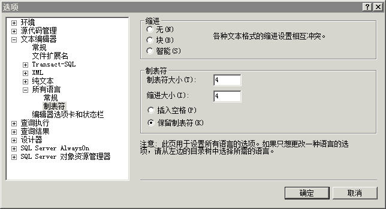

# 添加缩进
查询编辑器允许您通过一个步骤缩进大段代码，并允许您更改缩进量。  
  
## 缩进代码  
  
#### 缩进多行代码  
  
1.  在工具栏上，单击 **“新建查询”**。  
  
2.  创建第二个查询，该查询会从 **Person** 架构的 **Person** 表中选择 **BusinessEntityID**、FirstName、**MiddleName** 和 **LastName** 列。 将每个列放在单独的行上，使代码显示如下：  
  
    ```  
    -- Search for a contact  
    SELECT   
    BusinessEntityID,  
    FirstName,   
    MiddleName,   
    LastName  
    FROM Person.Person  
    WHERE LastName = 'Sanchez';  
    GO  
    ```  
  
3.  选择从 `BusinessEntityID` 到 `LastName` 的所有文本。  
  
4.  在“SQL 编辑器”工具栏中，单击“增加缩进”以同时缩进所有的行。  
  
#### 更改默认缩进  
  
1.  在“工具”  菜单上，单击“选项” 。  
  
2.  依次展开“文本编辑器”、“所有语言”，再单击“制表符”并设置适当的缩进值。 请注意，您可以更改缩进的大小和制表符的大小，还可更改是否将制表符转换为空格。  
  
      
  
3.  单击 **“确定”**。  
  
## 课程中的下一个任务  
[最大化查询编辑器](../../tools/sql-server-management-studio/maximizing-query-editor.md)  
  
  
  
