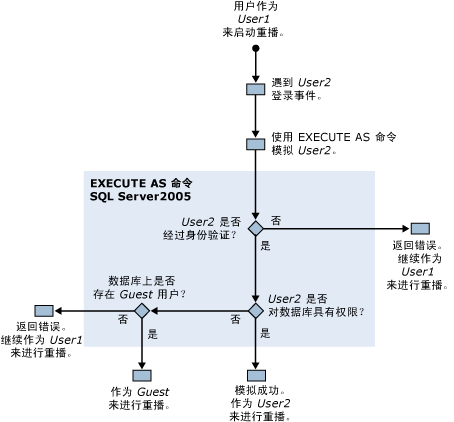

# 运行 SQL Server Profiler 所需的权限
[!INCLUDE[appliesto-ss-xxxx-xxxx-xxx-md](../../includes/appliesto-ss-xxxx-xxxx-xxx-md.md)]
  默认情况下，用户运行 [!INCLUDE[ssSqlProfiler](../../includes/sssqlprofiler-md.md)] 所需的权限与执行用于创建跟踪的 Transact-SQL 存储过程所需的权限相同。 若要运行 [!INCLUDE[ssSqlProfiler](../../includes/sssqlprofiler-md.md)]，用户必须拥有 ALTER TRACE 权限。 有关详细信息，请参阅 [GRANT 服务器权限 (Transact-SQL)](../../t-sql/statements/grant-server-permissions-transact-sql.md)。  
  
> [!IMPORTANT]  
>  拥有 SHOWPLAN、ALTER TRACE 或 VIEW SERVER STATE 权限的用户可以对显示计划输出中捕获的查询进行查看。 这些查询可能包含敏感信息，例如密码。 因此，建议您仅将这些权限授予有权查看敏感信息的一类用户，例如 db_owner 固定数据库角色的成员或 sysadmin 固定服务器角色的成员。 此外，建议您最好将包含显示计划相关事件的显示计划文件或跟踪文件保存到使用 NTFS 文件系统的某个位置，并且只允许有权查看敏感信息的用户对之进行访问。  
  
## 用于重播跟踪的权限  
 重播跟踪也要求重播跟踪的用户拥有 ALTER TRACE 权限。  
  
 但是，如果重播期间在重播的跟踪中遇到 Audit Login 事件， [!INCLUDE[ssSqlProfiler](../../includes/sssqlprofiler-md.md)] 将使用 EXECUTE AS 命令。 [!INCLUDE[ssSqlProfiler](../../includes/sssqlprofiler-md.md)] 使用 EXECUTE AS 命令模拟与登录事件关联的用户。  
  
 如果 [!INCLUDE[ssSqlProfiler](../../includes/sssqlprofiler-md.md)] 在重播的跟踪中遇到登录事件，将执行下列权限检查：  
  
1.  拥有 ALTER TRACE 权限的用户 1 开始重播跟踪。  
  
2.  在重播的跟踪中遇到用户 2 的登录事件。  
  
3.  [!INCLUDE[ssSqlProfiler](../../includes/sssqlprofiler-md.md)] 使用 EXECUTE AS 命令模拟用户 2。  
  
4.  [!INCLUDE[ssNoVersion](../../includes/ssnoversion-md.md)] 尝试验证用户 2 的身份，根据结果的不同会出现下列情况之一：  
  
    1.  如果用户 2 无法通过身份验证， [!INCLUDE[ssSqlProfiler](../../includes/sssqlprofiler-md.md)] 将返回一个错误，并以用户 1 的身份继续重播跟踪。  
  
    2.  如果用户 2 成功通过身份验证，将以用户 2 的身份继续重播跟踪。  
  
5.  检查用户 2 对目标数据库的权限，根据结果的不同会出现下列情况之一：  
  
    1.  如果用户 2 拥有对目标数据库的权限，则模拟成功，并以用户 2 的身份重播跟踪。  
  
    2.  如果用户 2 不拥有对目标数据库的权限，则服务器将检查该数据库的 Guest 用户。  
  
6.  将检查目标数据库中是否存在 Guest 用户，根据结果的不同会出现下列情况之一：  
  
    1.  如果 Guest 帐户存在，将以 Guest 帐户重播跟踪。  
  
    2.  如果目标数据库中不存在 Guest 帐户，将返回一个错误，并以用户 1 的身份重播跟踪。  
  
 以下关系图说明了重播跟踪时此检查权限的过程：  
  
   
  
## 另请参阅  
 [SQL Server Profiler 存储过程 (Transact-SQL)](../../relational-databases/system-stored-procedures/sql-server-profiler-stored-procedures-transact-sql.md)   
 [重播跟踪](../../tools/sql-server-profiler/replay-traces.md)   
 [创建跟踪 (SQL Server Profiler)](../../tools/sql-server-profiler/create-a-trace-sql-server-profiler.md)   
 [重播跟踪表 (SQL Server Profiler)](../../tools/sql-server-profiler/replay-a-trace-table-sql-server-profiler.md)   
 [重播跟踪文件 (SQL Server Profiler)](../../tools/sql-server-profiler/replay-a-trace-file-sql-server-profiler.md)  
  
  
